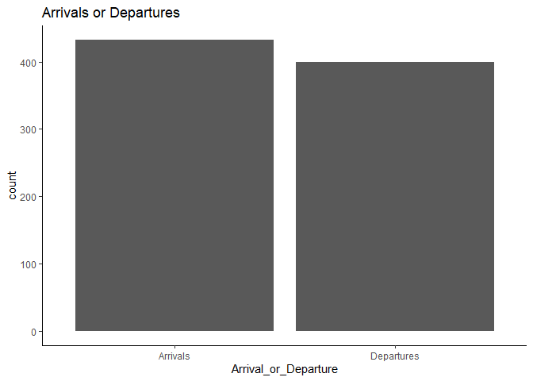
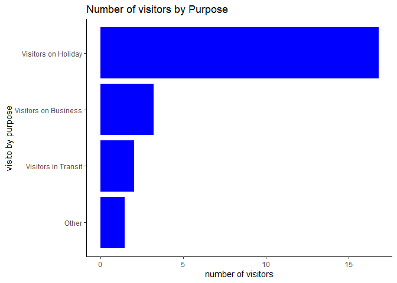
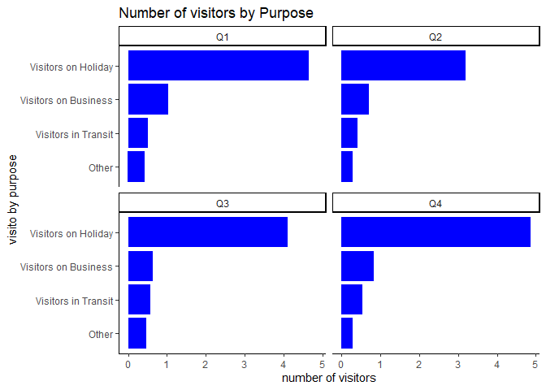
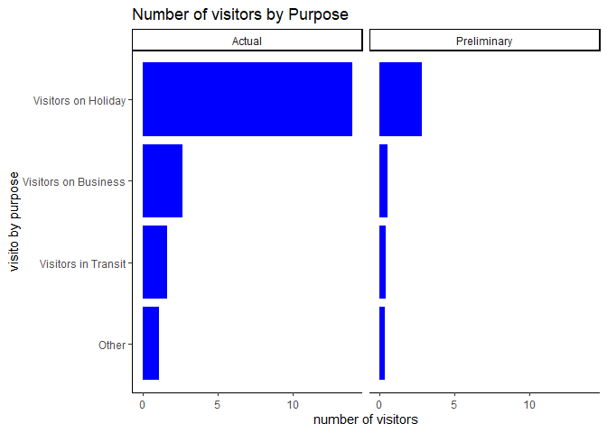

# Package Library

## Load desired package libraries


```r
require(dplyr)
require(tidyr)
require(magrittr)
require(ggplot2)
require(ggthemes)
theme_set(theme_classic())
require(kableExtra)
require(lubridate)
load(file = "visitor.Rdata")
```

## The raw data itself


```r
attach(Visitors_to_Kenya_between1991_to_2014_For_Developers)
Visitors_to_Kenya_between1991_to_2014_For_Developers %>% kable() %>% kable_styling() %>% 
  scroll_box(width = "100%", height = "300px")
```

<div style="border: 1px solid #ddd; padding: 0px; overflow-y: scroll; height:300px; overflow-x: scroll; width:100%; "><table class="table" style="margin-left: auto; margin-right: auto;">
 <thead>
  <tr>
   <th style="text-align:left;position: sticky; top:0; background-color: #FFFFFF;"> Arrival_or_Departure </th>
   <th style="text-align:left;position: sticky; top:0; background-color: #FFFFFF;"> Date_End_of_Quater </th>
   <th style="text-align:left;position: sticky; top:0; background-color: #FFFFFF;"> Year_Text </th>
   <th style="text-align:right;position: sticky; top:0; background-color: #FFFFFF;"> No_of_Visitors_to_Kenya </th>
   <th style="text-align:left;position: sticky; top:0; background-color: #FFFFFF;"> Visitors_by_Purpose </th>
   <th style="text-align:left;position: sticky; top:0; background-color: #FFFFFF;"> Period_Quater </th>
   <th style="text-align:left;position: sticky; top:0; background-color: #FFFFFF;"> Results_Status </th>
   <th style="text-align:right;position: sticky; top:0; background-color: #FFFFFF;"> OBJECTID </th>
  </tr>
 </thead>
<tbody>
  <tr>
   <td style="text-align:left;"> Arrivals </td>
   <td style="text-align:left;"> 03/31/2005 12:00:00 AM </td>
   <td style="text-align:left;"> 2005 </td>
   <td style="text-align:right;"> 264600 </td>
   <td style="text-align:left;"> Visitors on Holiday </td>
   <td style="text-align:left;"> Q1 </td>
   <td style="text-align:left;"> Actual </td>
   <td style="text-align:right;"> 0 </td>
  </tr>
  <tr>
   <td style="text-align:left;"> Arrivals </td>
   <td style="text-align:left;"> 06/30/1991 12:00:00 AM </td>
   <td style="text-align:left;"> 1991 </td>
   <td style="text-align:right;"> 149400 </td>
   <td style="text-align:left;"> Visitors on Holiday </td>
   <td style="text-align:left;"> Q2 </td>
   <td style="text-align:left;"> Actual </td>
   <td style="text-align:right;"> 1 </td>
  </tr>
  <tr>
   <td style="text-align:left;"> Arrivals </td>
   <td style="text-align:left;"> 09/30/1991 12:00:00 AM </td>
   <td style="text-align:left;"> 1991 </td>
   <td style="text-align:right;"> 215900 </td>
   <td style="text-align:left;"> Visitors on Holiday </td>
   <td style="text-align:left;"> Q3 </td>
   <td style="text-align:left;"> Actual </td>
   <td style="text-align:right;"> 2 </td>
  </tr>
  <tr>
   <td style="text-align:left;"> Arrivals </td>
   <td style="text-align:left;"> 12/31/1991 12:00:00 AM </td>
   <td style="text-align:left;"> 1991 </td>
   <td style="text-align:right;"> 158400 </td>
   <td style="text-align:left;"> Visitors on Holiday </td>
   <td style="text-align:left;"> Q4 </td>
   <td style="text-align:left;"> Actual </td>
   <td style="text-align:right;"> 3 </td>
  </tr>
  <tr>
   <td style="text-align:left;"> Arrivals </td>
   <td style="text-align:left;"> 03/31/1992 12:00:00 AM </td>
   <td style="text-align:left;"> 1992 </td>
   <td style="text-align:right;"> 155400 </td>
   <td style="text-align:left;"> Visitors on Holiday </td>
   <td style="text-align:left;"> Q1 </td>
   <td style="text-align:left;"> Actual </td>
   <td style="text-align:right;"> 4 </td>
  </tr>
  <tr>
   <td style="text-align:left;"> Arrivals </td>
   <td style="text-align:left;"> 06/30/1992 12:00:00 AM </td>
   <td style="text-align:left;"> 1992 </td>
   <td style="text-align:right;"> 136200 </td>
   <td style="text-align:left;"> Visitors on Holiday </td>
   <td style="text-align:left;"> Q2 </td>
   <td style="text-align:left;"> Actual </td>
   <td style="text-align:right;"> 5 </td>
  </tr>
  <tr>
   <td style="text-align:left;"> Arrivals </td>
   <td style="text-align:left;"> 09/30/1992 12:00:00 AM </td>
   <td style="text-align:left;"> 1992 </td>
   <td style="text-align:right;"> 211100 </td>
   <td style="text-align:left;"> Visitors on Holiday </td>
   <td style="text-align:left;"> Q3 </td>
   <td style="text-align:left;"> Actual </td>
   <td style="text-align:right;"> 6 </td>
  </tr>
  <tr>
   <td style="text-align:left;"> Arrivals </td>
   <td style="text-align:left;"> 12/31/1992 12:00:00 AM </td>
   <td style="text-align:left;"> 1992 </td>
   <td style="text-align:right;"> 104000 </td>
   <td style="text-align:left;"> Visitors on Holiday </td>
   <td style="text-align:left;"> Q4 </td>
   <td style="text-align:left;"> Actual </td>
   <td style="text-align:right;"> 7 </td>
  </tr>
  <tr>
   <td style="text-align:left;"> Arrivals </td>
   <td style="text-align:left;"> 03/31/1993 12:00:00 AM </td>
   <td style="text-align:left;"> 1993 </td>
   <td style="text-align:right;"> 69300 </td>
   <td style="text-align:left;"> Visitors on Holiday </td>
   <td style="text-align:left;"> Q1 </td>
   <td style="text-align:left;"> Actual </td>
   <td style="text-align:right;"> 8 </td>
  </tr>
  <tr>
   <td style="text-align:left;"> Arrivals </td>
   <td style="text-align:left;"> 06/30/1993 12:00:00 AM </td>
   <td style="text-align:left;"> 1993 </td>
   <td style="text-align:right;"> 211800 </td>
   <td style="text-align:left;"> Visitors on Holiday </td>
   <td style="text-align:left;"> Q2 </td>
   <td style="text-align:left;"> Actual </td>
   <td style="text-align:right;"> 9 </td>
  </tr>
  <tr>
   <td style="text-align:left;"> Arrivals </td>
   <td style="text-align:left;"> 09/30/1993 12:00:00 AM </td>
   <td style="text-align:left;"> 1993 </td>
   <td style="text-align:right;"> 208700 </td>
   <td style="text-align:left;"> Visitors on Holiday </td>
   <td style="text-align:left;"> Q3 </td>
   <td style="text-align:left;"> Actual </td>
   <td style="text-align:right;"> 10 </td>
  </tr>
  <tr>
   <td style="text-align:left;"> Arrivals </td>
   <td style="text-align:left;"> 12/31/1993 12:00:00 AM </td>
   <td style="text-align:left;"> 1993 </td>
   <td style="text-align:right;"> 190000 </td>
   <td style="text-align:left;"> Visitors on Holiday </td>
   <td style="text-align:left;"> Q4 </td>
   <td style="text-align:left;"> Actual </td>
   <td style="text-align:right;"> 11 </td>
  </tr>
  <tr>
   <td style="text-align:left;"> Arrivals </td>
   <td style="text-align:left;"> 03/31/1994 12:00:00 AM </td>
   <td style="text-align:left;"> 1994 </td>
   <td style="text-align:right;"> 145400 </td>
   <td style="text-align:left;"> Visitors on Holiday </td>
   <td style="text-align:left;"> Q1 </td>
   <td style="text-align:left;"> Actual </td>
   <td style="text-align:right;"> 12 </td>
  </tr>
  <tr>
   <td style="text-align:left;"> Arrivals </td>
   <td style="text-align:left;"> 06/30/1994 12:00:00 AM </td>
   <td style="text-align:left;"> 1994 </td>
   <td style="text-align:right;"> 192400 </td>
   <td style="text-align:left;"> Visitors on Holiday </td>
   <td style="text-align:left;"> Q2 </td>
   <td style="text-align:left;"> Actual </td>
   <td style="text-align:right;"> 13 </td>
  </tr>
  <tr>
   <td style="text-align:left;"> Arrivals </td>
   <td style="text-align:left;"> 09/30/1994 12:00:00 AM </td>
   <td style="text-align:left;"> 1994 </td>
   <td style="text-align:right;"> 189300 </td>
   <td style="text-align:left;"> Visitors on Holiday </td>
   <td style="text-align:left;"> Q3 </td>
   <td style="text-align:left;"> Actual </td>
   <td style="text-align:right;"> 14 </td>
  </tr>
  <tr>
   <td style="text-align:left;"> Arrivals </td>
   <td style="text-align:left;"> 12/31/1994 12:00:00 AM </td>
   <td style="text-align:left;"> 1994 </td>
   <td style="text-align:right;"> 151800 </td>
   <td style="text-align:left;"> Visitors on Holiday </td>
   <td style="text-align:left;"> Q4 </td>
   <td style="text-align:left;"> Actual </td>
   <td style="text-align:right;"> 15 </td>
  </tr>
  <tr>
   <td style="text-align:left;"> Arrivals </td>
   <td style="text-align:left;"> 03/31/1995 12:00:00 AM </td>
   <td style="text-align:left;"> 1995 </td>
   <td style="text-align:right;"> 212900 </td>
   <td style="text-align:left;"> Visitors on Holiday </td>
   <td style="text-align:left;"> Q1 </td>
   <td style="text-align:left;"> Actual </td>
   <td style="text-align:right;"> 16 </td>
  </tr>
  <tr>
   <td style="text-align:left;"> Arrivals </td>
   <td style="text-align:left;"> 06/30/1995 12:00:00 AM </td>
   <td style="text-align:left;"> 1995 </td>
   <td style="text-align:right;"> 182100 </td>
   <td style="text-align:left;"> Visitors on Holiday </td>
   <td style="text-align:left;"> Q2 </td>
   <td style="text-align:left;"> Actual </td>
   <td style="text-align:right;"> 17 </td>
  </tr>
  <tr>
   <td style="text-align:left;"> Arrivals </td>
   <td style="text-align:left;"> 09/30/1995 12:00:00 AM </td>
   <td style="text-align:left;"> 1995 </td>
   <td style="text-align:right;"> 199600 </td>
   <td style="text-align:left;"> Visitors on Holiday </td>
   <td style="text-align:left;"> Q3 </td>
   <td style="text-align:left;"> Actual </td>
   <td style="text-align:right;"> 18 </td>
  </tr>
  <tr>
   <td style="text-align:left;"> Arrivals </td>
   <td style="text-align:left;"> 12/31/1995 12:00:00 AM </td>
   <td style="text-align:left;"> 1995 </td>
   <td style="text-align:right;"> 201700 </td>
   <td style="text-align:left;"> Visitors on Holiday </td>
   <td style="text-align:left;"> Q4 </td>
   <td style="text-align:left;"> Actual </td>
   <td style="text-align:right;"> 19 </td>
  </tr>
  <tr>
   <td style="text-align:left;"> Arrivals </td>
   <td style="text-align:left;"> 03/31/1996 12:00:00 AM </td>
   <td style="text-align:left;"> 1996 </td>
   <td style="text-align:right;"> 213800 </td>
   <td style="text-align:left;"> Visitors on Holiday </td>
   <td style="text-align:left;"> Q1 </td>
   <td style="text-align:left;"> Actual </td>
   <td style="text-align:right;"> 20 </td>
  </tr>
  <tr>
   <td style="text-align:left;"> Arrivals </td>
   <td style="text-align:left;"> 06/30/1996 12:00:00 AM </td>
   <td style="text-align:left;"> 1996 </td>
   <td style="text-align:right;"> 175300 </td>
   <td style="text-align:left;"> Visitors on Holiday </td>
   <td style="text-align:left;"> Q2 </td>
   <td style="text-align:left;"> Actual </td>
   <td style="text-align:right;"> 21 </td>
  </tr>
  <tr>
   <td style="text-align:left;"> Arrivals </td>
   <td style="text-align:left;"> 09/30/1996 12:00:00 AM </td>
   <td style="text-align:left;"> 1996 </td>
   <td style="text-align:right;"> 212100 </td>
   <td style="text-align:left;"> Visitors on Holiday </td>
   <td style="text-align:left;"> Q3 </td>
   <td style="text-align:left;"> Actual </td>
   <td style="text-align:right;"> 22 </td>
  </tr>
  <tr>
   <td style="text-align:left;"> Arrivals </td>
   <td style="text-align:left;"> 12/31/1996 12:00:00 AM </td>
   <td style="text-align:left;"> 1996 </td>
   <td style="text-align:right;"> 219600 </td>
   <td style="text-align:left;"> Visitors on Holiday </td>
   <td style="text-align:left;"> Q4 </td>
   <td style="text-align:left;"> Actual </td>
   <td style="text-align:right;"> 23 </td>
  </tr>
  <tr>
   <td style="text-align:left;"> Arrivals </td>
   <td style="text-align:left;"> 03/31/1997 12:00:00 AM </td>
   <td style="text-align:left;"> 1997 </td>
   <td style="text-align:right;"> 233600 </td>
   <td style="text-align:left;"> Visitors on Holiday </td>
   <td style="text-align:left;"> Q1 </td>
   <td style="text-align:left;"> Actual </td>
   <td style="text-align:right;"> 24 </td>
  </tr>
  <tr>
   <td style="text-align:left;"> Arrivals </td>
   <td style="text-align:left;"> 06/30/1997 12:00:00 AM </td>
   <td style="text-align:left;"> 1997 </td>
   <td style="text-align:right;"> 176400 </td>
   <td style="text-align:left;"> Visitors on Holiday </td>
   <td style="text-align:left;"> Q2 </td>
   <td style="text-align:left;"> Actual </td>
   <td style="text-align:right;"> 25 </td>
  </tr>
  <tr>
   <td style="text-align:left;"> Arrivals </td>
   <td style="text-align:left;"> 09/30/1997 12:00:00 AM </td>
   <td style="text-align:left;"> 1997 </td>
   <td style="text-align:right;"> 210000 </td>
   <td style="text-align:left;"> Visitors on Holiday </td>
   <td style="text-align:left;"> Q3 </td>
   <td style="text-align:left;"> Actual </td>
   <td style="text-align:right;"> 26 </td>
  </tr>
  <tr>
   <td style="text-align:left;"> Arrivals </td>
   <td style="text-align:left;"> 12/31/1997 12:00:00 AM </td>
   <td style="text-align:left;"> 1997 </td>
   <td style="text-align:right;"> 168600 </td>
   <td style="text-align:left;"> Visitors on Holiday </td>
   <td style="text-align:left;"> Q4 </td>
   <td style="text-align:left;"> Actual </td>
   <td style="text-align:right;"> 27 </td>
  </tr>
  <tr>
   <td style="text-align:left;"> Arrivals </td>
   <td style="text-align:left;"> 03/31/1998 12:00:00 AM </td>
   <td style="text-align:left;"> 1998 </td>
   <td style="text-align:right;"> 192900 </td>
   <td style="text-align:left;"> Visitors on Holiday </td>
   <td style="text-align:left;"> Q1 </td>
   <td style="text-align:left;"> Actual </td>
   <td style="text-align:right;"> 28 </td>
  </tr>
  <tr>
   <td style="text-align:left;"> Arrivals </td>
   <td style="text-align:left;"> 06/30/1998 12:00:00 AM </td>
   <td style="text-align:left;"> 1998 </td>
   <td style="text-align:right;"> 149600 </td>
   <td style="text-align:left;"> Visitors on Holiday </td>
   <td style="text-align:left;"> Q2 </td>
   <td style="text-align:left;"> Actual </td>
   <td style="text-align:right;"> 29 </td>
  </tr>
  <tr>
   <td style="text-align:left;"> Arrivals </td>
   <td style="text-align:left;"> 09/30/1998 12:00:00 AM </td>
   <td style="text-align:left;"> 1998 </td>
   <td style="text-align:right;"> 175800 </td>
   <td style="text-align:left;"> Visitors on Holiday </td>
   <td style="text-align:left;"> Q3 </td>
   <td style="text-align:left;"> Actual </td>
   <td style="text-align:right;"> 30 </td>
  </tr>
  <tr>
   <td style="text-align:left;"> Arrivals </td>
   <td style="text-align:left;"> 12/31/1998 12:00:00 AM </td>
   <td style="text-align:left;"> 1998 </td>
   <td style="text-align:right;"> 168600 </td>
   <td style="text-align:left;"> Visitors on Holiday </td>
   <td style="text-align:left;"> Q4 </td>
   <td style="text-align:left;"> Actual </td>
   <td style="text-align:right;"> 31 </td>
  </tr>
  <tr>
   <td style="text-align:left;"> Arrivals </td>
   <td style="text-align:left;"> 03/31/1999 12:00:00 AM </td>
   <td style="text-align:left;"> 1999 </td>
   <td style="text-align:right;"> 193800 </td>
   <td style="text-align:left;"> Visitors on Holiday </td>
   <td style="text-align:left;"> Q1 </td>
   <td style="text-align:left;"> Actual </td>
   <td style="text-align:right;"> 32 </td>
  </tr>
  <tr>
   <td style="text-align:left;"> Arrivals </td>
   <td style="text-align:left;"> 06/30/1999 12:00:00 AM </td>
   <td style="text-align:left;"> 1999 </td>
   <td style="text-align:right;"> 163700 </td>
   <td style="text-align:left;"> Visitors on Holiday </td>
   <td style="text-align:left;"> Q2 </td>
   <td style="text-align:left;"> Actual </td>
   <td style="text-align:right;"> 33 </td>
  </tr>
  <tr>
   <td style="text-align:left;"> Arrivals </td>
   <td style="text-align:left;"> 09/30/1999 12:00:00 AM </td>
   <td style="text-align:left;"> 1999 </td>
   <td style="text-align:right;"> 207700 </td>
   <td style="text-align:left;"> Visitors on Holiday </td>
   <td style="text-align:left;"> Q3 </td>
   <td style="text-align:left;"> Actual </td>
   <td style="text-align:right;"> 34 </td>
  </tr>
  <tr>
   <td style="text-align:left;"> Arrivals </td>
   <td style="text-align:left;"> 12/31/1999 12:00:00 AM </td>
   <td style="text-align:left;"> 1999 </td>
   <td style="text-align:right;"> 181700 </td>
   <td style="text-align:left;"> Visitors on Holiday </td>
   <td style="text-align:left;"> Q4 </td>
   <td style="text-align:left;"> Actual </td>
   <td style="text-align:right;"> 35 </td>
  </tr>
  <tr>
   <td style="text-align:left;"> Arrivals </td>
   <td style="text-align:left;"> 03/31/2000 12:00:00 AM </td>
   <td style="text-align:left;"> 2000 </td>
   <td style="text-align:right;"> 194500 </td>
   <td style="text-align:left;"> Visitors on Holiday </td>
   <td style="text-align:left;"> Q1 </td>
   <td style="text-align:left;"> Actual </td>
   <td style="text-align:right;"> 36 </td>
  </tr>
  <tr>
   <td style="text-align:left;"> Arrivals </td>
   <td style="text-align:left;"> 06/30/2000 12:00:00 AM </td>
   <td style="text-align:left;"> 2000 </td>
   <td style="text-align:right;"> 165500 </td>
   <td style="text-align:left;"> Visitors on Holiday </td>
   <td style="text-align:left;"> Q2 </td>
   <td style="text-align:left;"> Actual </td>
   <td style="text-align:right;"> 37 </td>
  </tr>
  <tr>
   <td style="text-align:left;"> Arrivals </td>
   <td style="text-align:left;"> 09/30/2000 12:00:00 AM </td>
   <td style="text-align:left;"> 2000 </td>
   <td style="text-align:right;"> 211100 </td>
   <td style="text-align:left;"> Visitors on Holiday </td>
   <td style="text-align:left;"> Q3 </td>
   <td style="text-align:left;"> Actual </td>
   <td style="text-align:right;"> 38 </td>
  </tr>
  <tr>
   <td style="text-align:left;"> Arrivals </td>
   <td style="text-align:left;"> 12/31/2000 12:00:00 AM </td>
   <td style="text-align:left;"> 2000 </td>
   <td style="text-align:right;"> 207100 </td>
   <td style="text-align:left;"> Visitors on Holiday </td>
   <td style="text-align:left;"> Q4 </td>
   <td style="text-align:left;"> Actual </td>
   <td style="text-align:right;"> 39 </td>
  </tr>
  <tr>
   <td style="text-align:left;"> Arrivals </td>
   <td style="text-align:left;"> 03/31/2001 12:00:00 AM </td>
   <td style="text-align:left;"> 2001 </td>
   <td style="text-align:right;"> 200300 </td>
   <td style="text-align:left;"> Visitors on Holiday </td>
   <td style="text-align:left;"> Q1 </td>
   <td style="text-align:left;"> Actual </td>
   <td style="text-align:right;"> 40 </td>
  </tr>
  <tr>
   <td style="text-align:left;"> Arrivals </td>
   <td style="text-align:left;"> 06/30/2001 12:00:00 AM </td>
   <td style="text-align:left;"> 2001 </td>
   <td style="text-align:right;"> 149600 </td>
   <td style="text-align:left;"> Visitors on Holiday </td>
   <td style="text-align:left;"> Q2 </td>
   <td style="text-align:left;"> Actual </td>
   <td style="text-align:right;"> 41 </td>
  </tr>
  <tr>
   <td style="text-align:left;"> Arrivals </td>
   <td style="text-align:left;"> 10/01/2000 12:00:00 AM </td>
   <td style="text-align:left;"> 2001 </td>
   <td style="text-align:right;"> 184700 </td>
   <td style="text-align:left;"> Visitors on Holiday </td>
   <td style="text-align:left;"> Q3 </td>
   <td style="text-align:left;"> Actual </td>
   <td style="text-align:right;"> 42 </td>
  </tr>
  <tr>
   <td style="text-align:left;"> Arrivals </td>
   <td style="text-align:left;"> 12/31/2001 12:00:00 AM </td>
   <td style="text-align:left;"> 2001 </td>
   <td style="text-align:right;"> 194200 </td>
   <td style="text-align:left;"> Visitors on Holiday </td>
   <td style="text-align:left;"> Q4 </td>
   <td style="text-align:left;"> Actual </td>
   <td style="text-align:right;"> 43 </td>
  </tr>
  <tr>
   <td style="text-align:left;"> Arrivals </td>
   <td style="text-align:left;"> 03/31/2002 12:00:00 AM </td>
   <td style="text-align:left;"> 2002 </td>
   <td style="text-align:right;"> 176000 </td>
   <td style="text-align:left;"> Visitors on Holiday </td>
   <td style="text-align:left;"> Q1 </td>
   <td style="text-align:left;"> Actual </td>
   <td style="text-align:right;"> 44 </td>
  </tr>
  <tr>
   <td style="text-align:left;"> Arrivals </td>
   <td style="text-align:left;"> 06/30/2002 12:00:00 AM </td>
   <td style="text-align:left;"> 2002 </td>
   <td style="text-align:right;"> 158500 </td>
   <td style="text-align:left;"> Visitors on Holiday </td>
   <td style="text-align:left;"> Q2 </td>
   <td style="text-align:left;"> Actual </td>
   <td style="text-align:right;"> 45 </td>
  </tr>
  <tr>
   <td style="text-align:left;"> Arrivals </td>
   <td style="text-align:left;"> 10/02/2000 12:00:00 AM </td>
   <td style="text-align:left;"> 2002 </td>
   <td style="text-align:right;"> 194100 </td>
   <td style="text-align:left;"> Visitors on Holiday </td>
   <td style="text-align:left;"> Q3 </td>
   <td style="text-align:left;"> Actual </td>
   <td style="text-align:right;"> 46 </td>
  </tr>
  <tr>
   <td style="text-align:left;"> Arrivals </td>
   <td style="text-align:left;"> 12/31/2002 12:00:00 AM </td>
   <td style="text-align:left;"> 2002 </td>
   <td style="text-align:right;"> 204000 </td>
   <td style="text-align:left;"> Visitors on Holiday </td>
   <td style="text-align:left;"> Q4 </td>
   <td style="text-align:left;"> Actual </td>
   <td style="text-align:right;"> 47 </td>
  </tr>
  <tr>
   <td style="text-align:left;"> Arrivals </td>
   <td style="text-align:left;"> 03/31/2003 12:00:00 AM </td>
   <td style="text-align:left;"> 2003 </td>
   <td style="text-align:right;"> 206700 </td>
   <td style="text-align:left;"> Visitors on Holiday </td>
   <td style="text-align:left;"> Q1 </td>
   <td style="text-align:left;"> Actual </td>
   <td style="text-align:right;"> 48 </td>
  </tr>
  <tr>
   <td style="text-align:left;"> Arrivals </td>
   <td style="text-align:left;"> 06/30/2003 12:00:00 AM </td>
   <td style="text-align:left;"> 2003 </td>
   <td style="text-align:right;"> 112500 </td>
   <td style="text-align:left;"> Visitors on Holiday </td>
   <td style="text-align:left;"> Q2 </td>
   <td style="text-align:left;"> Actual </td>
   <td style="text-align:right;"> 49 </td>
  </tr>
  <tr>
   <td style="text-align:left;"> Arrivals </td>
   <td style="text-align:left;"> 10/03/2000 12:00:00 AM </td>
   <td style="text-align:left;"> 2003 </td>
   <td style="text-align:right;"> 183900 </td>
   <td style="text-align:left;"> Visitors on Holiday </td>
   <td style="text-align:left;"> Q3 </td>
   <td style="text-align:left;"> Actual </td>
   <td style="text-align:right;"> 50 </td>
  </tr>
  <tr>
   <td style="text-align:left;"> Arrivals </td>
   <td style="text-align:left;"> 12/31/2003 12:00:00 AM </td>
   <td style="text-align:left;"> 2003 </td>
   <td style="text-align:right;"> 180900 </td>
   <td style="text-align:left;"> Visitors on Holiday </td>
   <td style="text-align:left;"> Q4 </td>
   <td style="text-align:left;"> Actual </td>
   <td style="text-align:right;"> 51 </td>
  </tr>
  <tr>
   <td style="text-align:left;"> Arrivals </td>
   <td style="text-align:left;"> 03/31/1991 12:00:00 AM </td>
   <td style="text-align:left;"> 1991 </td>
   <td style="text-align:right;"> 149600 </td>
   <td style="text-align:left;"> Visitors on Holiday </td>
   <td style="text-align:left;"> Q1 </td>
   <td style="text-align:left;"> Actual </td>
   <td style="text-align:right;"> 52 </td>
  </tr>
  <tr>
   <td style="text-align:left;"> Arrivals </td>
   <td style="text-align:left;"> 06/30/2005 12:00:00 AM </td>
   <td style="text-align:left;"> 2005 </td>
   <td style="text-align:right;"> 213400 </td>
   <td style="text-align:left;"> Visitors on Holiday </td>
   <td style="text-align:left;"> Q2 </td>
   <td style="text-align:left;"> Actual </td>
   <td style="text-align:right;"> 53 </td>
  </tr>
  <tr>
   <td style="text-align:left;"> Arrivals </td>
   <td style="text-align:left;"> 10/05/2000 12:00:00 AM </td>
   <td style="text-align:left;"> 2005 </td>
   <td style="text-align:right;"> 288600 </td>
   <td style="text-align:left;"> Visitors on Holiday </td>
   <td style="text-align:left;"> Q3 </td>
   <td style="text-align:left;"> Actual </td>
   <td style="text-align:right;"> 54 </td>
  </tr>
  <tr>
   <td style="text-align:left;"> Arrivals </td>
   <td style="text-align:left;"> 12/31/2005 12:00:00 AM </td>
   <td style="text-align:left;"> 2005 </td>
   <td style="text-align:right;"> 2966000 </td>
   <td style="text-align:left;"> Visitors on Holiday </td>
   <td style="text-align:left;"> Q4 </td>
   <td style="text-align:left;"> Actual </td>
   <td style="text-align:right;"> 55 </td>
  </tr>
  <tr>
   <td style="text-align:left;"> Arrivals </td>
   <td style="text-align:left;"> 03/31/2006 12:00:00 AM </td>
   <td style="text-align:left;"> 2006 </td>
   <td style="text-align:right;"> 2756000 </td>
   <td style="text-align:left;"> Visitors on Holiday </td>
   <td style="text-align:left;"> Q1 </td>
   <td style="text-align:left;"> Actual </td>
   <td style="text-align:right;"> 56 </td>
  </tr>
  <tr>
   <td style="text-align:left;"> Arrivals </td>
   <td style="text-align:left;"> 06/30/2006 12:00:00 AM </td>
   <td style="text-align:left;"> 2006 </td>
   <td style="text-align:right;"> 219200 </td>
   <td style="text-align:left;"> Visitors on Holiday </td>
   <td style="text-align:left;"> Q2 </td>
   <td style="text-align:left;"> Actual </td>
   <td style="text-align:right;"> 57 </td>
  </tr>
  <tr>
   <td style="text-align:left;"> Arrivals </td>
   <td style="text-align:left;"> 10/06/2000 12:00:00 AM </td>
   <td style="text-align:left;"> 2006 </td>
   <td style="text-align:right;"> 289200 </td>
   <td style="text-align:left;"> Visitors on Holiday </td>
   <td style="text-align:left;"> Q3 </td>
   <td style="text-align:left;"> Actual </td>
   <td style="text-align:right;"> 58 </td>
  </tr>
  <tr>
   <td style="text-align:left;"> Arrivals </td>
   <td style="text-align:left;"> 12/31/2006 12:00:00 AM </td>
   <td style="text-align:left;"> 2006 </td>
   <td style="text-align:right;"> 303200 </td>
   <td style="text-align:left;"> Visitors on Holiday </td>
   <td style="text-align:left;"> Q4 </td>
   <td style="text-align:left;"> Actual </td>
   <td style="text-align:right;"> 59 </td>
  </tr>
  <tr>
   <td style="text-align:left;"> Arrivals </td>
   <td style="text-align:left;"> 03/31/2007 12:00:00 AM </td>
   <td style="text-align:left;"> 2007 </td>
   <td style="text-align:right;"> 298400 </td>
   <td style="text-align:left;"> Visitors on Holiday </td>
   <td style="text-align:left;"> Q1 </td>
   <td style="text-align:left;"> Actual </td>
   <td style="text-align:right;"> 60 </td>
  </tr>
  <tr>
   <td style="text-align:left;"> Arrivals </td>
   <td style="text-align:left;"> 06/30/2007 12:00:00 AM </td>
   <td style="text-align:left;"> 2007 </td>
   <td style="text-align:right;"> 263000 </td>
   <td style="text-align:left;"> Visitors on Holiday </td>
   <td style="text-align:left;"> Q2 </td>
   <td style="text-align:left;"> Actual </td>
   <td style="text-align:right;"> 61 </td>
  </tr>
  <tr>
   <td style="text-align:left;"> Arrivals </td>
   <td style="text-align:left;"> 10/07/2000 12:00:00 AM </td>
   <td style="text-align:left;"> 2007 </td>
   <td style="text-align:right;"> 380600 </td>
   <td style="text-align:left;"> Visitors on Holiday </td>
   <td style="text-align:left;"> Q3 </td>
   <td style="text-align:left;"> Actual </td>
   <td style="text-align:right;"> 62 </td>
  </tr>
  <tr>
   <td style="text-align:left;"> Arrivals </td>
   <td style="text-align:left;"> 12/31/2007 12:00:00 AM </td>
   <td style="text-align:left;"> 2007 </td>
   <td style="text-align:right;"> 336500 </td>
   <td style="text-align:left;"> Visitors on Holiday </td>
   <td style="text-align:left;"> Q4 </td>
   <td style="text-align:left;"> Actual </td>
   <td style="text-align:right;"> 63 </td>
  </tr>
  <tr>
   <td style="text-align:left;"> Arrivals </td>
   <td style="text-align:left;"> 03/31/2008 12:00:00 AM </td>
   <td style="text-align:left;"> 2008 </td>
   <td style="text-align:right;"> 201600 </td>
   <td style="text-align:left;"> Visitors on Holiday </td>
   <td style="text-align:left;"> Q1 </td>
   <td style="text-align:left;"> Actual </td>
   <td style="text-align:right;"> 64 </td>
  </tr>
  <tr>
   <td style="text-align:left;"> Arrivals </td>
   <td style="text-align:left;"> 06/30/2008 12:00:00 AM </td>
   <td style="text-align:left;"> 2008 </td>
   <td style="text-align:right;"> 205600 </td>
   <td style="text-align:left;"> Visitors on Holiday </td>
   <td style="text-align:left;"> Q2 </td>
   <td style="text-align:left;"> Actual </td>
   <td style="text-align:right;"> 65 </td>
  </tr>
  <tr>
   <td style="text-align:left;"> Arrivals </td>
   <td style="text-align:left;"> 10/08/2000 12:00:00 AM </td>
   <td style="text-align:left;"> 2008 </td>
   <td style="text-align:right;"> 243700 </td>
   <td style="text-align:left;"> Visitors on Holiday </td>
   <td style="text-align:left;"> Q3 </td>
   <td style="text-align:left;"> Actual </td>
   <td style="text-align:right;"> 66 </td>
  </tr>
  <tr>
   <td style="text-align:left;"> Arrivals </td>
   <td style="text-align:left;"> 12/31/2008 12:00:00 AM </td>
   <td style="text-align:left;"> 2008 </td>
   <td style="text-align:right;"> 285200 </td>
   <td style="text-align:left;"> Visitors on Holiday </td>
   <td style="text-align:left;"> Q4 </td>
   <td style="text-align:left;"> Actual </td>
   <td style="text-align:right;"> 67 </td>
  </tr>
  <tr>
   <td style="text-align:left;"> Arrivals </td>
   <td style="text-align:left;"> 03/31/2009 12:00:00 AM </td>
   <td style="text-align:left;"> 2009 </td>
   <td style="text-align:right;"> 258700 </td>
   <td style="text-align:left;"> Visitors on Holiday </td>
   <td style="text-align:left;"> Q1 </td>
   <td style="text-align:left;"> Actual </td>
   <td style="text-align:right;"> 68 </td>
  </tr>
  <tr>
   <td style="text-align:left;"> Arrivals </td>
   <td style="text-align:left;"> 06/30/2009 12:00:00 AM </td>
   <td style="text-align:left;"> 2009 </td>
   <td style="text-align:right;"> 217500 </td>
   <td style="text-align:left;"> Visitors on Holiday </td>
   <td style="text-align:left;"> Q2 </td>
   <td style="text-align:left;"> Actual </td>
   <td style="text-align:right;"> 69 </td>
  </tr>
  <tr>
   <td style="text-align:left;"> Arrivals </td>
   <td style="text-align:left;"> 10/09/2000 12:00:00 AM </td>
   <td style="text-align:left;"> 2009 </td>
   <td style="text-align:right;"> 282000 </td>
   <td style="text-align:left;"> Visitors on Holiday </td>
   <td style="text-align:left;"> Q3 </td>
   <td style="text-align:left;"> Actual </td>
   <td style="text-align:right;"> 70 </td>
  </tr>
  <tr>
   <td style="text-align:left;"> Arrivals </td>
   <td style="text-align:left;"> 12/31/2009 12:00:00 AM </td>
   <td style="text-align:left;"> 2009 </td>
   <td style="text-align:right;"> 306700 </td>
   <td style="text-align:left;"> Visitors on Holiday </td>
   <td style="text-align:left;"> Q4 </td>
   <td style="text-align:left;"> Actual </td>
   <td style="text-align:right;"> 71 </td>
  </tr>
  <tr>
   <td style="text-align:left;"> Arrivals </td>
   <td style="text-align:left;"> 03/31/2010 12:00:00 AM </td>
   <td style="text-align:left;"> 2010 </td>
   <td style="text-align:right;"> 261200 </td>
   <td style="text-align:left;"> Visitors on Holiday </td>
   <td style="text-align:left;"> Q1 </td>
   <td style="text-align:left;"> Actual </td>
   <td style="text-align:right;"> 72 </td>
  </tr>
  <tr>
   <td style="text-align:left;"> Arrivals </td>
   <td style="text-align:left;"> 06/30/2010 12:00:00 AM </td>
   <td style="text-align:left;"> 2010 </td>
   <td style="text-align:right;"> 228700 </td>
   <td style="text-align:left;"> Visitors on Holiday </td>
   <td style="text-align:left;"> Q2 </td>
   <td style="text-align:left;"> Actual </td>
   <td style="text-align:right;"> 73 </td>
  </tr>
  <tr>
   <td style="text-align:left;"> Arrivals </td>
   <td style="text-align:left;"> 09/30/2010 12:00:00 AM </td>
   <td style="text-align:left;"> 2010 </td>
   <td style="text-align:right;"> 302600 </td>
   <td style="text-align:left;"> Visitors on Holiday </td>
   <td style="text-align:left;"> Q3 </td>
   <td style="text-align:left;"> Actual </td>
   <td style="text-align:right;"> 74 </td>
  </tr>
  <tr>
   <td style="text-align:left;"> Arrivals </td>
   <td style="text-align:left;"> 12/31/2010 12:00:00 AM </td>
   <td style="text-align:left;"> 2010 </td>
   <td style="text-align:right;"> 308200 </td>
   <td style="text-align:left;"> Visitors on Holiday </td>
   <td style="text-align:left;"> Q4 </td>
   <td style="text-align:left;"> Actual </td>
   <td style="text-align:right;"> 75 </td>
  </tr>
  <tr>
   <td style="text-align:left;"> Arrivals </td>
   <td style="text-align:left;"> 03/31/2011 12:00:00 AM </td>
   <td style="text-align:left;"> 2011 </td>
   <td style="text-align:right;"> 302800 </td>
   <td style="text-align:left;"> Visitors on Holiday </td>
   <td style="text-align:left;"> Q1 </td>
   <td style="text-align:left;"> Actual </td>
   <td style="text-align:right;"> 76 </td>
  </tr>
  <tr>
   <td style="text-align:left;"> Arrivals </td>
   <td style="text-align:left;"> 06/30/2011 12:00:00 AM </td>
   <td style="text-align:left;"> 2011 </td>
   <td style="text-align:right;"> 235500 </td>
   <td style="text-align:left;"> Visitors on Holiday </td>
   <td style="text-align:left;"> Q2 </td>
   <td style="text-align:left;"> Actual </td>
   <td style="text-align:right;"> 77 </td>
  </tr>
  <tr>
   <td style="text-align:left;"> Arrivals </td>
   <td style="text-align:left;"> 09/30/2011 12:00:00 AM </td>
   <td style="text-align:left;"> 2011 </td>
   <td style="text-align:right;"> 411900 </td>
   <td style="text-align:left;"> Visitors on Holiday </td>
   <td style="text-align:left;"> Q3 </td>
   <td style="text-align:left;"> Actual </td>
   <td style="text-align:right;"> 78 </td>
  </tr>
  <tr>
   <td style="text-align:left;"> Arrivals </td>
   <td style="text-align:left;"> 12/31/2011 12:00:00 AM </td>
   <td style="text-align:left;"> 2011 </td>
   <td style="text-align:right;"> 369700 </td>
   <td style="text-align:left;"> Visitors on Holiday </td>
   <td style="text-align:left;"> Q4 </td>
   <td style="text-align:left;"> Actual </td>
   <td style="text-align:right;"> 79 </td>
  </tr>
  <tr>
   <td style="text-align:left;"> Arrivals </td>
   <td style="text-align:left;"> 03/31/2012 12:00:00 AM </td>
   <td style="text-align:left;"> 2012 </td>
   <td style="text-align:right;"> 317000 </td>
   <td style="text-align:left;"> Visitors on Holiday </td>
   <td style="text-align:left;"> Q1 </td>
   <td style="text-align:left;"> Actual </td>
   <td style="text-align:right;"> 80 </td>
  </tr>
  <tr>
   <td style="text-align:left;"> Arrivals </td>
   <td style="text-align:left;"> 06/30/2012 12:00:00 AM </td>
   <td style="text-align:left;"> 2012 </td>
   <td style="text-align:right;"> 240100 </td>
   <td style="text-align:left;"> Visitors on Holiday </td>
   <td style="text-align:left;"> Q2 </td>
   <td style="text-align:left;"> Actual </td>
   <td style="text-align:right;"> 81 </td>
  </tr>
  <tr>
   <td style="text-align:left;"> Arrivals </td>
   <td style="text-align:left;"> 09/30/2012 12:00:00 AM </td>
   <td style="text-align:left;"> 2012 </td>
   <td style="text-align:right;"> 323600 </td>
   <td style="text-align:left;"> Visitors on Holiday </td>
   <td style="text-align:left;"> Q3 </td>
   <td style="text-align:left;"> Actual </td>
   <td style="text-align:right;"> 82 </td>
  </tr>
  <tr>
   <td style="text-align:left;"> Arrivals </td>
   <td style="text-align:left;"> 12/31/2012 12:00:00 AM </td>
   <td style="text-align:left;"> 2012 </td>
   <td style="text-align:right;"> 338500 </td>
   <td style="text-align:left;"> Visitors on Holiday </td>
   <td style="text-align:left;"> Q4 </td>
   <td style="text-align:left;"> Actual </td>
   <td style="text-align:right;"> 83 </td>
  </tr>
  <tr>
   <td style="text-align:left;"> Arrivals </td>
   <td style="text-align:left;"> 03/31/2013 12:00:00 AM </td>
   <td style="text-align:left;"> 2013 </td>
   <td style="text-align:right;"> 257600 </td>
   <td style="text-align:left;"> Visitors on Holiday </td>
   <td style="text-align:left;"> Q1 </td>
   <td style="text-align:left;"> Actual </td>
   <td style="text-align:right;"> 84 </td>
  </tr>
  <tr>
   <td style="text-align:left;"> Arrivals </td>
   <td style="text-align:left;"> 06/30/2013 12:00:00 AM </td>
   <td style="text-align:left;"> 2013 </td>
   <td style="text-align:right;"> 222000 </td>
   <td style="text-align:left;"> Visitors on Holiday </td>
   <td style="text-align:left;"> Q2 </td>
   <td style="text-align:left;"> Actual </td>
   <td style="text-align:right;"> 85 </td>
  </tr>
  <tr>
   <td style="text-align:left;"> Arrivals </td>
   <td style="text-align:left;"> 09/30/2013 12:00:00 AM </td>
   <td style="text-align:left;"> 2013 </td>
   <td style="text-align:right;"> 284200 </td>
   <td style="text-align:left;"> Visitors on Holiday </td>
   <td style="text-align:left;"> Q3 </td>
   <td style="text-align:left;"> Actual </td>
   <td style="text-align:right;"> 86 </td>
  </tr>
  <tr>
   <td style="text-align:left;"> Arrivals </td>
   <td style="text-align:left;"> 12/31/2013 12:00:00 AM </td>
   <td style="text-align:left;"> 2013 </td>
   <td style="text-align:right;"> 340100 </td>
   <td style="text-align:left;"> Visitors on Holiday </td>
   <td style="text-align:left;"> Q4 </td>
   <td style="text-align:left;"> Actual </td>
   <td style="text-align:right;"> 87 </td>
  </tr>
  <tr>
   <td style="text-align:left;"> Arrivals </td>
   <td style="text-align:left;"> 03/31/1995 12:00:00 AM </td>
   <td style="text-align:left;"> 1995* </td>
   <td style="text-align:right;"> 109600 </td>
   <td style="text-align:left;"> Visitors on Holiday </td>
   <td style="text-align:left;"> Q1 </td>
   <td style="text-align:left;"> Preliminary </td>
   <td style="text-align:right;"> 88 </td>
  </tr>
  <tr>
   <td style="text-align:left;"> Arrivals </td>
   <td style="text-align:left;"> 06/30/1995 12:00:00 AM </td>
   <td style="text-align:left;"> 1995* </td>
   <td style="text-align:right;"> 138300 </td>
   <td style="text-align:left;"> Visitors on Holiday </td>
   <td style="text-align:left;"> Q2 </td>
   <td style="text-align:left;"> Preliminary </td>
   <td style="text-align:right;"> 89 </td>
  </tr>
  <tr>
   <td style="text-align:left;"> Arrivals </td>
   <td style="text-align:left;"> 09/30/1995 12:00:00 AM </td>
   <td style="text-align:left;"> 1995* </td>
   <td style="text-align:right;"> 150300 </td>
   <td style="text-align:left;"> Visitors on Holiday </td>
   <td style="text-align:left;"> Q3 </td>
   <td style="text-align:left;"> Preliminary </td>
   <td style="text-align:right;"> 90 </td>
  </tr>
  <tr>
   <td style="text-align:left;"> Arrivals </td>
   <td style="text-align:left;"> 12/31/1995 12:00:00 AM </td>
   <td style="text-align:left;"> 1995* </td>
   <td style="text-align:right;"> 139200 </td>
   <td style="text-align:left;"> Visitors on Holiday </td>
   <td style="text-align:left;"> Q4 </td>
   <td style="text-align:left;"> Preliminary </td>
   <td style="text-align:right;"> 91 </td>
  </tr>
  <tr>
   <td style="text-align:left;"> Arrivals </td>
   <td style="text-align:left;"> 03/31/1999 12:00:00 AM </td>
   <td style="text-align:left;"> 1999* </td>
   <td style="text-align:right;"> 193800 </td>
   <td style="text-align:left;"> Visitors on Holiday </td>
   <td style="text-align:left;"> Q1 </td>
   <td style="text-align:left;"> Preliminary </td>
   <td style="text-align:right;"> 92 </td>
  </tr>
  <tr>
   <td style="text-align:left;"> Arrivals </td>
   <td style="text-align:left;"> 06/30/1999 12:00:00 AM </td>
   <td style="text-align:left;"> 1999* </td>
   <td style="text-align:right;"> 163700 </td>
   <td style="text-align:left;"> Visitors on Holiday </td>
   <td style="text-align:left;"> Q2 </td>
   <td style="text-align:left;"> Preliminary </td>
   <td style="text-align:right;"> 93 </td>
  </tr>
  <tr>
   <td style="text-align:left;"> Arrivals </td>
   <td style="text-align:left;"> 09/30/1999 12:00:00 AM </td>
   <td style="text-align:left;"> 1999* </td>
   <td style="text-align:right;"> 207700 </td>
   <td style="text-align:left;"> Visitors on Holiday </td>
   <td style="text-align:left;"> Q3 </td>
   <td style="text-align:left;"> Preliminary </td>
   <td style="text-align:right;"> 94 </td>
  </tr>
  <tr>
   <td style="text-align:left;"> Arrivals </td>
   <td style="text-align:left;"> 12/31/1999 12:00:00 AM </td>
   <td style="text-align:left;"> 1999* </td>
   <td style="text-align:right;"> 181700 </td>
   <td style="text-align:left;"> Visitors on Holiday </td>
   <td style="text-align:left;"> Q4 </td>
   <td style="text-align:left;"> Preliminary </td>
   <td style="text-align:right;"> 95 </td>
  </tr>
  <tr>
   <td style="text-align:left;"> Arrivals </td>
   <td style="text-align:left;"> 03/31/2004 12:00:00 AM </td>
   <td style="text-align:left;"> 2004' </td>
   <td style="text-align:right;"> 209400 </td>
   <td style="text-align:left;"> Visitors on Holiday </td>
   <td style="text-align:left;"> Q1 </td>
   <td style="text-align:left;"> Preliminary </td>
   <td style="text-align:right;"> 96 </td>
  </tr>
  <tr>
   <td style="text-align:left;"> Arrivals </td>
   <td style="text-align:left;"> 06/30/2004 12:00:00 AM </td>
   <td style="text-align:left;"> 2004' </td>
   <td style="text-align:right;"> 178500 </td>
   <td style="text-align:left;"> Visitors on Holiday </td>
   <td style="text-align:left;"> Q2 </td>
   <td style="text-align:left;"> Preliminary </td>
   <td style="text-align:right;"> 97 </td>
  </tr>
  <tr>
   <td style="text-align:left;"> Arrivals </td>
   <td style="text-align:left;"> 10/04/2000 12:00:00 AM </td>
   <td style="text-align:left;"> 2004' </td>
   <td style="text-align:right;"> 239300 </td>
   <td style="text-align:left;"> Visitors on Holiday </td>
   <td style="text-align:left;"> Q3 </td>
   <td style="text-align:left;"> Preliminary </td>
   <td style="text-align:right;"> 98 </td>
  </tr>
  <tr>
   <td style="text-align:left;"> Arrivals </td>
   <td style="text-align:left;"> 12/31/2004 12:00:00 AM </td>
   <td style="text-align:left;"> 2004* </td>
   <td style="text-align:right;"> 258400 </td>
   <td style="text-align:left;"> Visitors on Holiday </td>
   <td style="text-align:left;"> Q4 </td>
   <td style="text-align:left;"> Preliminary </td>
   <td style="text-align:right;"> 99 </td>
  </tr>
  <tr>
   <td style="text-align:left;"> Arrivals </td>
   <td style="text-align:left;"> 03/31/2009 12:00:00 AM </td>
   <td style="text-align:left;"> 2009* </td>
   <td style="text-align:right;"> 248600 </td>
   <td style="text-align:left;"> Visitors on Holiday </td>
   <td style="text-align:left;"> Q1 </td>
   <td style="text-align:left;"> Preliminary </td>
   <td style="text-align:right;"> 100 </td>
  </tr>
  <tr>
   <td style="text-align:left;"> Arrivals </td>
   <td style="text-align:left;"> 06/30/2009 12:00:00 AM </td>
   <td style="text-align:left;"> 2009* </td>
   <td style="text-align:right;"> 211600 </td>
   <td style="text-align:left;"> Visitors on Holiday </td>
   <td style="text-align:left;"> Q2 </td>
   <td style="text-align:left;"> Preliminary </td>
   <td style="text-align:right;"> 101 </td>
  </tr>
  <tr>
   <td style="text-align:left;"> Arrivals </td>
   <td style="text-align:left;"> 10/09/2000 12:00:00 AM </td>
   <td style="text-align:left;"> 2009* </td>
   <td style="text-align:right;"> 294700 </td>
   <td style="text-align:left;"> Visitors on Holiday </td>
   <td style="text-align:left;"> Q3 </td>
   <td style="text-align:left;"> Preliminary </td>
   <td style="text-align:right;"> 102 </td>
  </tr>
  <tr>
   <td style="text-align:left;"> Arrivals </td>
   <td style="text-align:left;"> 12/31/2009 12:00:00 AM </td>
   <td style="text-align:left;"> 2009* </td>
   <td style="text-align:right;"> 306300 </td>
   <td style="text-align:left;"> Visitors on Holiday </td>
   <td style="text-align:left;"> Q4 </td>
   <td style="text-align:left;"> Preliminary </td>
   <td style="text-align:right;"> 103 </td>
  </tr>
  <tr>
   <td style="text-align:left;"> Arrivals </td>
   <td style="text-align:left;"> 03/31/2014 12:00:00 AM </td>
   <td style="text-align:left;"> 2014* </td>
   <td style="text-align:right;"> 266200 </td>
   <td style="text-align:left;"> Visitors on Holiday </td>
   <td style="text-align:left;"> Q1 </td>
   <td style="text-align:left;"> Preliminary </td>
   <td style="text-align:right;"> 104 </td>
  </tr>
  <tr>
   <td style="text-align:left;"> Arrivals </td>
   <td style="text-align:left;"> 06/30/2014 12:00:00 AM </td>
   <td style="text-align:left;"> 2014* </td>
   <td style="text-align:right;"> 207000 </td>
   <td style="text-align:left;"> Visitors on Holiday </td>
   <td style="text-align:left;"> Q2 </td>
   <td style="text-align:left;"> Preliminary </td>
   <td style="text-align:right;"> 105 </td>
  </tr>
  <tr>
   <td style="text-align:left;"> Arrivals </td>
   <td style="text-align:left;"> 09/30/2014 12:00:00 AM </td>
   <td style="text-align:left;"> 2014* </td>
   <td style="text-align:right;"> 267900 </td>
   <td style="text-align:left;"> Visitors on Holiday </td>
   <td style="text-align:left;"> Q3 </td>
   <td style="text-align:left;"> Preliminary </td>
   <td style="text-align:right;"> 106 </td>
  </tr>
  <tr>
   <td style="text-align:left;"> Arrivals </td>
   <td style="text-align:left;"> 12/31/2014 12:00:00 AM </td>
   <td style="text-align:left;"> 2014* </td>
   <td style="text-align:right;"> 235700 </td>
   <td style="text-align:left;"> Visitors on Holiday </td>
   <td style="text-align:left;"> Q4 </td>
   <td style="text-align:left;"> Preliminary </td>
   <td style="text-align:right;"> 107 </td>
  </tr>
  <tr>
   <td style="text-align:left;"> Departures </td>
   <td style="text-align:left;"> 12/31/1995 12:00:00 AM </td>
   <td style="text-align:left;"> 1995* </td>
   <td style="text-align:right;"> 113000 </td>
   <td style="text-align:left;"> Visitors on Holiday </td>
   <td style="text-align:left;"> Q4 </td>
   <td style="text-align:left;"> Preliminary </td>
   <td style="text-align:right;"> 108 </td>
  </tr>
  <tr>
   <td style="text-align:left;"> Departures </td>
   <td style="text-align:left;"> 12/31/1995 12:00:00 AM </td>
   <td style="text-align:left;"> 1995 </td>
   <td style="text-align:right;"> 196400 </td>
   <td style="text-align:left;"> Visitors on Holiday </td>
   <td style="text-align:left;"> Q4 </td>
   <td style="text-align:left;"> Actual </td>
   <td style="text-align:right;"> 109 </td>
  </tr>
  <tr>
   <td style="text-align:left;"> Departures </td>
   <td style="text-align:left;"> 12/31/1996 12:00:00 AM </td>
   <td style="text-align:left;"> 1996 </td>
   <td style="text-align:right;"> 206000 </td>
   <td style="text-align:left;"> Visitors on Holiday </td>
   <td style="text-align:left;"> Q4 </td>
   <td style="text-align:left;"> Actual </td>
   <td style="text-align:right;"> 110 </td>
  </tr>
  <tr>
   <td style="text-align:left;"> Departures </td>
   <td style="text-align:left;"> 12/31/1997 12:00:00 AM </td>
   <td style="text-align:left;"> 1997 </td>
   <td style="text-align:right;"> 168600 </td>
   <td style="text-align:left;"> Visitors on Holiday </td>
   <td style="text-align:left;"> Q4 </td>
   <td style="text-align:left;"> Actual </td>
   <td style="text-align:right;"> 111 </td>
  </tr>
  <tr>
   <td style="text-align:left;"> Departures </td>
   <td style="text-align:left;"> 12/31/1998 12:00:00 AM </td>
   <td style="text-align:left;"> 1998 </td>
   <td style="text-align:right;"> 172200 </td>
   <td style="text-align:left;"> Visitors on Holiday </td>
   <td style="text-align:left;"> Q4 </td>
   <td style="text-align:left;"> Actual </td>
   <td style="text-align:right;"> 112 </td>
  </tr>
  <tr>
   <td style="text-align:left;"> Departures </td>
   <td style="text-align:left;"> 12/31/1999 12:00:00 AM </td>
   <td style="text-align:left;"> 1999* </td>
   <td style="text-align:right;"> 182000 </td>
   <td style="text-align:left;"> Visitors on Holiday </td>
   <td style="text-align:left;"> Q4 </td>
   <td style="text-align:left;"> Preliminary </td>
   <td style="text-align:right;"> 113 </td>
  </tr>
  <tr>
   <td style="text-align:left;"> Departures </td>
   <td style="text-align:left;"> 12/31/2000 12:00:00 AM </td>
   <td style="text-align:left;"> 2000 </td>
   <td style="text-align:right;"> 207100 </td>
   <td style="text-align:left;"> Visitors on Holiday </td>
   <td style="text-align:left;"> Q4 </td>
   <td style="text-align:left;"> Actual </td>
   <td style="text-align:right;"> 114 </td>
  </tr>
  <tr>
   <td style="text-align:left;"> Departures </td>
   <td style="text-align:left;"> 12/31/2001 12:00:00 AM </td>
   <td style="text-align:left;"> 2001 </td>
   <td style="text-align:right;"> 194200 </td>
   <td style="text-align:left;"> Visitors on Holiday </td>
   <td style="text-align:left;"> Q4 </td>
   <td style="text-align:left;"> Actual </td>
   <td style="text-align:right;"> 115 </td>
  </tr>
  <tr>
   <td style="text-align:left;"> Departures </td>
   <td style="text-align:left;"> 12/31/2002 12:00:00 AM </td>
   <td style="text-align:left;"> 2002 </td>
   <td style="text-align:right;"> 204000 </td>
   <td style="text-align:left;"> Visitors on Holiday </td>
   <td style="text-align:left;"> Q4 </td>
   <td style="text-align:left;"> Actual </td>
   <td style="text-align:right;"> 116 </td>
  </tr>
  <tr>
   <td style="text-align:left;"> Departures </td>
   <td style="text-align:left;"> 12/31/2003 12:00:00 AM </td>
   <td style="text-align:left;"> 2003 </td>
   <td style="text-align:right;"> 180900 </td>
   <td style="text-align:left;"> Visitors on Holiday </td>
   <td style="text-align:left;"> Q4 </td>
   <td style="text-align:left;"> Actual </td>
   <td style="text-align:right;"> 117 </td>
  </tr>
  <tr>
   <td style="text-align:left;"> Departures </td>
   <td style="text-align:left;"> 12/31/2004 12:00:00 AM </td>
   <td style="text-align:left;"> 2004* </td>
   <td style="text-align:right;"> 258400 </td>
   <td style="text-align:left;"> Visitors on Holiday </td>
   <td style="text-align:left;"> Q4 </td>
   <td style="text-align:left;"> Preliminary </td>
   <td style="text-align:right;"> 118 </td>
  </tr>
  <tr>
   <td style="text-align:left;"> Departures </td>
   <td style="text-align:left;"> 12/31/2005 12:00:00 AM </td>
   <td style="text-align:left;"> 2005 </td>
   <td style="text-align:right;"> 267000 </td>
   <td style="text-align:left;"> Visitors on Holiday </td>
   <td style="text-align:left;"> Q4 </td>
   <td style="text-align:left;"> Actual </td>
   <td style="text-align:right;"> 119 </td>
  </tr>
  <tr>
   <td style="text-align:left;"> Departures </td>
   <td style="text-align:left;"> 12/31/2006 12:00:00 AM </td>
   <td style="text-align:left;"> 2006 </td>
   <td style="text-align:right;"> 284900 </td>
   <td style="text-align:left;"> Visitors on Holiday </td>
   <td style="text-align:left;"> Q4 </td>
   <td style="text-align:left;"> Actual </td>
   <td style="text-align:right;"> 120 </td>
  </tr>
  <tr>
   <td style="text-align:left;"> Departures </td>
   <td style="text-align:left;"> 03/31/2014 12:00:00 AM </td>
   <td style="text-align:left;"> 2014* </td>
   <td style="text-align:right;"> 234600 </td>
   <td style="text-align:left;"> Visitors on Holiday </td>
   <td style="text-align:left;"> Q1 </td>
   <td style="text-align:left;"> Preliminary </td>
   <td style="text-align:right;"> 121 </td>
  </tr>
  <tr>
   <td style="text-align:left;"> Departures </td>
   <td style="text-align:left;"> 12/31/2007 12:00:00 AM </td>
   <td style="text-align:left;"> 2007 </td>
   <td style="text-align:right;"> 295000 </td>
   <td style="text-align:left;"> Visitors on Holiday </td>
   <td style="text-align:left;"> Q4 </td>
   <td style="text-align:left;"> Actual </td>
   <td style="text-align:right;"> 122 </td>
  </tr>
  <tr>
   <td style="text-align:left;"> Departures </td>
   <td style="text-align:left;"> 06/30/2014 12:00:00 AM </td>
   <td style="text-align:left;"> 2014* </td>
   <td style="text-align:right;"> 205600 </td>
   <td style="text-align:left;"> Visitors on Holiday </td>
   <td style="text-align:left;"> Q2 </td>
   <td style="text-align:left;"> Preliminary </td>
   <td style="text-align:right;"> 123 </td>
  </tr>
  <tr>
   <td style="text-align:left;"> Departures </td>
   <td style="text-align:left;"> 12/31/2008 12:00:00 AM </td>
   <td style="text-align:left;"> 2008 </td>
   <td style="text-align:right;"> 236600 </td>
   <td style="text-align:left;"> Visitors on Holiday </td>
   <td style="text-align:left;"> Q4 </td>
   <td style="text-align:left;"> Actual </td>
   <td style="text-align:right;"> 124 </td>
  </tr>
  <tr>
   <td style="text-align:left;"> Departures </td>
   <td style="text-align:left;"> 09/30/2014 12:00:00 AM </td>
   <td style="text-align:left;"> 2014* </td>
   <td style="text-align:right;"> 244900 </td>
   <td style="text-align:left;"> Visitors on Holiday </td>
   <td style="text-align:left;"> Q3 </td>
   <td style="text-align:left;"> Preliminary </td>
   <td style="text-align:right;"> 125 </td>
  </tr>
  <tr>
   <td style="text-align:left;"> Departures </td>
   <td style="text-align:left;"> 12/31/2009 12:00:00 AM </td>
   <td style="text-align:left;"> 2009* </td>
   <td style="text-align:right;"> 306700 </td>
   <td style="text-align:left;"> Visitors on Holiday </td>
   <td style="text-align:left;"> Q4 </td>
   <td style="text-align:left;"> Preliminary </td>
   <td style="text-align:right;"> 126 </td>
  </tr>
  <tr>
   <td style="text-align:left;"> Departures </td>
   <td style="text-align:left;"> 12/31/2014 12:00:00 AM </td>
   <td style="text-align:left;"> 2014* </td>
   <td style="text-align:right;"> 260300 </td>
   <td style="text-align:left;"> Visitors on Holiday </td>
   <td style="text-align:left;"> Q4 </td>
   <td style="text-align:left;"> Preliminary </td>
   <td style="text-align:right;"> 127 </td>
  </tr>
  <tr>
   <td style="text-align:left;"> Departures </td>
   <td style="text-align:left;"> 03/31/1991 12:00:00 AM </td>
   <td style="text-align:left;"> 1991 </td>
   <td style="text-align:right;"> 149300 </td>
   <td style="text-align:left;"> Visitors on Holiday </td>
   <td style="text-align:left;"> Q1 </td>
   <td style="text-align:left;"> Actual </td>
   <td style="text-align:right;"> 128 </td>
  </tr>
  <tr>
   <td style="text-align:left;"> Departures </td>
   <td style="text-align:left;"> 03/31/1992 12:00:00 AM </td>
   <td style="text-align:left;"> 1992 </td>
   <td style="text-align:right;"> 186000 </td>
   <td style="text-align:left;"> Visitors on Holiday </td>
   <td style="text-align:left;"> Q1 </td>
   <td style="text-align:left;"> Actual </td>
   <td style="text-align:right;"> 129 </td>
  </tr>
  <tr>
   <td style="text-align:left;"> Departures </td>
   <td style="text-align:left;"> 03/31/1993 12:00:00 AM </td>
   <td style="text-align:left;"> 1993 </td>
   <td style="text-align:right;"> 163400 </td>
   <td style="text-align:left;"> Visitors on Holiday </td>
   <td style="text-align:left;"> Q1 </td>
   <td style="text-align:left;"> Actual </td>
   <td style="text-align:right;"> 130 </td>
  </tr>
  <tr>
   <td style="text-align:left;"> Departures </td>
   <td style="text-align:left;"> 03/31/1994 12:00:00 AM </td>
   <td style="text-align:left;"> 1994 </td>
   <td style="text-align:right;"> 205900 </td>
   <td style="text-align:left;"> Visitors on Holiday </td>
   <td style="text-align:left;"> Q1 </td>
   <td style="text-align:left;"> Actual </td>
   <td style="text-align:right;"> 131 </td>
  </tr>
  <tr>
   <td style="text-align:left;"> Departures </td>
   <td style="text-align:left;"> 03/31/1995 12:00:00 AM </td>
   <td style="text-align:left;"> 1995* </td>
   <td style="text-align:right;"> 130000 </td>
   <td style="text-align:left;"> Visitors on Holiday </td>
   <td style="text-align:left;"> Q1 </td>
   <td style="text-align:left;"> Preliminary </td>
   <td style="text-align:right;"> 132 </td>
  </tr>
  <tr>
   <td style="text-align:left;"> Departures </td>
   <td style="text-align:left;"> 03/31/1995 12:00:00 AM </td>
   <td style="text-align:left;"> 1995 </td>
   <td style="text-align:right;"> 215200 </td>
   <td style="text-align:left;"> Visitors on Holiday </td>
   <td style="text-align:left;"> Q1 </td>
   <td style="text-align:left;"> Actual </td>
   <td style="text-align:right;"> 133 </td>
  </tr>
  <tr>
   <td style="text-align:left;"> Departures </td>
   <td style="text-align:left;"> 03/31/1996 12:00:00 AM </td>
   <td style="text-align:left;"> 1996 </td>
   <td style="text-align:right;"> 214400 </td>
   <td style="text-align:left;"> Visitors on Holiday </td>
   <td style="text-align:left;"> Q1 </td>
   <td style="text-align:left;"> Actual </td>
   <td style="text-align:right;"> 134 </td>
  </tr>
  <tr>
   <td style="text-align:left;"> Departures </td>
   <td style="text-align:left;"> 03/31/1997 12:00:00 AM </td>
   <td style="text-align:left;"> 1997 </td>
   <td style="text-align:right;"> 221600 </td>
   <td style="text-align:left;"> Visitors on Holiday </td>
   <td style="text-align:left;"> Q1 </td>
   <td style="text-align:left;"> Actual </td>
   <td style="text-align:right;"> 135 </td>
  </tr>
  <tr>
   <td style="text-align:left;"> Departures </td>
   <td style="text-align:left;"> 03/31/1998 12:00:00 AM </td>
   <td style="text-align:left;"> 1998 </td>
   <td style="text-align:right;"> 181200 </td>
   <td style="text-align:left;"> Visitors on Holiday </td>
   <td style="text-align:left;"> Q1 </td>
   <td style="text-align:left;"> Actual </td>
   <td style="text-align:right;"> 136 </td>
  </tr>
  <tr>
   <td style="text-align:left;"> Departures </td>
   <td style="text-align:left;"> 03/31/1999 12:00:00 AM </td>
   <td style="text-align:left;"> 1999* </td>
   <td style="text-align:right;"> 196000 </td>
   <td style="text-align:left;"> Visitors on Holiday </td>
   <td style="text-align:left;"> Q1 </td>
   <td style="text-align:left;"> Preliminary </td>
   <td style="text-align:right;"> 137 </td>
  </tr>
  <tr>
   <td style="text-align:left;"> Departures </td>
   <td style="text-align:left;"> 03/31/2000 12:00:00 AM </td>
   <td style="text-align:left;"> 2000 </td>
   <td style="text-align:right;"> 194500 </td>
   <td style="text-align:left;"> Visitors on Holiday </td>
   <td style="text-align:left;"> Q1 </td>
   <td style="text-align:left;"> Actual </td>
   <td style="text-align:right;"> 138 </td>
  </tr>
  <tr>
   <td style="text-align:left;"> Departures </td>
   <td style="text-align:left;"> 03/31/2001 12:00:00 AM </td>
   <td style="text-align:left;"> 2001 </td>
   <td style="text-align:right;"> 200300 </td>
   <td style="text-align:left;"> Visitors on Holiday </td>
   <td style="text-align:left;"> Q1 </td>
   <td style="text-align:left;"> Actual </td>
   <td style="text-align:right;"> 139 </td>
  </tr>
  <tr>
   <td style="text-align:left;"> Departures </td>
   <td style="text-align:left;"> 03/31/2002 12:00:00 AM </td>
   <td style="text-align:left;"> 2002 </td>
   <td style="text-align:right;"> 176000 </td>
   <td style="text-align:left;"> Visitors on Holiday </td>
   <td style="text-align:left;"> Q1 </td>
   <td style="text-align:left;"> Actual </td>
   <td style="text-align:right;"> 140 </td>
  </tr>
  <tr>
   <td style="text-align:left;"> Departures </td>
   <td style="text-align:left;"> 03/31/2003 12:00:00 AM </td>
   <td style="text-align:left;"> 2003 </td>
   <td style="text-align:right;"> 206700 </td>
   <td style="text-align:left;"> Visitors on Holiday </td>
   <td style="text-align:left;"> Q1 </td>
   <td style="text-align:left;"> Actual </td>
   <td style="text-align:right;"> 141 </td>
  </tr>
  <tr>
   <td style="text-align:left;"> Departures </td>
   <td style="text-align:left;"> 03/31/2004 12:00:00 AM </td>
   <td style="text-align:left;"> 2004* </td>
   <td style="text-align:right;"> 209400 </td>
   <td style="text-align:left;"> Visitors on Holiday </td>
   <td style="text-align:left;"> Q1 </td>
   <td style="text-align:left;"> Preliminary </td>
   <td style="text-align:right;"> 142 </td>
  </tr>
  <tr>
   <td style="text-align:left;"> Departures </td>
   <td style="text-align:left;"> 03/31/2005 12:00:00 AM </td>
   <td style="text-align:left;"> 2005 </td>
   <td style="text-align:right;"> 258900 </td>
   <td style="text-align:left;"> Visitors on Holiday </td>
   <td style="text-align:left;"> Q1 </td>
   <td style="text-align:left;"> Actual </td>
   <td style="text-align:right;"> 143 </td>
  </tr>
  <tr>
   <td style="text-align:left;"> Departures </td>
   <td style="text-align:left;"> 03/31/2006 12:00:00 AM </td>
   <td style="text-align:left;"> 2006 </td>
   <td style="text-align:right;"> 285300 </td>
   <td style="text-align:left;"> Visitors on Holiday </td>
   <td style="text-align:left;"> Q1 </td>
   <td style="text-align:left;"> Actual </td>
   <td style="text-align:right;"> 144 </td>
  </tr>
  <tr>
   <td style="text-align:left;"> Departures </td>
   <td style="text-align:left;"> 03/31/2007 12:00:00 AM </td>
   <td style="text-align:left;"> 2007 </td>
   <td style="text-align:right;"> 314200 </td>
   <td style="text-align:left;"> Visitors on Holiday </td>
   <td style="text-align:left;"> Q1 </td>
   <td style="text-align:left;"> Actual </td>
   <td style="text-align:right;"> 145 </td>
  </tr>
  <tr>
   <td style="text-align:left;"> Departures </td>
   <td style="text-align:left;"> 03/31/2008 12:00:00 AM </td>
   <td style="text-align:left;"> 2008 </td>
   <td style="text-align:right;"> 210100 </td>
   <td style="text-align:left;"> Visitors on Holiday </td>
   <td style="text-align:left;"> Q1 </td>
   <td style="text-align:left;"> Actual </td>
   <td style="text-align:right;"> 146 </td>
  </tr>
  <tr>
   <td style="text-align:left;"> Departures </td>
   <td style="text-align:left;"> 03/31/2009 12:00:00 AM </td>
   <td style="text-align:left;"> 2009* </td>
   <td style="text-align:right;"> 258700 </td>
   <td style="text-align:left;"> Visitors on Holiday </td>
   <td style="text-align:left;"> Q1 </td>
   <td style="text-align:left;"> Preliminary </td>
   <td style="text-align:right;"> 147 </td>
  </tr>
  <tr>
   <td style="text-align:left;"> Departures </td>
   <td style="text-align:left;"> 06/30/1991 12:00:00 AM </td>
   <td style="text-align:left;"> 1991 </td>
   <td style="text-align:right;"> 111200 </td>
   <td style="text-align:left;"> Visitors on Holiday </td>
   <td style="text-align:left;"> Q2 </td>
   <td style="text-align:left;"> Actual </td>
   <td style="text-align:right;"> 148 </td>
  </tr>
  <tr>
   <td style="text-align:left;"> Departures </td>
   <td style="text-align:left;"> 06/30/1992 12:00:00 AM </td>
   <td style="text-align:left;"> 1992 </td>
   <td style="text-align:right;"> 114600 </td>
   <td style="text-align:left;"> Visitors on Holiday </td>
   <td style="text-align:left;"> Q2 </td>
   <td style="text-align:left;"> Actual </td>
   <td style="text-align:right;"> 149 </td>
  </tr>
  <tr>
   <td style="text-align:left;"> Departures </td>
   <td style="text-align:left;"> 06/30/1993 12:00:00 AM </td>
   <td style="text-align:left;"> 1993 </td>
   <td style="text-align:right;"> 118700 </td>
   <td style="text-align:left;"> Visitors on Holiday </td>
   <td style="text-align:left;"> Q2 </td>
   <td style="text-align:left;"> Actual </td>
   <td style="text-align:right;"> 150 </td>
  </tr>
  <tr>
   <td style="text-align:left;"> Departures </td>
   <td style="text-align:left;"> 06/30/1994 12:00:00 AM </td>
   <td style="text-align:left;"> 1994 </td>
   <td style="text-align:right;"> 173500 </td>
   <td style="text-align:left;"> Visitors on Holiday </td>
   <td style="text-align:left;"> Q2 </td>
   <td style="text-align:left;"> Actual </td>
   <td style="text-align:right;"> 151 </td>
  </tr>
  <tr>
   <td style="text-align:left;"> Departures </td>
   <td style="text-align:left;"> 06/30/1995 12:00:00 AM </td>
   <td style="text-align:left;"> 1995* </td>
   <td style="text-align:right;"> 122600 </td>
   <td style="text-align:left;"> Visitors on Holiday </td>
   <td style="text-align:left;"> Q2 </td>
   <td style="text-align:left;"> Preliminary </td>
   <td style="text-align:right;"> 152 </td>
  </tr>
  <tr>
   <td style="text-align:left;"> Departures </td>
   <td style="text-align:left;"> 06/30/1995 12:00:00 AM </td>
   <td style="text-align:left;"> 1995 </td>
   <td style="text-align:right;"> 179400 </td>
   <td style="text-align:left;"> Visitors on Holiday </td>
   <td style="text-align:left;"> Q2 </td>
   <td style="text-align:left;"> Actual </td>
   <td style="text-align:right;"> 153 </td>
  </tr>
  <tr>
   <td style="text-align:left;"> Departures </td>
   <td style="text-align:left;"> 06/30/1996 12:00:00 AM </td>
   <td style="text-align:left;"> 1996 </td>
   <td style="text-align:right;"> 183700 </td>
   <td style="text-align:left;"> Visitors on Holiday </td>
   <td style="text-align:left;"> Q2 </td>
   <td style="text-align:left;"> Actual </td>
   <td style="text-align:right;"> 154 </td>
  </tr>
  <tr>
   <td style="text-align:left;"> Departures </td>
   <td style="text-align:left;"> 06/30/1997 12:00:00 AM </td>
   <td style="text-align:left;"> 1997 </td>
   <td style="text-align:right;"> 158800 </td>
   <td style="text-align:left;"> Visitors on Holiday </td>
   <td style="text-align:left;"> Q2 </td>
   <td style="text-align:left;"> Actual </td>
   <td style="text-align:right;"> 155 </td>
  </tr>
  <tr>
   <td style="text-align:left;"> Departures </td>
   <td style="text-align:left;"> 06/30/1998 12:00:00 AM </td>
   <td style="text-align:left;"> 1998 </td>
   <td style="text-align:right;"> 152800 </td>
   <td style="text-align:left;"> Visitors on Holiday </td>
   <td style="text-align:left;"> Q2 </td>
   <td style="text-align:left;"> Actual </td>
   <td style="text-align:right;"> 156 </td>
  </tr>
  <tr>
   <td style="text-align:left;"> Departures </td>
   <td style="text-align:left;"> 06/30/1999 12:00:00 AM </td>
   <td style="text-align:left;"> 1999* </td>
   <td style="text-align:right;"> 165500 </td>
   <td style="text-align:left;"> Visitors on Holiday </td>
   <td style="text-align:left;"> Q2 </td>
   <td style="text-align:left;"> Preliminary </td>
   <td style="text-align:right;"> 157 </td>
  </tr>
  <tr>
   <td style="text-align:left;"> Departures </td>
   <td style="text-align:left;"> 06/30/2000 12:00:00 AM </td>
   <td style="text-align:left;"> 2000 </td>
   <td style="text-align:right;"> 165500 </td>
   <td style="text-align:left;"> Visitors on Holiday </td>
   <td style="text-align:left;"> Q2 </td>
   <td style="text-align:left;"> Actual </td>
   <td style="text-align:right;"> 158 </td>
  </tr>
  <tr>
   <td style="text-align:left;"> Departures </td>
   <td style="text-align:left;"> 06/30/2001 12:00:00 AM </td>
   <td style="text-align:left;"> 2001 </td>
   <td style="text-align:right;"> 149600 </td>
   <td style="text-align:left;"> Visitors on Holiday </td>
   <td style="text-align:left;"> Q2 </td>
   <td style="text-align:left;"> Actual </td>
   <td style="text-align:right;"> 159 </td>
  </tr>
  <tr>
   <td style="text-align:left;"> Departures </td>
   <td style="text-align:left;"> 06/30/2002 12:00:00 AM </td>
   <td style="text-align:left;"> 2002 </td>
   <td style="text-align:right;"> 158500 </td>
   <td style="text-align:left;"> Visitors on Holiday </td>
   <td style="text-align:left;"> Q2 </td>
   <td style="text-align:left;"> Actual </td>
   <td style="text-align:right;"> 160 </td>
  </tr>
  <tr>
   <td style="text-align:left;"> Departures </td>
   <td style="text-align:left;"> 06/30/2003 12:00:00 AM </td>
   <td style="text-align:left;"> 2003 </td>
   <td style="text-align:right;"> 112500 </td>
   <td style="text-align:left;"> Visitors on Holiday </td>
   <td style="text-align:left;"> Q2 </td>
   <td style="text-align:left;"> Actual </td>
   <td style="text-align:right;"> 161 </td>
  </tr>
  <tr>
   <td style="text-align:left;"> Departures </td>
   <td style="text-align:left;"> 06/30/2004 12:00:00 AM </td>
   <td style="text-align:left;"> 2004* </td>
   <td style="text-align:right;"> 178500 </td>
   <td style="text-align:left;"> Visitors on Holiday </td>
   <td style="text-align:left;"> Q2 </td>
   <td style="text-align:left;"> Preliminary </td>
   <td style="text-align:right;"> 162 </td>
  </tr>
  <tr>
   <td style="text-align:left;"> Departures </td>
   <td style="text-align:left;"> 06/30/2005 12:00:00 AM </td>
   <td style="text-align:left;"> 2005 </td>
   <td style="text-align:right;"> 221900 </td>
   <td style="text-align:left;"> Visitors on Holiday </td>
   <td style="text-align:left;"> Q2 </td>
   <td style="text-align:left;"> Actual </td>
   <td style="text-align:right;"> 163 </td>
  </tr>
  <tr>
   <td style="text-align:left;"> Departures </td>
   <td style="text-align:left;"> 06/30/2006 12:00:00 AM </td>
   <td style="text-align:left;"> 2006 </td>
   <td style="text-align:right;"> 232900 </td>
   <td style="text-align:left;"> Visitors on Holiday </td>
   <td style="text-align:left;"> Q2 </td>
   <td style="text-align:left;"> Actual </td>
   <td style="text-align:right;"> 164 </td>
  </tr>
  <tr>
   <td style="text-align:left;"> Departures </td>
   <td style="text-align:left;"> 06/30/2007 12:00:00 AM </td>
   <td style="text-align:left;"> 2007 </td>
   <td style="text-align:right;"> 270200 </td>
   <td style="text-align:left;"> Visitors on Holiday </td>
   <td style="text-align:left;"> Q2 </td>
   <td style="text-align:left;"> Actual </td>
   <td style="text-align:right;"> 165 </td>
  </tr>
  <tr>
   <td style="text-align:left;"> Departures </td>
   <td style="text-align:left;"> 06/30/2008 12:00:00 AM </td>
   <td style="text-align:left;"> 2008 </td>
   <td style="text-align:right;"> 193400 </td>
   <td style="text-align:left;"> Visitors on Holiday </td>
   <td style="text-align:left;"> Q2 </td>
   <td style="text-align:left;"> Actual </td>
   <td style="text-align:right;"> 166 </td>
  </tr>
  <tr>
   <td style="text-align:left;"> Departures </td>
   <td style="text-align:left;"> 06/30/2009 12:00:00 AM </td>
   <td style="text-align:left;"> 2009* </td>
   <td style="text-align:right;"> 217500 </td>
   <td style="text-align:left;"> Visitors on Holiday </td>
   <td style="text-align:left;"> Q2 </td>
   <td style="text-align:left;"> Preliminary </td>
   <td style="text-align:right;"> 167 </td>
  </tr>
  <tr>
   <td style="text-align:left;"> Departures </td>
   <td style="text-align:left;"> 09/30/1991 12:00:00 AM </td>
   <td style="text-align:left;"> 1991 </td>
   <td style="text-align:right;"> 156200 </td>
   <td style="text-align:left;"> Visitors on Holiday </td>
   <td style="text-align:left;"> Q3 </td>
   <td style="text-align:left;"> Actual </td>
   <td style="text-align:right;"> 168 </td>
  </tr>
  <tr>
   <td style="text-align:left;"> Departures </td>
   <td style="text-align:left;"> 09/30/1992 12:00:00 AM </td>
   <td style="text-align:left;"> 1992 </td>
   <td style="text-align:right;"> 152400 </td>
   <td style="text-align:left;"> Visitors on Holiday </td>
   <td style="text-align:left;"> Q3 </td>
   <td style="text-align:left;"> Actual </td>
   <td style="text-align:right;"> 169 </td>
  </tr>
  <tr>
   <td style="text-align:left;"> Departures </td>
   <td style="text-align:left;"> 09/30/1993 12:00:00 AM </td>
   <td style="text-align:left;"> 1993 </td>
   <td style="text-align:right;"> 140100 </td>
   <td style="text-align:left;"> Visitors on Holiday </td>
   <td style="text-align:left;"> Q3 </td>
   <td style="text-align:left;"> Actual </td>
   <td style="text-align:right;"> 170 </td>
  </tr>
  <tr>
   <td style="text-align:left;"> Departures </td>
   <td style="text-align:left;"> 09/30/1994 12:00:00 AM </td>
   <td style="text-align:left;"> 1994 </td>
   <td style="text-align:right;"> 173300 </td>
   <td style="text-align:left;"> Visitors on Holiday </td>
   <td style="text-align:left;"> Q3 </td>
   <td style="text-align:left;"> Actual </td>
   <td style="text-align:right;"> 171 </td>
  </tr>
  <tr>
   <td style="text-align:left;"> Departures </td>
   <td style="text-align:left;"> 09/30/1995 12:00:00 AM </td>
   <td style="text-align:left;"> 1995* </td>
   <td style="text-align:right;"> 138900 </td>
   <td style="text-align:left;"> Visitors on Holiday </td>
   <td style="text-align:left;"> Q3 </td>
   <td style="text-align:left;"> Preliminary </td>
   <td style="text-align:right;"> 172 </td>
  </tr>
  <tr>
   <td style="text-align:left;"> Departures </td>
   <td style="text-align:left;"> 03/31/2010 12:00:00 AM </td>
   <td style="text-align:left;"> 2010 </td>
   <td style="text-align:right;"> 265600 </td>
   <td style="text-align:left;"> Visitors on Holiday </td>
   <td style="text-align:left;"> Q1 </td>
   <td style="text-align:left;"> Actual </td>
   <td style="text-align:right;"> 173 </td>
  </tr>
  <tr>
   <td style="text-align:left;"> Departures </td>
   <td style="text-align:left;"> 09/30/1995 12:00:00 AM </td>
   <td style="text-align:left;"> 1995 </td>
   <td style="text-align:right;"> 194700 </td>
   <td style="text-align:left;"> Visitors on Holiday </td>
   <td style="text-align:left;"> Q3 </td>
   <td style="text-align:left;"> Actual </td>
   <td style="text-align:right;"> 174 </td>
  </tr>
  <tr>
   <td style="text-align:left;"> Departures </td>
   <td style="text-align:left;"> 06/30/2010 12:00:00 AM </td>
   <td style="text-align:left;"> 2010 </td>
   <td style="text-align:right;"> 220200 </td>
   <td style="text-align:left;"> Visitors on Holiday </td>
   <td style="text-align:left;"> Q2 </td>
   <td style="text-align:left;"> Actual </td>
   <td style="text-align:right;"> 175 </td>
  </tr>
  <tr>
   <td style="text-align:left;"> Departures </td>
   <td style="text-align:left;"> 09/30/1996 12:00:00 AM </td>
   <td style="text-align:left;"> 1996 </td>
   <td style="text-align:right;"> 196400 </td>
   <td style="text-align:left;"> Visitors on Holiday </td>
   <td style="text-align:left;"> Q3 </td>
   <td style="text-align:left;"> Actual </td>
   <td style="text-align:right;"> 176 </td>
  </tr>
  <tr>
   <td style="text-align:left;"> Departures </td>
   <td style="text-align:left;"> 09/30/2010 12:00:00 AM </td>
   <td style="text-align:left;"> 2010 </td>
   <td style="text-align:right;"> 290300 </td>
   <td style="text-align:left;"> Visitors on Holiday </td>
   <td style="text-align:left;"> Q3 </td>
   <td style="text-align:left;"> Actual </td>
   <td style="text-align:right;"> 177 </td>
  </tr>
  <tr>
   <td style="text-align:left;"> Departures </td>
   <td style="text-align:left;"> 09/30/1997 12:00:00 AM </td>
   <td style="text-align:left;"> 1997 </td>
   <td style="text-align:right;"> 195300 </td>
   <td style="text-align:left;"> Visitors on Holiday </td>
   <td style="text-align:left;"> Q3 </td>
   <td style="text-align:left;"> Actual </td>
   <td style="text-align:right;"> 178 </td>
  </tr>
  <tr>
   <td style="text-align:left;"> Departures </td>
   <td style="text-align:left;"> 12/31/2010 12:00:00 AM </td>
   <td style="text-align:left;"> 2010 </td>
   <td style="text-align:right;"> 309000 </td>
   <td style="text-align:left;"> Visitors on Holiday </td>
   <td style="text-align:left;"> Q4 </td>
   <td style="text-align:left;"> Actual </td>
   <td style="text-align:right;"> 179 </td>
  </tr>
  <tr>
   <td style="text-align:left;"> Departures </td>
   <td style="text-align:left;"> 09/30/1998 12:00:00 AM </td>
   <td style="text-align:left;"> 1998 </td>
   <td style="text-align:right;"> 166700 </td>
   <td style="text-align:left;"> Visitors on Holiday </td>
   <td style="text-align:left;"> Q3 </td>
   <td style="text-align:left;"> Actual </td>
   <td style="text-align:right;"> 180 </td>
  </tr>
  <tr>
   <td style="text-align:left;"> Departures </td>
   <td style="text-align:left;"> 03/31/2011 12:00:00 AM </td>
   <td style="text-align:left;"> 2011 </td>
   <td style="text-align:right;"> 277600 </td>
   <td style="text-align:left;"> Visitors on Holiday </td>
   <td style="text-align:left;"> Q1 </td>
   <td style="text-align:left;"> Actual </td>
   <td style="text-align:right;"> 181 </td>
  </tr>
  <tr>
   <td style="text-align:left;"> Departures </td>
   <td style="text-align:left;"> 09/30/1999 12:00:00 AM </td>
   <td style="text-align:left;"> 1999* </td>
   <td style="text-align:right;"> 203000 </td>
   <td style="text-align:left;"> Visitors on Holiday </td>
   <td style="text-align:left;"> Q3 </td>
   <td style="text-align:left;"> Preliminary </td>
   <td style="text-align:right;"> 182 </td>
  </tr>
  <tr>
   <td style="text-align:left;"> Departures </td>
   <td style="text-align:left;"> 06/30/2011 12:00:00 AM </td>
   <td style="text-align:left;"> 2011 </td>
   <td style="text-align:right;"> 204900 </td>
   <td style="text-align:left;"> Visitors on Holiday </td>
   <td style="text-align:left;"> Q2 </td>
   <td style="text-align:left;"> Actual </td>
   <td style="text-align:right;"> 183 </td>
  </tr>
  <tr>
   <td style="text-align:left;"> Departures </td>
   <td style="text-align:left;"> 09/30/2000 12:00:00 AM </td>
   <td style="text-align:left;"> 2000 </td>
   <td style="text-align:right;"> 211100 </td>
   <td style="text-align:left;"> Visitors on Holiday </td>
   <td style="text-align:left;"> Q3 </td>
   <td style="text-align:left;"> Actual </td>
   <td style="text-align:right;"> 184 </td>
  </tr>
  <tr>
   <td style="text-align:left;"> Departures </td>
   <td style="text-align:left;"> 09/30/2011 12:00:00 AM </td>
   <td style="text-align:left;"> 2011 </td>
   <td style="text-align:right;"> 322800 </td>
   <td style="text-align:left;"> Visitors on Holiday </td>
   <td style="text-align:left;"> Q3 </td>
   <td style="text-align:left;"> Actual </td>
   <td style="text-align:right;"> 185 </td>
  </tr>
  <tr>
   <td style="text-align:left;"> Departures </td>
   <td style="text-align:left;"> 09/30/2001 12:00:00 AM </td>
   <td style="text-align:left;"> 2001 </td>
   <td style="text-align:right;"> 184700 </td>
   <td style="text-align:left;"> Visitors on Holiday </td>
   <td style="text-align:left;"> Q3 </td>
   <td style="text-align:left;"> Actual </td>
   <td style="text-align:right;"> 186 </td>
  </tr>
  <tr>
   <td style="text-align:left;"> Departures </td>
   <td style="text-align:left;"> 12/31/2011 12:00:00 AM </td>
   <td style="text-align:left;"> 2011 </td>
   <td style="text-align:right;"> 314200 </td>
   <td style="text-align:left;"> Visitors on Holiday </td>
   <td style="text-align:left;"> Q4 </td>
   <td style="text-align:left;"> Actual </td>
   <td style="text-align:right;"> 187 </td>
  </tr>
  <tr>
   <td style="text-align:left;"> Departures </td>
   <td style="text-align:left;"> 09/30/2002 12:00:00 AM </td>
   <td style="text-align:left;"> 2002 </td>
   <td style="text-align:right;"> 194100 </td>
   <td style="text-align:left;"> Visitors on Holiday </td>
   <td style="text-align:left;"> Q3 </td>
   <td style="text-align:left;"> Actual </td>
   <td style="text-align:right;"> 188 </td>
  </tr>
  <tr>
   <td style="text-align:left;"> Departures </td>
   <td style="text-align:left;"> 03/31/2012 12:00:00 AM </td>
   <td style="text-align:left;"> 2012 </td>
   <td style="text-align:right;"> 281700 </td>
   <td style="text-align:left;"> Visitors on Holiday </td>
   <td style="text-align:left;"> Q1 </td>
   <td style="text-align:left;"> Actual </td>
   <td style="text-align:right;"> 189 </td>
  </tr>
  <tr>
   <td style="text-align:left;"> Departures </td>
   <td style="text-align:left;"> 09/30/2003 12:00:00 AM </td>
   <td style="text-align:left;"> 2003 </td>
   <td style="text-align:right;"> 183900 </td>
   <td style="text-align:left;"> Visitors on Holiday </td>
   <td style="text-align:left;"> Q3 </td>
   <td style="text-align:left;"> Actual </td>
   <td style="text-align:right;"> 190 </td>
  </tr>
  <tr>
   <td style="text-align:left;"> Departures </td>
   <td style="text-align:left;"> 06/30/2012 12:00:00 AM </td>
   <td style="text-align:left;"> 2012 </td>
   <td style="text-align:right;"> 216000 </td>
   <td style="text-align:left;"> Visitors on Holiday </td>
   <td style="text-align:left;"> Q2 </td>
   <td style="text-align:left;"> Actual </td>
   <td style="text-align:right;"> 191 </td>
  </tr>
  <tr>
   <td style="text-align:left;"> Departures </td>
   <td style="text-align:left;"> 09/30/2004 12:00:00 AM </td>
   <td style="text-align:left;"> 2004* </td>
   <td style="text-align:right;"> 239300 </td>
   <td style="text-align:left;"> Visitors on Holiday </td>
   <td style="text-align:left;"> Q3 </td>
   <td style="text-align:left;"> Preliminary </td>
   <td style="text-align:right;"> 192 </td>
  </tr>
  <tr>
   <td style="text-align:left;"> Departures </td>
   <td style="text-align:left;"> 09/30/2012 12:00:00 AM </td>
   <td style="text-align:left;"> 2012 </td>
   <td style="text-align:right;"> 297600 </td>
   <td style="text-align:left;"> Visitors on Holiday </td>
   <td style="text-align:left;"> Q3 </td>
   <td style="text-align:left;"> Actual </td>
   <td style="text-align:right;"> 193 </td>
  </tr>
  <tr>
   <td style="text-align:left;"> Departures </td>
   <td style="text-align:left;"> 09/30/2005 12:00:00 AM </td>
   <td style="text-align:left;"> 2005 </td>
   <td style="text-align:right;"> 279300 </td>
   <td style="text-align:left;"> Visitors on Holiday </td>
   <td style="text-align:left;"> Q3 </td>
   <td style="text-align:left;"> Actual </td>
   <td style="text-align:right;"> 194 </td>
  </tr>
  <tr>
   <td style="text-align:left;"> Departures </td>
   <td style="text-align:left;"> 12/31/2012 12:00:00 AM </td>
   <td style="text-align:left;"> 2012 </td>
   <td style="text-align:right;"> 289400 </td>
   <td style="text-align:left;"> Visitors on Holiday </td>
   <td style="text-align:left;"> Q4 </td>
   <td style="text-align:left;"> Actual </td>
   <td style="text-align:right;"> 195 </td>
  </tr>
  <tr>
   <td style="text-align:left;"> Departures </td>
   <td style="text-align:left;"> 09/30/2006 12:00:00 AM </td>
   <td style="text-align:left;"> 2006 </td>
   <td style="text-align:right;"> 274900 </td>
   <td style="text-align:left;"> Visitors on Holiday </td>
   <td style="text-align:left;"> Q3 </td>
   <td style="text-align:left;"> Actual </td>
   <td style="text-align:right;"> 196 </td>
  </tr>
  <tr>
   <td style="text-align:left;"> Departures </td>
   <td style="text-align:left;"> 03/31/2013 12:00:00 AM </td>
   <td style="text-align:left;"> 2013 </td>
   <td style="text-align:right;"> 264000 </td>
   <td style="text-align:left;"> Visitors on Holiday </td>
   <td style="text-align:left;"> Q1 </td>
   <td style="text-align:left;"> Actual </td>
   <td style="text-align:right;"> 197 </td>
  </tr>
  <tr>
   <td style="text-align:left;"> Departures </td>
   <td style="text-align:left;"> 09/30/2007 12:00:00 AM </td>
   <td style="text-align:left;"> 2007 </td>
   <td style="text-align:right;"> 352600 </td>
   <td style="text-align:left;"> Visitors on Holiday </td>
   <td style="text-align:left;"> Q3 </td>
   <td style="text-align:left;"> Actual </td>
   <td style="text-align:right;"> 198 </td>
  </tr>
  <tr>
   <td style="text-align:left;"> Departures </td>
   <td style="text-align:left;"> 06/30/2013 12:00:00 AM </td>
   <td style="text-align:left;"> 2013 </td>
   <td style="text-align:right;"> 206800 </td>
   <td style="text-align:left;"> Visitors on Holiday </td>
   <td style="text-align:left;"> Q2 </td>
   <td style="text-align:left;"> Actual </td>
   <td style="text-align:right;"> 199 </td>
  </tr>
  <tr>
   <td style="text-align:left;"> Departures </td>
   <td style="text-align:left;"> 09/30/2008 12:00:00 AM </td>
   <td style="text-align:left;"> 2008 </td>
   <td style="text-align:right;"> 251500 </td>
   <td style="text-align:left;"> Visitors on Holiday </td>
   <td style="text-align:left;"> Q3 </td>
   <td style="text-align:left;"> Actual </td>
   <td style="text-align:right;"> 200 </td>
  </tr>
  <tr>
   <td style="text-align:left;"> Departures </td>
   <td style="text-align:left;"> 09/30/2013 12:00:00 AM </td>
   <td style="text-align:left;"> 2013 </td>
   <td style="text-align:right;"> 265700 </td>
   <td style="text-align:left;"> Visitors on Holiday </td>
   <td style="text-align:left;"> Q3 </td>
   <td style="text-align:left;"> Actual </td>
   <td style="text-align:right;"> 201 </td>
  </tr>
  <tr>
   <td style="text-align:left;"> Departures </td>
   <td style="text-align:left;"> 09/30/2009 12:00:00 AM </td>
   <td style="text-align:left;"> 2009* </td>
   <td style="text-align:right;"> 282000 </td>
   <td style="text-align:left;"> Visitors on Holiday </td>
   <td style="text-align:left;"> Q3 </td>
   <td style="text-align:left;"> Preliminary </td>
   <td style="text-align:right;"> 202 </td>
  </tr>
  <tr>
   <td style="text-align:left;"> Departures </td>
   <td style="text-align:left;"> 12/31/2013 12:00:00 AM </td>
   <td style="text-align:left;"> 2013 </td>
   <td style="text-align:right;"> 323300 </td>
   <td style="text-align:left;"> Visitors on Holiday </td>
   <td style="text-align:left;"> Q4 </td>
   <td style="text-align:left;"> Actual </td>
   <td style="text-align:right;"> 203 </td>
  </tr>
  <tr>
   <td style="text-align:left;"> Departures </td>
   <td style="text-align:left;"> 12/31/1991 12:00:00 AM </td>
   <td style="text-align:left;"> 1991 </td>
   <td style="text-align:right;"> 142800 </td>
   <td style="text-align:left;"> Visitors on Holiday </td>
   <td style="text-align:left;"> Q4 </td>
   <td style="text-align:left;"> Actual </td>
   <td style="text-align:right;"> 204 </td>
  </tr>
  <tr>
   <td style="text-align:left;"> Departures </td>
   <td style="text-align:left;"> 12/31/1992 12:00:00 AM </td>
   <td style="text-align:left;"> 1992 </td>
   <td style="text-align:right;"> 61800 </td>
   <td style="text-align:left;"> Visitors on Holiday </td>
   <td style="text-align:left;"> Q4 </td>
   <td style="text-align:left;"> Actual </td>
   <td style="text-align:right;"> 205 </td>
  </tr>
  <tr>
   <td style="text-align:left;"> Departures </td>
   <td style="text-align:left;"> 12/31/1993 12:00:00 AM </td>
   <td style="text-align:left;"> 1993 </td>
   <td style="text-align:right;"> 113600 </td>
   <td style="text-align:left;"> Visitors on Holiday </td>
   <td style="text-align:left;"> Q4 </td>
   <td style="text-align:left;"> Actual </td>
   <td style="text-align:right;"> 206 </td>
  </tr>
  <tr>
   <td style="text-align:left;"> Departures </td>
   <td style="text-align:left;"> 12/31/1994 12:00:00 AM </td>
   <td style="text-align:left;"> 1994 </td>
   <td style="text-align:right;"> 123400 </td>
   <td style="text-align:left;"> Visitors on Holiday </td>
   <td style="text-align:left;"> Q4 </td>
   <td style="text-align:left;"> Actual </td>
   <td style="text-align:right;"> 207 </td>
  </tr>
  <tr>
   <td style="text-align:left;"> Arrivals </td>
   <td style="text-align:left;"> 03/31/2005 12:00:00 AM </td>
   <td style="text-align:left;"> 2005 </td>
   <td style="text-align:right;"> 516000 </td>
   <td style="text-align:left;"> Visitors on Business </td>
   <td style="text-align:left;"> Q1 </td>
   <td style="text-align:left;"> Actual </td>
   <td style="text-align:right;"> 208 </td>
  </tr>
  <tr>
   <td style="text-align:left;"> Arrivals </td>
   <td style="text-align:left;"> 06/30/1991 12:00:00 AM </td>
   <td style="text-align:left;"> 1991 </td>
   <td style="text-align:right;"> 16600 </td>
   <td style="text-align:left;"> Visitors on Business </td>
   <td style="text-align:left;"> Q2 </td>
   <td style="text-align:left;"> Actual </td>
   <td style="text-align:right;"> 209 </td>
  </tr>
  <tr>
   <td style="text-align:left;"> Arrivals </td>
   <td style="text-align:left;"> 09/30/1991 12:00:00 AM </td>
   <td style="text-align:left;"> 1991 </td>
   <td style="text-align:right;"> 23100 </td>
   <td style="text-align:left;"> Visitors on Business </td>
   <td style="text-align:left;"> Q3 </td>
   <td style="text-align:left;"> Actual </td>
   <td style="text-align:right;"> 210 </td>
  </tr>
  <tr>
   <td style="text-align:left;"> Arrivals </td>
   <td style="text-align:left;"> 12/31/1991 12:00:00 AM </td>
   <td style="text-align:left;"> 1991 </td>
   <td style="text-align:right;"> 20000 </td>
   <td style="text-align:left;"> Visitors on Business </td>
   <td style="text-align:left;"> Q4 </td>
   <td style="text-align:left;"> Actual </td>
   <td style="text-align:right;"> 211 </td>
  </tr>
  <tr>
   <td style="text-align:left;"> Arrivals </td>
   <td style="text-align:left;"> 03/31/1992 12:00:00 AM </td>
   <td style="text-align:left;"> 1992 </td>
   <td style="text-align:right;"> 39100 </td>
   <td style="text-align:left;"> Visitors on Business </td>
   <td style="text-align:left;"> Q1 </td>
   <td style="text-align:left;"> Actual </td>
   <td style="text-align:right;"> 212 </td>
  </tr>
  <tr>
   <td style="text-align:left;"> Arrivals </td>
   <td style="text-align:left;"> 06/30/1992 12:00:00 AM </td>
   <td style="text-align:left;"> 1992 </td>
   <td style="text-align:right;"> 27300 </td>
   <td style="text-align:left;"> Visitors on Business </td>
   <td style="text-align:left;"> Q2 </td>
   <td style="text-align:left;"> Actual </td>
   <td style="text-align:right;"> 213 </td>
  </tr>
  <tr>
   <td style="text-align:left;"> Arrivals </td>
   <td style="text-align:left;"> 09/30/1992 12:00:00 AM </td>
   <td style="text-align:left;"> 1992 </td>
   <td style="text-align:right;"> 19300 </td>
   <td style="text-align:left;"> Visitors on Business </td>
   <td style="text-align:left;"> Q3 </td>
   <td style="text-align:left;"> Actual </td>
   <td style="text-align:right;"> 214 </td>
  </tr>
  <tr>
   <td style="text-align:left;"> Arrivals </td>
   <td style="text-align:left;"> 12/31/1992 12:00:00 AM </td>
   <td style="text-align:left;"> 1992 </td>
   <td style="text-align:right;"> 23600 </td>
   <td style="text-align:left;"> Visitors on Business </td>
   <td style="text-align:left;"> Q4 </td>
   <td style="text-align:left;"> Actual </td>
   <td style="text-align:right;"> 215 </td>
  </tr>
  <tr>
   <td style="text-align:left;"> Arrivals </td>
   <td style="text-align:left;"> 03/31/1993 12:00:00 AM </td>
   <td style="text-align:left;"> 1993 </td>
   <td style="text-align:right;"> 26200 </td>
   <td style="text-align:left;"> Visitors on Business </td>
   <td style="text-align:left;"> Q1 </td>
   <td style="text-align:left;"> Actual </td>
   <td style="text-align:right;"> 216 </td>
  </tr>
  <tr>
   <td style="text-align:left;"> Arrivals </td>
   <td style="text-align:left;"> 06/30/1993 12:00:00 AM </td>
   <td style="text-align:left;"> 1993 </td>
   <td style="text-align:right;"> 23700 </td>
   <td style="text-align:left;"> Visitors on Business </td>
   <td style="text-align:left;"> Q2 </td>
   <td style="text-align:left;"> Actual </td>
   <td style="text-align:right;"> 217 </td>
  </tr>
  <tr>
   <td style="text-align:left;"> Arrivals </td>
   <td style="text-align:left;"> 09/30/1993 12:00:00 AM </td>
   <td style="text-align:left;"> 1993 </td>
   <td style="text-align:right;"> 20000 </td>
   <td style="text-align:left;"> Visitors on Business </td>
   <td style="text-align:left;"> Q3 </td>
   <td style="text-align:left;"> Actual </td>
   <td style="text-align:right;"> 218 </td>
  </tr>
  <tr>
   <td style="text-align:left;"> Arrivals </td>
   <td style="text-align:left;"> 12/31/1993 12:00:00 AM </td>
   <td style="text-align:left;"> 1993 </td>
   <td style="text-align:right;"> 27700 </td>
   <td style="text-align:left;"> Visitors on Business </td>
   <td style="text-align:left;"> Q4 </td>
   <td style="text-align:left;"> Actual </td>
   <td style="text-align:right;"> 219 </td>
  </tr>
  <tr>
   <td style="text-align:left;"> Arrivals </td>
   <td style="text-align:left;"> 03/31/1994 12:00:00 AM </td>
   <td style="text-align:left;"> 1994 </td>
   <td style="text-align:right;"> 60800 </td>
   <td style="text-align:left;"> Visitors on Business </td>
   <td style="text-align:left;"> Q1 </td>
   <td style="text-align:left;"> Actual </td>
   <td style="text-align:right;"> 220 </td>
  </tr>
  <tr>
   <td style="text-align:left;"> Arrivals </td>
   <td style="text-align:left;"> 06/30/1994 12:00:00 AM </td>
   <td style="text-align:left;"> 1994 </td>
   <td style="text-align:right;"> 21500 </td>
   <td style="text-align:left;"> Visitors on Business </td>
   <td style="text-align:left;"> Q2 </td>
   <td style="text-align:left;"> Actual </td>
   <td style="text-align:right;"> 221 </td>
  </tr>
  <tr>
   <td style="text-align:left;"> Arrivals </td>
   <td style="text-align:left;"> 09/30/1994 12:00:00 AM </td>
   <td style="text-align:left;"> 1994 </td>
   <td style="text-align:right;"> 18200 </td>
   <td style="text-align:left;"> Visitors on Business </td>
   <td style="text-align:left;"> Q3 </td>
   <td style="text-align:left;"> Actual </td>
   <td style="text-align:right;"> 222 </td>
  </tr>
  <tr>
   <td style="text-align:left;"> Arrivals </td>
   <td style="text-align:left;"> 12/31/1994 12:00:00 AM </td>
   <td style="text-align:left;"> 1994 </td>
   <td style="text-align:right;"> 22100 </td>
   <td style="text-align:left;"> Visitors on Business </td>
   <td style="text-align:left;"> Q4 </td>
   <td style="text-align:left;"> Actual </td>
   <td style="text-align:right;"> 223 </td>
  </tr>
  <tr>
   <td style="text-align:left;"> Arrivals </td>
   <td style="text-align:left;"> 03/31/1995 12:00:00 AM </td>
   <td style="text-align:left;"> 1995 </td>
   <td style="text-align:right;"> 26900 </td>
   <td style="text-align:left;"> Visitors on Business </td>
   <td style="text-align:left;"> Q1 </td>
   <td style="text-align:left;"> Actual </td>
   <td style="text-align:right;"> 224 </td>
  </tr>
  <tr>
   <td style="text-align:left;"> Arrivals </td>
   <td style="text-align:left;"> 06/30/1995 12:00:00 AM </td>
   <td style="text-align:left;"> 1995 </td>
   <td style="text-align:right;"> 23000 </td>
   <td style="text-align:left;"> Visitors on Business </td>
   <td style="text-align:left;"> Q2 </td>
   <td style="text-align:left;"> Actual </td>
   <td style="text-align:right;"> 225 </td>
  </tr>
  <tr>
   <td style="text-align:left;"> Arrivals </td>
   <td style="text-align:left;"> 09/30/1995 12:00:00 AM </td>
   <td style="text-align:left;"> 1995 </td>
   <td style="text-align:right;"> 25100 </td>
   <td style="text-align:left;"> Visitors on Business </td>
   <td style="text-align:left;"> Q3 </td>
   <td style="text-align:left;"> Actual </td>
   <td style="text-align:right;"> 226 </td>
  </tr>
  <tr>
   <td style="text-align:left;"> Arrivals </td>
   <td style="text-align:left;"> 12/31/1995 12:00:00 AM </td>
   <td style="text-align:left;"> 1995 </td>
   <td style="text-align:right;"> 25500 </td>
   <td style="text-align:left;"> Visitors on Business </td>
   <td style="text-align:left;"> Q4 </td>
   <td style="text-align:left;"> Actual </td>
   <td style="text-align:right;"> 227 </td>
  </tr>
  <tr>
   <td style="text-align:left;"> Arrivals </td>
   <td style="text-align:left;"> 03/31/1996 12:00:00 AM </td>
   <td style="text-align:left;"> 1996 </td>
   <td style="text-align:right;"> 27000 </td>
   <td style="text-align:left;"> Visitors on Business </td>
   <td style="text-align:left;"> Q1 </td>
   <td style="text-align:left;"> Actual </td>
   <td style="text-align:right;"> 228 </td>
  </tr>
  <tr>
   <td style="text-align:left;"> Arrivals </td>
   <td style="text-align:left;"> 06/30/1996 12:00:00 AM </td>
   <td style="text-align:left;"> 1996 </td>
   <td style="text-align:right;"> 22100 </td>
   <td style="text-align:left;"> Visitors on Business </td>
   <td style="text-align:left;"> Q2 </td>
   <td style="text-align:left;"> Actual </td>
   <td style="text-align:right;"> 229 </td>
  </tr>
  <tr>
   <td style="text-align:left;"> Arrivals </td>
   <td style="text-align:left;"> 09/30/1996 12:00:00 AM </td>
   <td style="text-align:left;"> 1996 </td>
   <td style="text-align:right;"> 26800 </td>
   <td style="text-align:left;"> Visitors on Business </td>
   <td style="text-align:left;"> Q3 </td>
   <td style="text-align:left;"> Actual </td>
   <td style="text-align:right;"> 230 </td>
  </tr>
  <tr>
   <td style="text-align:left;"> Arrivals </td>
   <td style="text-align:left;"> 12/31/1996 12:00:00 AM </td>
   <td style="text-align:left;"> 1996 </td>
   <td style="text-align:right;"> 27800 </td>
   <td style="text-align:left;"> Visitors on Business </td>
   <td style="text-align:left;"> Q4 </td>
   <td style="text-align:left;"> Actual </td>
   <td style="text-align:right;"> 231 </td>
  </tr>
  <tr>
   <td style="text-align:left;"> Arrivals </td>
   <td style="text-align:left;"> 03/31/1997 12:00:00 AM </td>
   <td style="text-align:left;"> 1997 </td>
   <td style="text-align:right;"> 29500 </td>
   <td style="text-align:left;"> Visitors on Business </td>
   <td style="text-align:left;"> Q1 </td>
   <td style="text-align:left;"> Actual </td>
   <td style="text-align:right;"> 232 </td>
  </tr>
  <tr>
   <td style="text-align:left;"> Arrivals </td>
   <td style="text-align:left;"> 06/30/1997 12:00:00 AM </td>
   <td style="text-align:left;"> 1997 </td>
   <td style="text-align:right;"> 22300 </td>
   <td style="text-align:left;"> Visitors on Business </td>
   <td style="text-align:left;"> Q2 </td>
   <td style="text-align:left;"> Actual </td>
   <td style="text-align:right;"> 233 </td>
  </tr>
  <tr>
   <td style="text-align:left;"> Arrivals </td>
   <td style="text-align:left;"> 09/30/1997 12:00:00 AM </td>
   <td style="text-align:left;"> 1997 </td>
   <td style="text-align:right;"> 26500 </td>
   <td style="text-align:left;"> Visitors on Business </td>
   <td style="text-align:left;"> Q3 </td>
   <td style="text-align:left;"> Actual </td>
   <td style="text-align:right;"> 234 </td>
  </tr>
  <tr>
   <td style="text-align:left;"> Arrivals </td>
   <td style="text-align:left;"> 12/31/1997 12:00:00 AM </td>
   <td style="text-align:left;"> 1997 </td>
   <td style="text-align:right;"> 23400 </td>
   <td style="text-align:left;"> Visitors on Business </td>
   <td style="text-align:left;"> Q4 </td>
   <td style="text-align:left;"> Actual </td>
   <td style="text-align:right;"> 235 </td>
  </tr>
  <tr>
   <td style="text-align:left;"> Arrivals </td>
   <td style="text-align:left;"> 03/31/1998 12:00:00 AM </td>
   <td style="text-align:left;"> 1998 </td>
   <td style="text-align:right;"> 24400 </td>
   <td style="text-align:left;"> Visitors on Business </td>
   <td style="text-align:left;"> Q1 </td>
   <td style="text-align:left;"> Actual </td>
   <td style="text-align:right;"> 236 </td>
  </tr>
  <tr>
   <td style="text-align:left;"> Arrivals </td>
   <td style="text-align:left;"> 06/30/1998 12:00:00 AM </td>
   <td style="text-align:left;"> 1998 </td>
   <td style="text-align:right;"> 18900 </td>
   <td style="text-align:left;"> Visitors on Business </td>
   <td style="text-align:left;"> Q2 </td>
   <td style="text-align:left;"> Actual </td>
   <td style="text-align:right;"> 237 </td>
  </tr>
  <tr>
   <td style="text-align:left;"> Arrivals </td>
   <td style="text-align:left;"> 09/30/1998 12:00:00 AM </td>
   <td style="text-align:left;"> 1998 </td>
   <td style="text-align:right;"> 22200 </td>
   <td style="text-align:left;"> Visitors on Business </td>
   <td style="text-align:left;"> Q3 </td>
   <td style="text-align:left;"> Actual </td>
   <td style="text-align:right;"> 238 </td>
  </tr>
  <tr>
   <td style="text-align:left;"> Arrivals </td>
   <td style="text-align:left;"> 12/31/1998 12:00:00 AM </td>
   <td style="text-align:left;"> 1998 </td>
   <td style="text-align:right;"> 21300 </td>
   <td style="text-align:left;"> Visitors on Business </td>
   <td style="text-align:left;"> Q4 </td>
   <td style="text-align:left;"> Actual </td>
   <td style="text-align:right;"> 239 </td>
  </tr>
  <tr>
   <td style="text-align:left;"> Arrivals </td>
   <td style="text-align:left;"> 03/31/1999 12:00:00 AM </td>
   <td style="text-align:left;"> 1999 </td>
   <td style="text-align:right;"> 24500 </td>
   <td style="text-align:left;"> Visitors on Business </td>
   <td style="text-align:left;"> Q1 </td>
   <td style="text-align:left;"> Actual </td>
   <td style="text-align:right;"> 240 </td>
  </tr>
  <tr>
   <td style="text-align:left;"> Arrivals </td>
   <td style="text-align:left;"> 06/30/1999 12:00:00 AM </td>
   <td style="text-align:left;"> 1999 </td>
   <td style="text-align:right;"> 20700 </td>
   <td style="text-align:left;"> Visitors on Business </td>
   <td style="text-align:left;"> Q2 </td>
   <td style="text-align:left;"> Actual </td>
   <td style="text-align:right;"> 241 </td>
  </tr>
  <tr>
   <td style="text-align:left;"> Arrivals </td>
   <td style="text-align:left;"> 09/30/1999 12:00:00 AM </td>
   <td style="text-align:left;"> 1999 </td>
   <td style="text-align:right;"> 26200 </td>
   <td style="text-align:left;"> Visitors on Business </td>
   <td style="text-align:left;"> Q3 </td>
   <td style="text-align:left;"> Actual </td>
   <td style="text-align:right;"> 242 </td>
  </tr>
  <tr>
   <td style="text-align:left;"> Arrivals </td>
   <td style="text-align:left;"> 12/31/1999 12:00:00 AM </td>
   <td style="text-align:left;"> 1999 </td>
   <td style="text-align:right;"> 23000 </td>
   <td style="text-align:left;"> Visitors on Business </td>
   <td style="text-align:left;"> Q4 </td>
   <td style="text-align:left;"> Actual </td>
   <td style="text-align:right;"> 243 </td>
  </tr>
  <tr>
   <td style="text-align:left;"> Arrivals </td>
   <td style="text-align:left;"> 03/31/2000 12:00:00 AM </td>
   <td style="text-align:left;"> 2000 </td>
   <td style="text-align:right;"> 24600 </td>
   <td style="text-align:left;"> Visitors on Business </td>
   <td style="text-align:left;"> Q1 </td>
   <td style="text-align:left;"> Actual </td>
   <td style="text-align:right;"> 244 </td>
  </tr>
  <tr>
   <td style="text-align:left;"> Arrivals </td>
   <td style="text-align:left;"> 06/30/2000 12:00:00 AM </td>
   <td style="text-align:left;"> 2000 </td>
   <td style="text-align:right;"> 20900 </td>
   <td style="text-align:left;"> Visitors on Business </td>
   <td style="text-align:left;"> Q2 </td>
   <td style="text-align:left;"> Actual </td>
   <td style="text-align:right;"> 245 </td>
  </tr>
  <tr>
   <td style="text-align:left;"> Arrivals </td>
   <td style="text-align:left;"> 09/30/2000 12:00:00 AM </td>
   <td style="text-align:left;"> 2000 </td>
   <td style="text-align:right;"> 26600 </td>
   <td style="text-align:left;"> Visitors on Business </td>
   <td style="text-align:left;"> Q3 </td>
   <td style="text-align:left;"> Actual </td>
   <td style="text-align:right;"> 246 </td>
  </tr>
  <tr>
   <td style="text-align:left;"> Arrivals </td>
   <td style="text-align:left;"> 12/31/2000 12:00:00 AM </td>
   <td style="text-align:left;"> 2000 </td>
   <td style="text-align:right;"> 26200 </td>
   <td style="text-align:left;"> Visitors on Business </td>
   <td style="text-align:left;"> Q4 </td>
   <td style="text-align:left;"> Actual </td>
   <td style="text-align:right;"> 247 </td>
  </tr>
  <tr>
   <td style="text-align:left;"> Arrivals </td>
   <td style="text-align:left;"> 03/31/2001 12:00:00 AM </td>
   <td style="text-align:left;"> 2001 </td>
   <td style="text-align:right;"> 25300 </td>
   <td style="text-align:left;"> Visitors on Business </td>
   <td style="text-align:left;"> Q1 </td>
   <td style="text-align:left;"> Actual </td>
   <td style="text-align:right;"> 248 </td>
  </tr>
  <tr>
   <td style="text-align:left;"> Arrivals </td>
   <td style="text-align:left;"> 06/30/2001 12:00:00 AM </td>
   <td style="text-align:left;"> 2001 </td>
   <td style="text-align:right;"> 18900 </td>
   <td style="text-align:left;"> Visitors on Business </td>
   <td style="text-align:left;"> Q2 </td>
   <td style="text-align:left;"> Actual </td>
   <td style="text-align:right;"> 249 </td>
  </tr>
  <tr>
   <td style="text-align:left;"> Arrivals </td>
   <td style="text-align:left;"> 10/01/2000 12:00:00 AM </td>
   <td style="text-align:left;"> 2001 </td>
   <td style="text-align:right;"> 23300 </td>
   <td style="text-align:left;"> Visitors on Business </td>
   <td style="text-align:left;"> Q3 </td>
   <td style="text-align:left;"> Actual </td>
   <td style="text-align:right;"> 250 </td>
  </tr>
  <tr>
   <td style="text-align:left;"> Arrivals </td>
   <td style="text-align:left;"> 12/31/2001 12:00:00 AM </td>
   <td style="text-align:left;"> 2001 </td>
   <td style="text-align:right;"> 24600 </td>
   <td style="text-align:left;"> Visitors on Business </td>
   <td style="text-align:left;"> Q4 </td>
   <td style="text-align:left;"> Actual </td>
   <td style="text-align:right;"> 251 </td>
  </tr>
  <tr>
   <td style="text-align:left;"> Arrivals </td>
   <td style="text-align:left;"> 03/31/2002 12:00:00 AM </td>
   <td style="text-align:left;"> 2002 </td>
   <td style="text-align:right;"> 26100 </td>
   <td style="text-align:left;"> Visitors on Business </td>
   <td style="text-align:left;"> Q1 </td>
   <td style="text-align:left;"> Actual </td>
   <td style="text-align:right;"> 252 </td>
  </tr>
  <tr>
   <td style="text-align:left;"> Arrivals </td>
   <td style="text-align:left;"> 06/30/2002 12:00:00 AM </td>
   <td style="text-align:left;"> 2002 </td>
   <td style="text-align:right;"> 17100 </td>
   <td style="text-align:left;"> Visitors on Business </td>
   <td style="text-align:left;"> Q2 </td>
   <td style="text-align:left;"> Actual </td>
   <td style="text-align:right;"> 253 </td>
  </tr>
  <tr>
   <td style="text-align:left;"> Arrivals </td>
   <td style="text-align:left;"> 10/02/2000 12:00:00 AM </td>
   <td style="text-align:left;"> 2002 </td>
   <td style="text-align:right;"> 20400 </td>
   <td style="text-align:left;"> Visitors on Business </td>
   <td style="text-align:left;"> Q3 </td>
   <td style="text-align:left;"> Actual </td>
   <td style="text-align:right;"> 254 </td>
  </tr>
  <tr>
   <td style="text-align:left;"> Arrivals </td>
   <td style="text-align:left;"> 12/31/2002 12:00:00 AM </td>
   <td style="text-align:left;"> 2002 </td>
   <td style="text-align:right;"> 23000 </td>
   <td style="text-align:left;"> Visitors on Business </td>
   <td style="text-align:left;"> Q4 </td>
   <td style="text-align:left;"> Actual </td>
   <td style="text-align:right;"> 255 </td>
  </tr>
  <tr>
   <td style="text-align:left;"> Arrivals </td>
   <td style="text-align:left;"> 03/31/2003 12:00:00 AM </td>
   <td style="text-align:left;"> 2003 </td>
   <td style="text-align:right;"> 34700 </td>
   <td style="text-align:left;"> Visitors on Business </td>
   <td style="text-align:left;"> Q1 </td>
   <td style="text-align:left;"> Actual </td>
   <td style="text-align:right;"> 256 </td>
  </tr>
  <tr>
   <td style="text-align:left;"> Arrivals </td>
   <td style="text-align:left;"> 06/30/2003 12:00:00 AM </td>
   <td style="text-align:left;"> 2003 </td>
   <td style="text-align:right;"> 44700 </td>
   <td style="text-align:left;"> Visitors on Business </td>
   <td style="text-align:left;"> Q2 </td>
   <td style="text-align:left;"> Actual </td>
   <td style="text-align:right;"> 257 </td>
  </tr>
  <tr>
   <td style="text-align:left;"> Arrivals </td>
   <td style="text-align:left;"> 10/03/2000 12:00:00 AM </td>
   <td style="text-align:left;"> 2003 </td>
   <td style="text-align:right;"> 53400 </td>
   <td style="text-align:left;"> Visitors on Business </td>
   <td style="text-align:left;"> Q3 </td>
   <td style="text-align:left;"> Actual </td>
   <td style="text-align:right;"> 258 </td>
  </tr>
  <tr>
   <td style="text-align:left;"> Arrivals </td>
   <td style="text-align:left;"> 12/31/2003 12:00:00 AM </td>
   <td style="text-align:left;"> 2003 </td>
   <td style="text-align:right;"> 49300 </td>
   <td style="text-align:left;"> Visitors on Business </td>
   <td style="text-align:left;"> Q4 </td>
   <td style="text-align:left;"> Actual </td>
   <td style="text-align:right;"> 259 </td>
  </tr>
  <tr>
   <td style="text-align:left;"> Arrivals </td>
   <td style="text-align:left;"> 03/31/1991 12:00:00 AM </td>
   <td style="text-align:left;"> 1991 </td>
   <td style="text-align:right;"> 17900 </td>
   <td style="text-align:left;"> Visitors on Business </td>
   <td style="text-align:left;"> Q1 </td>
   <td style="text-align:left;"> Actual </td>
   <td style="text-align:right;"> 260 </td>
  </tr>
  <tr>
   <td style="text-align:left;"> Arrivals </td>
   <td style="text-align:left;"> 06/30/2005 12:00:00 AM </td>
   <td style="text-align:left;"> 2005 </td>
   <td style="text-align:right;"> 41900 </td>
   <td style="text-align:left;"> Visitors on Business </td>
   <td style="text-align:left;"> Q2 </td>
   <td style="text-align:left;"> Actual </td>
   <td style="text-align:right;"> 261 </td>
  </tr>
  <tr>
   <td style="text-align:left;"> Arrivals </td>
   <td style="text-align:left;"> 10/05/2000 12:00:00 AM </td>
   <td style="text-align:left;"> 2005 </td>
   <td style="text-align:right;"> 56600 </td>
   <td style="text-align:left;"> Visitors on Business </td>
   <td style="text-align:left;"> Q3 </td>
   <td style="text-align:left;"> Actual </td>
   <td style="text-align:right;"> 262 </td>
  </tr>
  <tr>
   <td style="text-align:left;"> Arrivals </td>
   <td style="text-align:left;"> 12/31/2005 12:00:00 AM </td>
   <td style="text-align:left;"> 2005 </td>
   <td style="text-align:right;"> 556000 </td>
   <td style="text-align:left;"> Visitors on Business </td>
   <td style="text-align:left;"> Q4 </td>
   <td style="text-align:left;"> Actual </td>
   <td style="text-align:right;"> 263 </td>
  </tr>
  <tr>
   <td style="text-align:left;"> Arrivals </td>
   <td style="text-align:left;"> 03/31/2006 12:00:00 AM </td>
   <td style="text-align:left;"> 2006 </td>
   <td style="text-align:right;"> 61700 </td>
   <td style="text-align:left;"> Visitors on Business </td>
   <td style="text-align:left;"> Q1 </td>
   <td style="text-align:left;"> Actual </td>
   <td style="text-align:right;"> 264 </td>
  </tr>
  <tr>
   <td style="text-align:left;"> Arrivals </td>
   <td style="text-align:left;"> 06/30/2006 12:00:00 AM </td>
   <td style="text-align:left;"> 2006 </td>
   <td style="text-align:right;"> 456000 </td>
   <td style="text-align:left;"> Visitors on Business </td>
   <td style="text-align:left;"> Q2 </td>
   <td style="text-align:left;"> Actual </td>
   <td style="text-align:right;"> 265 </td>
  </tr>
  <tr>
   <td style="text-align:left;"> Arrivals </td>
   <td style="text-align:left;"> 10/06/2000 12:00:00 AM </td>
   <td style="text-align:left;"> 2006 </td>
   <td style="text-align:right;"> 59400 </td>
   <td style="text-align:left;"> Visitors on Business </td>
   <td style="text-align:left;"> Q3 </td>
   <td style="text-align:left;"> Actual </td>
   <td style="text-align:right;"> 266 </td>
  </tr>
  <tr>
   <td style="text-align:left;"> Arrivals </td>
   <td style="text-align:left;"> 12/31/2006 12:00:00 AM </td>
   <td style="text-align:left;"> 2006 </td>
   <td style="text-align:right;"> 59600 </td>
   <td style="text-align:left;"> Visitors on Business </td>
   <td style="text-align:left;"> Q4 </td>
   <td style="text-align:left;"> Actual </td>
   <td style="text-align:right;"> 267 </td>
  </tr>
  <tr>
   <td style="text-align:left;"> Arrivals </td>
   <td style="text-align:left;"> 03/31/2007 12:00:00 AM </td>
   <td style="text-align:left;"> 2007 </td>
   <td style="text-align:right;"> 756000 </td>
   <td style="text-align:left;"> Visitors on Business </td>
   <td style="text-align:left;"> Q1 </td>
   <td style="text-align:left;"> Actual </td>
   <td style="text-align:right;"> 268 </td>
  </tr>
  <tr>
   <td style="text-align:left;"> Arrivals </td>
   <td style="text-align:left;"> 06/30/2007 12:00:00 AM </td>
   <td style="text-align:left;"> 2007 </td>
   <td style="text-align:right;"> 51600 </td>
   <td style="text-align:left;"> Visitors on Business </td>
   <td style="text-align:left;"> Q2 </td>
   <td style="text-align:left;"> Actual </td>
   <td style="text-align:right;"> 269 </td>
  </tr>
  <tr>
   <td style="text-align:left;"> Arrivals </td>
   <td style="text-align:left;"> 10/07/2000 12:00:00 AM </td>
   <td style="text-align:left;"> 2007 </td>
   <td style="text-align:right;"> 64700 </td>
   <td style="text-align:left;"> Visitors on Business </td>
   <td style="text-align:left;"> Q3 </td>
   <td style="text-align:left;"> Actual </td>
   <td style="text-align:right;"> 270 </td>
  </tr>
  <tr>
   <td style="text-align:left;"> Arrivals </td>
   <td style="text-align:left;"> 12/31/2007 12:00:00 AM </td>
   <td style="text-align:left;"> 2007 </td>
   <td style="text-align:right;"> 50100 </td>
   <td style="text-align:left;"> Visitors on Business </td>
   <td style="text-align:left;"> Q4 </td>
   <td style="text-align:left;"> Actual </td>
   <td style="text-align:right;"> 271 </td>
  </tr>
  <tr>
   <td style="text-align:left;"> Arrivals </td>
   <td style="text-align:left;"> 03/31/2008 12:00:00 AM </td>
   <td style="text-align:left;"> 2008 </td>
   <td style="text-align:right;"> 20400 </td>
   <td style="text-align:left;"> Visitors on Business </td>
   <td style="text-align:left;"> Q1 </td>
   <td style="text-align:left;"> Actual </td>
   <td style="text-align:right;"> 272 </td>
  </tr>
  <tr>
   <td style="text-align:left;"> Arrivals </td>
   <td style="text-align:left;"> 06/30/2008 12:00:00 AM </td>
   <td style="text-align:left;"> 2008 </td>
   <td style="text-align:right;"> 18600 </td>
   <td style="text-align:left;"> Visitors on Business </td>
   <td style="text-align:left;"> Q2 </td>
   <td style="text-align:left;"> Actual </td>
   <td style="text-align:right;"> 273 </td>
  </tr>
  <tr>
   <td style="text-align:left;"> Arrivals </td>
   <td style="text-align:left;"> 10/08/2000 12:00:00 AM </td>
   <td style="text-align:left;"> 2008 </td>
   <td style="text-align:right;"> 33100 </td>
   <td style="text-align:left;"> Visitors on Business </td>
   <td style="text-align:left;"> Q3 </td>
   <td style="text-align:left;"> Actual </td>
   <td style="text-align:right;"> 274 </td>
  </tr>
  <tr>
   <td style="text-align:left;"> Arrivals </td>
   <td style="text-align:left;"> 12/31/2008 12:00:00 AM </td>
   <td style="text-align:left;"> 2008 </td>
   <td style="text-align:right;"> 37200 </td>
   <td style="text-align:left;"> Visitors on Business </td>
   <td style="text-align:left;"> Q4 </td>
   <td style="text-align:left;"> Actual </td>
   <td style="text-align:right;"> 275 </td>
  </tr>
  <tr>
   <td style="text-align:left;"> Arrivals </td>
   <td style="text-align:left;"> 03/31/2009 12:00:00 AM </td>
   <td style="text-align:left;"> 2009 </td>
   <td style="text-align:right;"> 38000 </td>
   <td style="text-align:left;"> Visitors on Business </td>
   <td style="text-align:left;"> Q1 </td>
   <td style="text-align:left;"> Actual </td>
   <td style="text-align:right;"> 276 </td>
  </tr>
  <tr>
   <td style="text-align:left;"> Arrivals </td>
   <td style="text-align:left;"> 06/30/2009 12:00:00 AM </td>
   <td style="text-align:left;"> 2009 </td>
   <td style="text-align:right;"> 44400 </td>
   <td style="text-align:left;"> Visitors on Business </td>
   <td style="text-align:left;"> Q2 </td>
   <td style="text-align:left;"> Actual </td>
   <td style="text-align:right;"> 277 </td>
  </tr>
  <tr>
   <td style="text-align:left;"> Arrivals </td>
   <td style="text-align:left;"> 10/09/2000 12:00:00 AM </td>
   <td style="text-align:left;"> 2009 </td>
   <td style="text-align:right;"> 40100 </td>
   <td style="text-align:left;"> Visitors on Business </td>
   <td style="text-align:left;"> Q3 </td>
   <td style="text-align:left;"> Actual </td>
   <td style="text-align:right;"> 278 </td>
  </tr>
  <tr>
   <td style="text-align:left;"> Arrivals </td>
   <td style="text-align:left;"> 12/31/2009 12:00:00 AM </td>
   <td style="text-align:left;"> 2009 </td>
   <td style="text-align:right;"> 46800 </td>
   <td style="text-align:left;"> Visitors on Business </td>
   <td style="text-align:left;"> Q4 </td>
   <td style="text-align:left;"> Actual </td>
   <td style="text-align:right;"> 279 </td>
  </tr>
  <tr>
   <td style="text-align:left;"> Arrivals </td>
   <td style="text-align:left;"> 03/31/2010 12:00:00 AM </td>
   <td style="text-align:left;"> 2010 </td>
   <td style="text-align:right;"> 59700 </td>
   <td style="text-align:left;"> Visitors on Business </td>
   <td style="text-align:left;"> Q1 </td>
   <td style="text-align:left;"> Actual </td>
   <td style="text-align:right;"> 280 </td>
  </tr>
  <tr>
   <td style="text-align:left;"> Arrivals </td>
   <td style="text-align:left;"> 06/30/2010 12:00:00 AM </td>
   <td style="text-align:left;"> 2010 </td>
   <td style="text-align:right;"> 48600 </td>
   <td style="text-align:left;"> Visitors on Business </td>
   <td style="text-align:left;"> Q2 </td>
   <td style="text-align:left;"> Actual </td>
   <td style="text-align:right;"> 281 </td>
  </tr>
  <tr>
   <td style="text-align:left;"> Arrivals </td>
   <td style="text-align:left;"> 09/30/2010 12:00:00 AM </td>
   <td style="text-align:left;"> 2010 </td>
   <td style="text-align:right;"> 62000 </td>
   <td style="text-align:left;"> Visitors on Business </td>
   <td style="text-align:left;"> Q3 </td>
   <td style="text-align:left;"> Actual </td>
   <td style="text-align:right;"> 282 </td>
  </tr>
  <tr>
   <td style="text-align:left;"> Arrivals </td>
   <td style="text-align:left;"> 12/31/2010 12:00:00 AM </td>
   <td style="text-align:left;"> 2010 </td>
   <td style="text-align:right;"> 58600 </td>
   <td style="text-align:left;"> Visitors on Business </td>
   <td style="text-align:left;"> Q4 </td>
   <td style="text-align:left;"> Actual </td>
   <td style="text-align:right;"> 283 </td>
  </tr>
  <tr>
   <td style="text-align:left;"> Arrivals </td>
   <td style="text-align:left;"> 03/31/2011 12:00:00 AM </td>
   <td style="text-align:left;"> 2011 </td>
   <td style="text-align:right;"> 63600 </td>
   <td style="text-align:left;"> Visitors on Business </td>
   <td style="text-align:left;"> Q1 </td>
   <td style="text-align:left;"> Actual </td>
   <td style="text-align:right;"> 284 </td>
  </tr>
  <tr>
   <td style="text-align:left;"> Arrivals </td>
   <td style="text-align:left;"> 06/30/2011 12:00:00 AM </td>
   <td style="text-align:left;"> 2011 </td>
   <td style="text-align:right;"> 56000 </td>
   <td style="text-align:left;"> Visitors on Business </td>
   <td style="text-align:left;"> Q2 </td>
   <td style="text-align:left;"> Actual </td>
   <td style="text-align:right;"> 285 </td>
  </tr>
  <tr>
   <td style="text-align:left;"> Arrivals </td>
   <td style="text-align:left;"> 09/30/2011 12:00:00 AM </td>
   <td style="text-align:left;"> 2011 </td>
   <td style="text-align:right;"> 50100 </td>
   <td style="text-align:left;"> Visitors on Business </td>
   <td style="text-align:left;"> Q3 </td>
   <td style="text-align:left;"> Actual </td>
   <td style="text-align:right;"> 286 </td>
  </tr>
  <tr>
   <td style="text-align:left;"> Arrivals </td>
   <td style="text-align:left;"> 12/31/2011 12:00:00 AM </td>
   <td style="text-align:left;"> 2011 </td>
   <td style="text-align:right;"> 62400 </td>
   <td style="text-align:left;"> Visitors on Business </td>
   <td style="text-align:left;"> Q4 </td>
   <td style="text-align:left;"> Actual </td>
   <td style="text-align:right;"> 287 </td>
  </tr>
  <tr>
   <td style="text-align:left;"> Arrivals </td>
   <td style="text-align:left;"> 03/31/2012 12:00:00 AM </td>
   <td style="text-align:left;"> 2012 </td>
   <td style="text-align:right;"> 68400 </td>
   <td style="text-align:left;"> Visitors on Business </td>
   <td style="text-align:left;"> Q1 </td>
   <td style="text-align:left;"> Actual </td>
   <td style="text-align:right;"> 288 </td>
  </tr>
  <tr>
   <td style="text-align:left;"> Arrivals </td>
   <td style="text-align:left;"> 06/30/2012 12:00:00 AM </td>
   <td style="text-align:left;"> 2012 </td>
   <td style="text-align:right;"> 58800 </td>
   <td style="text-align:left;"> Visitors on Business </td>
   <td style="text-align:left;"> Q2 </td>
   <td style="text-align:left;"> Actual </td>
   <td style="text-align:right;"> 289 </td>
  </tr>
  <tr>
   <td style="text-align:left;"> Arrivals </td>
   <td style="text-align:left;"> 09/30/2012 12:00:00 AM </td>
   <td style="text-align:left;"> 2012 </td>
   <td style="text-align:right;"> 55700 </td>
   <td style="text-align:left;"> Visitors on Business </td>
   <td style="text-align:left;"> Q3 </td>
   <td style="text-align:left;"> Actual </td>
   <td style="text-align:right;"> 290 </td>
  </tr>
  <tr>
   <td style="text-align:left;"> Arrivals </td>
   <td style="text-align:left;"> 12/31/2012 12:00:00 AM </td>
   <td style="text-align:left;"> 2012 </td>
   <td style="text-align:right;"> 53200 </td>
   <td style="text-align:left;"> Visitors on Business </td>
   <td style="text-align:left;"> Q4 </td>
   <td style="text-align:left;"> Actual </td>
   <td style="text-align:right;"> 291 </td>
  </tr>
  <tr>
   <td style="text-align:left;"> Arrivals </td>
   <td style="text-align:left;"> 03/31/2013 12:00:00 AM </td>
   <td style="text-align:left;"> 2013 </td>
   <td style="text-align:right;"> 45900 </td>
   <td style="text-align:left;"> Visitors on Business </td>
   <td style="text-align:left;"> Q1 </td>
   <td style="text-align:left;"> Actual </td>
   <td style="text-align:right;"> 292 </td>
  </tr>
  <tr>
   <td style="text-align:left;"> Arrivals </td>
   <td style="text-align:left;"> 06/30/2013 12:00:00 AM </td>
   <td style="text-align:left;"> 2013 </td>
   <td style="text-align:right;"> 47300 </td>
   <td style="text-align:left;"> Visitors on Business </td>
   <td style="text-align:left;"> Q2 </td>
   <td style="text-align:left;"> Actual </td>
   <td style="text-align:right;"> 293 </td>
  </tr>
  <tr>
   <td style="text-align:left;"> Arrivals </td>
   <td style="text-align:left;"> 09/30/2013 12:00:00 AM </td>
   <td style="text-align:left;"> 2013 </td>
   <td style="text-align:right;"> 41700 </td>
   <td style="text-align:left;"> Visitors on Business </td>
   <td style="text-align:left;"> Q3 </td>
   <td style="text-align:left;"> Actual </td>
   <td style="text-align:right;"> 294 </td>
  </tr>
  <tr>
   <td style="text-align:left;"> Arrivals </td>
   <td style="text-align:left;"> 12/31/2013 12:00:00 AM </td>
   <td style="text-align:left;"> 2013 </td>
   <td style="text-align:right;"> 55300 </td>
   <td style="text-align:left;"> Visitors on Business </td>
   <td style="text-align:left;"> Q4 </td>
   <td style="text-align:left;"> Actual </td>
   <td style="text-align:right;"> 295 </td>
  </tr>
  <tr>
   <td style="text-align:left;"> Arrivals </td>
   <td style="text-align:left;"> 03/31/1995 12:00:00 AM </td>
   <td style="text-align:left;"> 1995* </td>
   <td style="text-align:right;"> 45900 </td>
   <td style="text-align:left;"> Visitors on Business </td>
   <td style="text-align:left;"> Q1 </td>
   <td style="text-align:left;"> Preliminary </td>
   <td style="text-align:right;"> 296 </td>
  </tr>
  <tr>
   <td style="text-align:left;"> Arrivals </td>
   <td style="text-align:left;"> 06/30/1995 12:00:00 AM </td>
   <td style="text-align:left;"> 1995* </td>
   <td style="text-align:right;"> 15400 </td>
   <td style="text-align:left;"> Visitors on Business </td>
   <td style="text-align:left;"> Q2 </td>
   <td style="text-align:left;"> Preliminary </td>
   <td style="text-align:right;"> 297 </td>
  </tr>
  <tr>
   <td style="text-align:left;"> Arrivals </td>
   <td style="text-align:left;"> 09/30/1995 12:00:00 AM </td>
   <td style="text-align:left;"> 1995* </td>
   <td style="text-align:right;"> 14500 </td>
   <td style="text-align:left;"> Visitors on Business </td>
   <td style="text-align:left;"> Q3 </td>
   <td style="text-align:left;"> Preliminary </td>
   <td style="text-align:right;"> 298 </td>
  </tr>
  <tr>
   <td style="text-align:left;"> Arrivals </td>
   <td style="text-align:left;"> 12/31/1995 12:00:00 AM </td>
   <td style="text-align:left;"> 1995* </td>
   <td style="text-align:right;"> 20300 </td>
   <td style="text-align:left;"> Visitors on Business </td>
   <td style="text-align:left;"> Q4 </td>
   <td style="text-align:left;"> Preliminary </td>
   <td style="text-align:right;"> 299 </td>
  </tr>
  <tr>
   <td style="text-align:left;"> Arrivals </td>
   <td style="text-align:left;"> 03/31/1999 12:00:00 AM </td>
   <td style="text-align:left;"> 1999* </td>
   <td style="text-align:right;"> 24500 </td>
   <td style="text-align:left;"> Visitors on Business </td>
   <td style="text-align:left;"> Q1 </td>
   <td style="text-align:left;"> Preliminary </td>
   <td style="text-align:right;"> 300 </td>
  </tr>
  <tr>
   <td style="text-align:left;"> Arrivals </td>
   <td style="text-align:left;"> 06/30/1999 12:00:00 AM </td>
   <td style="text-align:left;"> 1999* </td>
   <td style="text-align:right;"> 20700 </td>
   <td style="text-align:left;"> Visitors on Business </td>
   <td style="text-align:left;"> Q2 </td>
   <td style="text-align:left;"> Preliminary </td>
   <td style="text-align:right;"> 301 </td>
  </tr>
  <tr>
   <td style="text-align:left;"> Arrivals </td>
   <td style="text-align:left;"> 09/30/1999 12:00:00 AM </td>
   <td style="text-align:left;"> 1999* </td>
   <td style="text-align:right;"> 26200 </td>
   <td style="text-align:left;"> Visitors on Business </td>
   <td style="text-align:left;"> Q3 </td>
   <td style="text-align:left;"> Preliminary </td>
   <td style="text-align:right;"> 302 </td>
  </tr>
  <tr>
   <td style="text-align:left;"> Arrivals </td>
   <td style="text-align:left;"> 12/31/1999 12:00:00 AM </td>
   <td style="text-align:left;"> 1999* </td>
   <td style="text-align:right;"> 23000 </td>
   <td style="text-align:left;"> Visitors on Business </td>
   <td style="text-align:left;"> Q4 </td>
   <td style="text-align:left;"> Preliminary </td>
   <td style="text-align:right;"> 303 </td>
  </tr>
  <tr>
   <td style="text-align:left;"> Arrivals </td>
   <td style="text-align:left;"> 03/31/2004 12:00:00 AM </td>
   <td style="text-align:left;"> 2004' </td>
   <td style="text-align:right;"> 51100 </td>
   <td style="text-align:left;"> Visitors on Business </td>
   <td style="text-align:left;"> Q1 </td>
   <td style="text-align:left;"> Preliminary </td>
   <td style="text-align:right;"> 304 </td>
  </tr>
  <tr>
   <td style="text-align:left;"> Arrivals </td>
   <td style="text-align:left;"> 06/30/2004 12:00:00 AM </td>
   <td style="text-align:left;"> 2004' </td>
   <td style="text-align:right;"> 49300 </td>
   <td style="text-align:left;"> Visitors on Business </td>
   <td style="text-align:left;"> Q2 </td>
   <td style="text-align:left;"> Preliminary </td>
   <td style="text-align:right;"> 305 </td>
  </tr>
  <tr>
   <td style="text-align:left;"> Arrivals </td>
   <td style="text-align:left;"> 10/04/2000 12:00:00 AM </td>
   <td style="text-align:left;"> 2004' </td>
   <td style="text-align:right;"> 70800 </td>
   <td style="text-align:left;"> Visitors on Business </td>
   <td style="text-align:left;"> Q3 </td>
   <td style="text-align:left;"> Preliminary </td>
   <td style="text-align:right;"> 306 </td>
  </tr>
  <tr>
   <td style="text-align:left;"> Arrivals </td>
   <td style="text-align:left;"> 12/31/2004 12:00:00 AM </td>
   <td style="text-align:left;"> 2004* </td>
   <td style="text-align:right;"> 75200 </td>
   <td style="text-align:left;"> Visitors on Business </td>
   <td style="text-align:left;"> Q4 </td>
   <td style="text-align:left;"> Preliminary </td>
   <td style="text-align:right;"> 307 </td>
  </tr>
  <tr>
   <td style="text-align:left;"> Arrivals </td>
   <td style="text-align:left;"> 03/31/2009 12:00:00 AM </td>
   <td style="text-align:left;"> 2009* </td>
   <td style="text-align:right;"> 44100 </td>
   <td style="text-align:left;"> Visitors on Business </td>
   <td style="text-align:left;"> Q1 </td>
   <td style="text-align:left;"> Preliminary </td>
   <td style="text-align:right;"> 308 </td>
  </tr>
  <tr>
   <td style="text-align:left;"> Arrivals </td>
   <td style="text-align:left;"> 06/30/2009 12:00:00 AM </td>
   <td style="text-align:left;"> 2009* </td>
   <td style="text-align:right;"> 46400 </td>
   <td style="text-align:left;"> Visitors on Business </td>
   <td style="text-align:left;"> Q2 </td>
   <td style="text-align:left;"> Preliminary </td>
   <td style="text-align:right;"> 309 </td>
  </tr>
  <tr>
   <td style="text-align:left;"> Arrivals </td>
   <td style="text-align:left;"> 10/09/2000 12:00:00 AM </td>
   <td style="text-align:left;"> 2009* </td>
   <td style="text-align:right;"> 46400 </td>
   <td style="text-align:left;"> Visitors on Business </td>
   <td style="text-align:left;"> Q3 </td>
   <td style="text-align:left;"> Preliminary </td>
   <td style="text-align:right;"> 310 </td>
  </tr>
  <tr>
   <td style="text-align:left;"> Arrivals </td>
   <td style="text-align:left;"> 12/31/2009 12:00:00 AM </td>
   <td style="text-align:left;"> 2009* </td>
   <td style="text-align:right;"> 43600 </td>
   <td style="text-align:left;"> Visitors on Business </td>
   <td style="text-align:left;"> Q4 </td>
   <td style="text-align:left;"> Preliminary </td>
   <td style="text-align:right;"> 311 </td>
  </tr>
  <tr>
   <td style="text-align:left;"> Arrivals </td>
   <td style="text-align:left;"> 03/31/2014 12:00:00 AM </td>
   <td style="text-align:left;"> 2014* </td>
   <td style="text-align:right;"> 50100 </td>
   <td style="text-align:left;"> Visitors on Business </td>
   <td style="text-align:left;"> Q1 </td>
   <td style="text-align:left;"> Preliminary </td>
   <td style="text-align:right;"> 312 </td>
  </tr>
  <tr>
   <td style="text-align:left;"> Arrivals </td>
   <td style="text-align:left;"> 06/30/2014 12:00:00 AM </td>
   <td style="text-align:left;"> 2014* </td>
   <td style="text-align:right;"> 38500 </td>
   <td style="text-align:left;"> Visitors on Business </td>
   <td style="text-align:left;"> Q2 </td>
   <td style="text-align:left;"> Preliminary </td>
   <td style="text-align:right;"> 313 </td>
  </tr>
  <tr>
   <td style="text-align:left;"> Arrivals </td>
   <td style="text-align:left;"> 09/30/2014 12:00:00 AM </td>
   <td style="text-align:left;"> 2014* </td>
   <td style="text-align:right;"> 43000 </td>
   <td style="text-align:left;"> Visitors on Business </td>
   <td style="text-align:left;"> Q3 </td>
   <td style="text-align:left;"> Preliminary </td>
   <td style="text-align:right;"> 314 </td>
  </tr>
  <tr>
   <td style="text-align:left;"> Arrivals </td>
   <td style="text-align:left;"> 12/31/2014 12:00:00 AM </td>
   <td style="text-align:left;"> 2014* </td>
   <td style="text-align:right;"> 35300 </td>
   <td style="text-align:left;"> Visitors on Business </td>
   <td style="text-align:left;"> Q4 </td>
   <td style="text-align:left;"> Preliminary </td>
   <td style="text-align:right;"> 315 </td>
  </tr>
  <tr>
   <td style="text-align:left;"> Departures </td>
   <td style="text-align:left;"> 12/31/1995 12:00:00 AM </td>
   <td style="text-align:left;"> 1995* </td>
   <td style="text-align:right;"> 29900 </td>
   <td style="text-align:left;"> Visitors on Business </td>
   <td style="text-align:left;"> Q4 </td>
   <td style="text-align:left;"> Preliminary </td>
   <td style="text-align:right;"> 316 </td>
  </tr>
  <tr>
   <td style="text-align:left;"> Departures </td>
   <td style="text-align:left;"> 12/31/1995 12:00:00 AM </td>
   <td style="text-align:left;"> 1995 </td>
   <td style="text-align:right;"> 24800 </td>
   <td style="text-align:left;"> Visitors on Business </td>
   <td style="text-align:left;"> Q4 </td>
   <td style="text-align:left;"> Actual </td>
   <td style="text-align:right;"> 317 </td>
  </tr>
  <tr>
   <td style="text-align:left;"> Departures </td>
   <td style="text-align:left;"> 12/31/1996 12:00:00 AM </td>
   <td style="text-align:left;"> 1996 </td>
   <td style="text-align:right;"> 26000 </td>
   <td style="text-align:left;"> Visitors on Business </td>
   <td style="text-align:left;"> Q4 </td>
   <td style="text-align:left;"> Actual </td>
   <td style="text-align:right;"> 318 </td>
  </tr>
  <tr>
   <td style="text-align:left;"> Departures </td>
   <td style="text-align:left;"> 12/31/1997 12:00:00 AM </td>
   <td style="text-align:left;"> 1997 </td>
   <td style="text-align:right;"> 21300 </td>
   <td style="text-align:left;"> Visitors on Business </td>
   <td style="text-align:left;"> Q4 </td>
   <td style="text-align:left;"> Actual </td>
   <td style="text-align:right;"> 319 </td>
  </tr>
  <tr>
   <td style="text-align:left;"> Departures </td>
   <td style="text-align:left;"> 12/31/1998 12:00:00 AM </td>
   <td style="text-align:left;"> 1998 </td>
   <td style="text-align:right;"> 21800 </td>
   <td style="text-align:left;"> Visitors on Business </td>
   <td style="text-align:left;"> Q4 </td>
   <td style="text-align:left;"> Actual </td>
   <td style="text-align:right;"> 320 </td>
  </tr>
  <tr>
   <td style="text-align:left;"> Departures </td>
   <td style="text-align:left;"> 12/31/1999 12:00:00 AM </td>
   <td style="text-align:left;"> 1999* </td>
   <td style="text-align:right;"> 23000 </td>
   <td style="text-align:left;"> Visitors on Business </td>
   <td style="text-align:left;"> Q4 </td>
   <td style="text-align:left;"> Preliminary </td>
   <td style="text-align:right;"> 321 </td>
  </tr>
  <tr>
   <td style="text-align:left;"> Departures </td>
   <td style="text-align:left;"> 12/31/2000 12:00:00 AM </td>
   <td style="text-align:left;"> 2000 </td>
   <td style="text-align:right;"> 26200 </td>
   <td style="text-align:left;"> Visitors on Business </td>
   <td style="text-align:left;"> Q4 </td>
   <td style="text-align:left;"> Actual </td>
   <td style="text-align:right;"> 322 </td>
  </tr>
  <tr>
   <td style="text-align:left;"> Departures </td>
   <td style="text-align:left;"> 12/31/2001 12:00:00 AM </td>
   <td style="text-align:left;"> 2001 </td>
   <td style="text-align:right;"> 24600 </td>
   <td style="text-align:left;"> Visitors on Business </td>
   <td style="text-align:left;"> Q4 </td>
   <td style="text-align:left;"> Actual </td>
   <td style="text-align:right;"> 323 </td>
  </tr>
  <tr>
   <td style="text-align:left;"> Departures </td>
   <td style="text-align:left;"> 12/31/2002 12:00:00 AM </td>
   <td style="text-align:left;"> 2002 </td>
   <td style="text-align:right;"> 23000 </td>
   <td style="text-align:left;"> Visitors on Business </td>
   <td style="text-align:left;"> Q4 </td>
   <td style="text-align:left;"> Actual </td>
   <td style="text-align:right;"> 324 </td>
  </tr>
  <tr>
   <td style="text-align:left;"> Departures </td>
   <td style="text-align:left;"> 12/31/2003 12:00:00 AM </td>
   <td style="text-align:left;"> 2003 </td>
   <td style="text-align:right;"> 49300 </td>
   <td style="text-align:left;"> Visitors on Business </td>
   <td style="text-align:left;"> Q4 </td>
   <td style="text-align:left;"> Actual </td>
   <td style="text-align:right;"> 325 </td>
  </tr>
  <tr>
   <td style="text-align:left;"> Departures </td>
   <td style="text-align:left;"> 12/31/2004 12:00:00 AM </td>
   <td style="text-align:left;"> 2004* </td>
   <td style="text-align:right;"> 75200 </td>
   <td style="text-align:left;"> Visitors on Business </td>
   <td style="text-align:left;"> Q4 </td>
   <td style="text-align:left;"> Preliminary </td>
   <td style="text-align:right;"> 326 </td>
  </tr>
  <tr>
   <td style="text-align:left;"> Departures </td>
   <td style="text-align:left;"> 12/31/2005 12:00:00 AM </td>
   <td style="text-align:left;"> 2005 </td>
   <td style="text-align:right;"> 52400 </td>
   <td style="text-align:left;"> Visitors on Business </td>
   <td style="text-align:left;"> Q4 </td>
   <td style="text-align:left;"> Actual </td>
   <td style="text-align:right;"> 327 </td>
  </tr>
  <tr>
   <td style="text-align:left;"> Departures </td>
   <td style="text-align:left;"> 12/31/2006 12:00:00 AM </td>
   <td style="text-align:left;"> 2006 </td>
   <td style="text-align:right;"> 55000 </td>
   <td style="text-align:left;"> Visitors on Business </td>
   <td style="text-align:left;"> Q4 </td>
   <td style="text-align:left;"> Actual </td>
   <td style="text-align:right;"> 328 </td>
  </tr>
  <tr>
   <td style="text-align:left;"> Departures </td>
   <td style="text-align:left;"> 03/31/2014 12:00:00 AM </td>
   <td style="text-align:left;"> 2014* </td>
   <td style="text-align:right;"> 53600 </td>
   <td style="text-align:left;"> Visitors on Business </td>
   <td style="text-align:left;"> Q1 </td>
   <td style="text-align:left;"> Preliminary </td>
   <td style="text-align:right;"> 329 </td>
  </tr>
  <tr>
   <td style="text-align:left;"> Departures </td>
   <td style="text-align:left;"> 12/31/2007 12:00:00 AM </td>
   <td style="text-align:left;"> 2007 </td>
   <td style="text-align:right;"> 53900 </td>
   <td style="text-align:left;"> Visitors on Business </td>
   <td style="text-align:left;"> Q4 </td>
   <td style="text-align:left;"> Actual </td>
   <td style="text-align:right;"> 330 </td>
  </tr>
  <tr>
   <td style="text-align:left;"> Departures </td>
   <td style="text-align:left;"> 06/30/2014 12:00:00 AM </td>
   <td style="text-align:left;"> 2014* </td>
   <td style="text-align:right;"> 45600 </td>
   <td style="text-align:left;"> Visitors on Business </td>
   <td style="text-align:left;"> Q2 </td>
   <td style="text-align:left;"> Preliminary </td>
   <td style="text-align:right;"> 331 </td>
  </tr>
  <tr>
   <td style="text-align:left;"> Departures </td>
   <td style="text-align:left;"> 12/31/2008 12:00:00 AM </td>
   <td style="text-align:left;"> 2008 </td>
   <td style="text-align:right;"> 38100 </td>
   <td style="text-align:left;"> Visitors on Business </td>
   <td style="text-align:left;"> Q4 </td>
   <td style="text-align:left;"> Actual </td>
   <td style="text-align:right;"> 332 </td>
  </tr>
  <tr>
   <td style="text-align:left;"> Departures </td>
   <td style="text-align:left;"> 09/30/2014 12:00:00 AM </td>
   <td style="text-align:left;"> 2014* </td>
   <td style="text-align:right;"> 45700 </td>
   <td style="text-align:left;"> Visitors on Business </td>
   <td style="text-align:left;"> Q3 </td>
   <td style="text-align:left;"> Preliminary </td>
   <td style="text-align:right;"> 333 </td>
  </tr>
  <tr>
   <td style="text-align:left;"> Departures </td>
   <td style="text-align:left;"> 12/31/2009 12:00:00 AM </td>
   <td style="text-align:left;"> 2009* </td>
   <td style="text-align:right;"> 46800 </td>
   <td style="text-align:left;"> Visitors on Business </td>
   <td style="text-align:left;"> Q4 </td>
   <td style="text-align:left;"> Preliminary </td>
   <td style="text-align:right;"> 334 </td>
  </tr>
  <tr>
   <td style="text-align:left;"> Departures </td>
   <td style="text-align:left;"> 12/31/2014 12:00:00 AM </td>
   <td style="text-align:left;"> 2014* </td>
   <td style="text-align:right;"> 48100 </td>
   <td style="text-align:left;"> Visitors on Business </td>
   <td style="text-align:left;"> Q4 </td>
   <td style="text-align:left;"> Preliminary </td>
   <td style="text-align:right;"> 335 </td>
  </tr>
  <tr>
   <td style="text-align:left;"> Departures </td>
   <td style="text-align:left;"> 03/31/1991 12:00:00 AM </td>
   <td style="text-align:left;"> 1991 </td>
   <td style="text-align:right;"> 16400 </td>
   <td style="text-align:left;"> Visitors on Business </td>
   <td style="text-align:left;"> Q1 </td>
   <td style="text-align:left;"> Actual </td>
   <td style="text-align:right;"> 336 </td>
  </tr>
  <tr>
   <td style="text-align:left;"> Departures </td>
   <td style="text-align:left;"> 03/31/1992 12:00:00 AM </td>
   <td style="text-align:left;"> 1992 </td>
   <td style="text-align:right;"> 20700 </td>
   <td style="text-align:left;"> Visitors on Business </td>
   <td style="text-align:left;"> Q1 </td>
   <td style="text-align:left;"> Actual </td>
   <td style="text-align:right;"> 337 </td>
  </tr>
  <tr>
   <td style="text-align:left;"> Departures </td>
   <td style="text-align:left;"> 03/31/1993 12:00:00 AM </td>
   <td style="text-align:left;"> 1993 </td>
   <td style="text-align:right;"> 18200 </td>
   <td style="text-align:left;"> Visitors on Business </td>
   <td style="text-align:left;"> Q1 </td>
   <td style="text-align:left;"> Actual </td>
   <td style="text-align:right;"> 338 </td>
  </tr>
  <tr>
   <td style="text-align:left;"> Departures </td>
   <td style="text-align:left;"> 03/31/1994 12:00:00 AM </td>
   <td style="text-align:left;"> 1994 </td>
   <td style="text-align:right;"> 22900 </td>
   <td style="text-align:left;"> Visitors on Business </td>
   <td style="text-align:left;"> Q1 </td>
   <td style="text-align:left;"> Actual </td>
   <td style="text-align:right;"> 339 </td>
  </tr>
  <tr>
   <td style="text-align:left;"> Departures </td>
   <td style="text-align:left;"> 03/31/1995 12:00:00 AM </td>
   <td style="text-align:left;"> 1995* </td>
   <td style="text-align:right;"> 14500 </td>
   <td style="text-align:left;"> Visitors on Business </td>
   <td style="text-align:left;"> Q1 </td>
   <td style="text-align:left;"> Preliminary </td>
   <td style="text-align:right;"> 340 </td>
  </tr>
  <tr>
   <td style="text-align:left;"> Departures </td>
   <td style="text-align:left;"> 03/31/1995 12:00:00 AM </td>
   <td style="text-align:left;"> 1995 </td>
   <td style="text-align:right;"> 27100 </td>
   <td style="text-align:left;"> Visitors on Business </td>
   <td style="text-align:left;"> Q1 </td>
   <td style="text-align:left;"> Actual </td>
   <td style="text-align:right;"> 341 </td>
  </tr>
  <tr>
   <td style="text-align:left;"> Departures </td>
   <td style="text-align:left;"> 03/31/1996 12:00:00 AM </td>
   <td style="text-align:left;"> 1996 </td>
   <td style="text-align:right;"> 27100 </td>
   <td style="text-align:left;"> Visitors on Business </td>
   <td style="text-align:left;"> Q1 </td>
   <td style="text-align:left;"> Actual </td>
   <td style="text-align:right;"> 342 </td>
  </tr>
  <tr>
   <td style="text-align:left;"> Departures </td>
   <td style="text-align:left;"> 03/31/1997 12:00:00 AM </td>
   <td style="text-align:left;"> 1997 </td>
   <td style="text-align:right;"> 28000 </td>
   <td style="text-align:left;"> Visitors on Business </td>
   <td style="text-align:left;"> Q1 </td>
   <td style="text-align:left;"> Actual </td>
   <td style="text-align:right;"> 343 </td>
  </tr>
  <tr>
   <td style="text-align:left;"> Departures </td>
   <td style="text-align:left;"> 03/31/1998 12:00:00 AM </td>
   <td style="text-align:left;"> 1998 </td>
   <td style="text-align:right;"> 22900 </td>
   <td style="text-align:left;"> Visitors on Business </td>
   <td style="text-align:left;"> Q1 </td>
   <td style="text-align:left;"> Actual </td>
   <td style="text-align:right;"> 344 </td>
  </tr>
  <tr>
   <td style="text-align:left;"> Departures </td>
   <td style="text-align:left;"> 03/31/1999 12:00:00 AM </td>
   <td style="text-align:left;"> 1999* </td>
   <td style="text-align:right;"> 24800 </td>
   <td style="text-align:left;"> Visitors on Business </td>
   <td style="text-align:left;"> Q1 </td>
   <td style="text-align:left;"> Preliminary </td>
   <td style="text-align:right;"> 345 </td>
  </tr>
  <tr>
   <td style="text-align:left;"> Departures </td>
   <td style="text-align:left;"> 03/31/2000 12:00:00 AM </td>
   <td style="text-align:left;"> 2000 </td>
   <td style="text-align:right;"> 24600 </td>
   <td style="text-align:left;"> Visitors on Business </td>
   <td style="text-align:left;"> Q1 </td>
   <td style="text-align:left;"> Actual </td>
   <td style="text-align:right;"> 346 </td>
  </tr>
  <tr>
   <td style="text-align:left;"> Departures </td>
   <td style="text-align:left;"> 03/31/2001 12:00:00 AM </td>
   <td style="text-align:left;"> 2001 </td>
   <td style="text-align:right;"> 25300 </td>
   <td style="text-align:left;"> Visitors on Business </td>
   <td style="text-align:left;"> Q1 </td>
   <td style="text-align:left;"> Actual </td>
   <td style="text-align:right;"> 347 </td>
  </tr>
  <tr>
   <td style="text-align:left;"> Departures </td>
   <td style="text-align:left;"> 03/31/2002 12:00:00 AM </td>
   <td style="text-align:left;"> 2002 </td>
   <td style="text-align:right;"> 26100 </td>
   <td style="text-align:left;"> Visitors on Business </td>
   <td style="text-align:left;"> Q1 </td>
   <td style="text-align:left;"> Actual </td>
   <td style="text-align:right;"> 348 </td>
  </tr>
  <tr>
   <td style="text-align:left;"> Departures </td>
   <td style="text-align:left;"> 03/31/2003 12:00:00 AM </td>
   <td style="text-align:left;"> 2003 </td>
   <td style="text-align:right;"> 34700 </td>
   <td style="text-align:left;"> Visitors on Business </td>
   <td style="text-align:left;"> Q1 </td>
   <td style="text-align:left;"> Actual </td>
   <td style="text-align:right;"> 349 </td>
  </tr>
  <tr>
   <td style="text-align:left;"> Departures </td>
   <td style="text-align:left;"> 03/31/2004 12:00:00 AM </td>
   <td style="text-align:left;"> 2004* </td>
   <td style="text-align:right;"> 51100 </td>
   <td style="text-align:left;"> Visitors on Business </td>
   <td style="text-align:left;"> Q1 </td>
   <td style="text-align:left;"> Preliminary </td>
   <td style="text-align:right;"> 350 </td>
  </tr>
  <tr>
   <td style="text-align:left;"> Departures </td>
   <td style="text-align:left;"> 03/31/2005 12:00:00 AM </td>
   <td style="text-align:left;"> 2005 </td>
   <td style="text-align:right;"> 50800 </td>
   <td style="text-align:left;"> Visitors on Business </td>
   <td style="text-align:left;"> Q1 </td>
   <td style="text-align:left;"> Actual </td>
   <td style="text-align:right;"> 351 </td>
  </tr>
  <tr>
   <td style="text-align:left;"> Departures </td>
   <td style="text-align:left;"> 03/31/2006 12:00:00 AM </td>
   <td style="text-align:left;"> 2006 </td>
   <td style="text-align:right;"> 56700 </td>
   <td style="text-align:left;"> Visitors on Business </td>
   <td style="text-align:left;"> Q1 </td>
   <td style="text-align:left;"> Actual </td>
   <td style="text-align:right;"> 352 </td>
  </tr>
  <tr>
   <td style="text-align:left;"> Departures </td>
   <td style="text-align:left;"> 03/31/2007 12:00:00 AM </td>
   <td style="text-align:left;"> 2007 </td>
   <td style="text-align:right;"> 65500 </td>
   <td style="text-align:left;"> Visitors on Business </td>
   <td style="text-align:left;"> Q1 </td>
   <td style="text-align:left;"> Actual </td>
   <td style="text-align:right;"> 353 </td>
  </tr>
  <tr>
   <td style="text-align:left;"> Departures </td>
   <td style="text-align:left;"> 03/31/2008 12:00:00 AM </td>
   <td style="text-align:left;"> 2008 </td>
   <td style="text-align:right;"> 18900 </td>
   <td style="text-align:left;"> Visitors on Business </td>
   <td style="text-align:left;"> Q1 </td>
   <td style="text-align:left;"> Actual </td>
   <td style="text-align:right;"> 354 </td>
  </tr>
  <tr>
   <td style="text-align:left;"> Departures </td>
   <td style="text-align:left;"> 03/31/2009 12:00:00 AM </td>
   <td style="text-align:left;"> 2009* </td>
   <td style="text-align:right;"> 38000 </td>
   <td style="text-align:left;"> Visitors on Business </td>
   <td style="text-align:left;"> Q1 </td>
   <td style="text-align:left;"> Preliminary </td>
   <td style="text-align:right;"> 355 </td>
  </tr>
  <tr>
   <td style="text-align:left;"> Departures </td>
   <td style="text-align:left;"> 06/30/1991 12:00:00 AM </td>
   <td style="text-align:left;"> 1991 </td>
   <td style="text-align:right;"> 17900 </td>
   <td style="text-align:left;"> Visitors on Business </td>
   <td style="text-align:left;"> Q2 </td>
   <td style="text-align:left;"> Actual </td>
   <td style="text-align:right;"> 356 </td>
  </tr>
  <tr>
   <td style="text-align:left;"> Departures </td>
   <td style="text-align:left;"> 06/30/1992 12:00:00 AM </td>
   <td style="text-align:left;"> 1992 </td>
   <td style="text-align:right;"> 21900 </td>
   <td style="text-align:left;"> Visitors on Business </td>
   <td style="text-align:left;"> Q2 </td>
   <td style="text-align:left;"> Actual </td>
   <td style="text-align:right;"> 357 </td>
  </tr>
  <tr>
   <td style="text-align:left;"> Departures </td>
   <td style="text-align:left;"> 06/30/1993 12:00:00 AM </td>
   <td style="text-align:left;"> 1993 </td>
   <td style="text-align:right;"> 22700 </td>
   <td style="text-align:left;"> Visitors on Business </td>
   <td style="text-align:left;"> Q2 </td>
   <td style="text-align:left;"> Actual </td>
   <td style="text-align:right;"> 358 </td>
  </tr>
  <tr>
   <td style="text-align:left;"> Departures </td>
   <td style="text-align:left;"> 06/30/1994 12:00:00 AM </td>
   <td style="text-align:left;"> 1994 </td>
   <td style="text-align:right;"> 33200 </td>
   <td style="text-align:left;"> Visitors on Business </td>
   <td style="text-align:left;"> Q2 </td>
   <td style="text-align:left;"> Actual </td>
   <td style="text-align:right;"> 359 </td>
  </tr>
  <tr>
   <td style="text-align:left;"> Departures </td>
   <td style="text-align:left;"> 06/30/1995 12:00:00 AM </td>
   <td style="text-align:left;"> 1995* </td>
   <td style="text-align:right;"> 23500 </td>
   <td style="text-align:left;"> Visitors on Business </td>
   <td style="text-align:left;"> Q2 </td>
   <td style="text-align:left;"> Preliminary </td>
   <td style="text-align:right;"> 360 </td>
  </tr>
  <tr>
   <td style="text-align:left;"> Departures </td>
   <td style="text-align:left;"> 06/30/1995 12:00:00 AM </td>
   <td style="text-align:left;"> 1995 </td>
   <td style="text-align:right;"> 22700 </td>
   <td style="text-align:left;"> Visitors on Business </td>
   <td style="text-align:left;"> Q2 </td>
   <td style="text-align:left;"> Actual </td>
   <td style="text-align:right;"> 361 </td>
  </tr>
  <tr>
   <td style="text-align:left;"> Departures </td>
   <td style="text-align:left;"> 06/30/1996 12:00:00 AM </td>
   <td style="text-align:left;"> 1996 </td>
   <td style="text-align:right;"> 23200 </td>
   <td style="text-align:left;"> Visitors on Business </td>
   <td style="text-align:left;"> Q2 </td>
   <td style="text-align:left;"> Actual </td>
   <td style="text-align:right;"> 362 </td>
  </tr>
  <tr>
   <td style="text-align:left;"> Departures </td>
   <td style="text-align:left;"> 06/30/1997 12:00:00 AM </td>
   <td style="text-align:left;"> 1997 </td>
   <td style="text-align:right;"> 20100 </td>
   <td style="text-align:left;"> Visitors on Business </td>
   <td style="text-align:left;"> Q2 </td>
   <td style="text-align:left;"> Actual </td>
   <td style="text-align:right;"> 363 </td>
  </tr>
  <tr>
   <td style="text-align:left;"> Departures </td>
   <td style="text-align:left;"> 06/30/1998 12:00:00 AM </td>
   <td style="text-align:left;"> 1998 </td>
   <td style="text-align:right;"> 19300 </td>
   <td style="text-align:left;"> Visitors on Business </td>
   <td style="text-align:left;"> Q2 </td>
   <td style="text-align:left;"> Actual </td>
   <td style="text-align:right;"> 364 </td>
  </tr>
  <tr>
   <td style="text-align:left;"> Departures </td>
   <td style="text-align:left;"> 06/30/1999 12:00:00 AM </td>
   <td style="text-align:left;"> 1999* </td>
   <td style="text-align:right;"> 20900 </td>
   <td style="text-align:left;"> Visitors on Business </td>
   <td style="text-align:left;"> Q2 </td>
   <td style="text-align:left;"> Preliminary </td>
   <td style="text-align:right;"> 365 </td>
  </tr>
  <tr>
   <td style="text-align:left;"> Departures </td>
   <td style="text-align:left;"> 06/30/2000 12:00:00 AM </td>
   <td style="text-align:left;"> 2000 </td>
   <td style="text-align:right;"> 20900 </td>
   <td style="text-align:left;"> Visitors on Business </td>
   <td style="text-align:left;"> Q2 </td>
   <td style="text-align:left;"> Actual </td>
   <td style="text-align:right;"> 366 </td>
  </tr>
  <tr>
   <td style="text-align:left;"> Departures </td>
   <td style="text-align:left;"> 06/30/2001 12:00:00 AM </td>
   <td style="text-align:left;"> 2001 </td>
   <td style="text-align:right;"> 18900 </td>
   <td style="text-align:left;"> Visitors on Business </td>
   <td style="text-align:left;"> Q2 </td>
   <td style="text-align:left;"> Actual </td>
   <td style="text-align:right;"> 367 </td>
  </tr>
  <tr>
   <td style="text-align:left;"> Departures </td>
   <td style="text-align:left;"> 06/30/2002 12:00:00 AM </td>
   <td style="text-align:left;"> 2002 </td>
   <td style="text-align:right;"> 17100 </td>
   <td style="text-align:left;"> Visitors on Business </td>
   <td style="text-align:left;"> Q2 </td>
   <td style="text-align:left;"> Actual </td>
   <td style="text-align:right;"> 368 </td>
  </tr>
  <tr>
   <td style="text-align:left;"> Departures </td>
   <td style="text-align:left;"> 06/30/2003 12:00:00 AM </td>
   <td style="text-align:left;"> 2003 </td>
   <td style="text-align:right;"> 44700 </td>
   <td style="text-align:left;"> Visitors on Business </td>
   <td style="text-align:left;"> Q2 </td>
   <td style="text-align:left;"> Actual </td>
   <td style="text-align:right;"> 369 </td>
  </tr>
  <tr>
   <td style="text-align:left;"> Departures </td>
   <td style="text-align:left;"> 06/30/2004 12:00:00 AM </td>
   <td style="text-align:left;"> 2004* </td>
   <td style="text-align:right;"> 49300 </td>
   <td style="text-align:left;"> Visitors on Business </td>
   <td style="text-align:left;"> Q2 </td>
   <td style="text-align:left;"> Preliminary </td>
   <td style="text-align:right;"> 370 </td>
  </tr>
  <tr>
   <td style="text-align:left;"> Departures </td>
   <td style="text-align:left;"> 06/30/2005 12:00:00 AM </td>
   <td style="text-align:left;"> 2005 </td>
   <td style="text-align:right;"> 43600 </td>
   <td style="text-align:left;"> Visitors on Business </td>
   <td style="text-align:left;"> Q2 </td>
   <td style="text-align:left;"> Actual </td>
   <td style="text-align:right;"> 371 </td>
  </tr>
  <tr>
   <td style="text-align:left;"> Departures </td>
   <td style="text-align:left;"> 06/30/2006 12:00:00 AM </td>
   <td style="text-align:left;"> 2006 </td>
   <td style="text-align:right;"> 47900 </td>
   <td style="text-align:left;"> Visitors on Business </td>
   <td style="text-align:left;"> Q2 </td>
   <td style="text-align:left;"> Actual </td>
   <td style="text-align:right;"> 372 </td>
  </tr>
  <tr>
   <td style="text-align:left;"> Departures </td>
   <td style="text-align:left;"> 06/30/2007 12:00:00 AM </td>
   <td style="text-align:left;"> 2007 </td>
   <td style="text-align:right;"> 49100 </td>
   <td style="text-align:left;"> Visitors on Business </td>
   <td style="text-align:left;"> Q2 </td>
   <td style="text-align:left;"> Actual </td>
   <td style="text-align:right;"> 373 </td>
  </tr>
  <tr>
   <td style="text-align:left;"> Departures </td>
   <td style="text-align:left;"> 06/30/2008 12:00:00 AM </td>
   <td style="text-align:left;"> 2008 </td>
   <td style="text-align:right;"> 19900 </td>
   <td style="text-align:left;"> Visitors on Business </td>
   <td style="text-align:left;"> Q2 </td>
   <td style="text-align:left;"> Actual </td>
   <td style="text-align:right;"> 374 </td>
  </tr>
  <tr>
   <td style="text-align:left;"> Departures </td>
   <td style="text-align:left;"> 06/30/2009 12:00:00 AM </td>
   <td style="text-align:left;"> 2009* </td>
   <td style="text-align:right;"> 44400 </td>
   <td style="text-align:left;"> Visitors on Business </td>
   <td style="text-align:left;"> Q2 </td>
   <td style="text-align:left;"> Preliminary </td>
   <td style="text-align:right;"> 375 </td>
  </tr>
  <tr>
   <td style="text-align:left;"> Departures </td>
   <td style="text-align:left;"> 09/30/1991 12:00:00 AM </td>
   <td style="text-align:left;"> 1991 </td>
   <td style="text-align:right;"> 17800 </td>
   <td style="text-align:left;"> Visitors on Business </td>
   <td style="text-align:left;"> Q3 </td>
   <td style="text-align:left;"> Actual </td>
   <td style="text-align:right;"> 376 </td>
  </tr>
  <tr>
   <td style="text-align:left;"> Departures </td>
   <td style="text-align:left;"> 09/30/1992 12:00:00 AM </td>
   <td style="text-align:left;"> 1992 </td>
   <td style="text-align:right;"> 22800 </td>
   <td style="text-align:left;"> Visitors on Business </td>
   <td style="text-align:left;"> Q3 </td>
   <td style="text-align:left;"> Actual </td>
   <td style="text-align:right;"> 377 </td>
  </tr>
  <tr>
   <td style="text-align:left;"> Departures </td>
   <td style="text-align:left;"> 09/30/1993 12:00:00 AM </td>
   <td style="text-align:left;"> 1993 </td>
   <td style="text-align:right;"> 21000 </td>
   <td style="text-align:left;"> Visitors on Business </td>
   <td style="text-align:left;"> Q3 </td>
   <td style="text-align:left;"> Actual </td>
   <td style="text-align:right;"> 378 </td>
  </tr>
  <tr>
   <td style="text-align:left;"> Departures </td>
   <td style="text-align:left;"> 09/30/1994 12:00:00 AM </td>
   <td style="text-align:left;"> 1994 </td>
   <td style="text-align:right;"> 26000 </td>
   <td style="text-align:left;"> Visitors on Business </td>
   <td style="text-align:left;"> Q3 </td>
   <td style="text-align:left;"> Actual </td>
   <td style="text-align:right;"> 379 </td>
  </tr>
  <tr>
   <td style="text-align:left;"> Departures </td>
   <td style="text-align:left;"> 09/30/1995 12:00:00 AM </td>
   <td style="text-align:left;"> 1995* </td>
   <td style="text-align:right;"> 20500 </td>
   <td style="text-align:left;"> Visitors on Business </td>
   <td style="text-align:left;"> Q3 </td>
   <td style="text-align:left;"> Preliminary </td>
   <td style="text-align:right;"> 380 </td>
  </tr>
  <tr>
   <td style="text-align:left;"> Departures </td>
   <td style="text-align:left;"> 03/31/2010 12:00:00 AM </td>
   <td style="text-align:left;"> 2010 </td>
   <td style="text-align:right;"> 40000 </td>
   <td style="text-align:left;"> Visitors on Business </td>
   <td style="text-align:left;"> Q1 </td>
   <td style="text-align:left;"> Actual </td>
   <td style="text-align:right;"> 381 </td>
  </tr>
  <tr>
   <td style="text-align:left;"> Departures </td>
   <td style="text-align:left;"> 09/30/1995 12:00:00 AM </td>
   <td style="text-align:left;"> 1995 </td>
   <td style="text-align:right;"> 24600 </td>
   <td style="text-align:left;"> Visitors on Business </td>
   <td style="text-align:left;"> Q3 </td>
   <td style="text-align:left;"> Actual </td>
   <td style="text-align:right;"> 382 </td>
  </tr>
  <tr>
   <td style="text-align:left;"> Departures </td>
   <td style="text-align:left;"> 06/30/2010 12:00:00 AM </td>
   <td style="text-align:left;"> 2010 </td>
   <td style="text-align:right;"> 45300 </td>
   <td style="text-align:left;"> Visitors on Business </td>
   <td style="text-align:left;"> Q2 </td>
   <td style="text-align:left;"> Actual </td>
   <td style="text-align:right;"> 383 </td>
  </tr>
  <tr>
   <td style="text-align:left;"> Departures </td>
   <td style="text-align:left;"> 09/30/1996 12:00:00 AM </td>
   <td style="text-align:left;"> 1996 </td>
   <td style="text-align:right;"> 24800 </td>
   <td style="text-align:left;"> Visitors on Business </td>
   <td style="text-align:left;"> Q3 </td>
   <td style="text-align:left;"> Actual </td>
   <td style="text-align:right;"> 384 </td>
  </tr>
  <tr>
   <td style="text-align:left;"> Departures </td>
   <td style="text-align:left;"> 09/30/2010 12:00:00 AM </td>
   <td style="text-align:left;"> 2010 </td>
   <td style="text-align:right;"> 41600 </td>
   <td style="text-align:left;"> Visitors on Business </td>
   <td style="text-align:left;"> Q3 </td>
   <td style="text-align:left;"> Actual </td>
   <td style="text-align:right;"> 385 </td>
  </tr>
  <tr>
   <td style="text-align:left;"> Departures </td>
   <td style="text-align:left;"> 09/30/1997 12:00:00 AM </td>
   <td style="text-align:left;"> 1997 </td>
   <td style="text-align:right;"> 24600 </td>
   <td style="text-align:left;"> Visitors on Business </td>
   <td style="text-align:left;"> Q3 </td>
   <td style="text-align:left;"> Actual </td>
   <td style="text-align:right;"> 386 </td>
  </tr>
  <tr>
   <td style="text-align:left;"> Departures </td>
   <td style="text-align:left;"> 12/31/2010 12:00:00 AM </td>
   <td style="text-align:left;"> 2010 </td>
   <td style="text-align:right;"> 46200 </td>
   <td style="text-align:left;"> Visitors on Business </td>
   <td style="text-align:left;"> Q4 </td>
   <td style="text-align:left;"> Actual </td>
   <td style="text-align:right;"> 387 </td>
  </tr>
  <tr>
   <td style="text-align:left;"> Departures </td>
   <td style="text-align:left;"> 09/30/1998 12:00:00 AM </td>
   <td style="text-align:left;"> 1998 </td>
   <td style="text-align:right;"> 21000 </td>
   <td style="text-align:left;"> Visitors on Business </td>
   <td style="text-align:left;"> Q3 </td>
   <td style="text-align:left;"> Actual </td>
   <td style="text-align:right;"> 388 </td>
  </tr>
  <tr>
   <td style="text-align:left;"> Departures </td>
   <td style="text-align:left;"> 03/31/2011 12:00:00 AM </td>
   <td style="text-align:left;"> 2011 </td>
   <td style="text-align:right;"> 56900 </td>
   <td style="text-align:left;"> Visitors on Business </td>
   <td style="text-align:left;"> Q1 </td>
   <td style="text-align:left;"> Actual </td>
   <td style="text-align:right;"> 389 </td>
  </tr>
  <tr>
   <td style="text-align:left;"> Departures </td>
   <td style="text-align:left;"> 09/30/1999 12:00:00 AM </td>
   <td style="text-align:left;"> 1999* </td>
   <td style="text-align:right;"> 25000 </td>
   <td style="text-align:left;"> Visitors on Business </td>
   <td style="text-align:left;"> Q3 </td>
   <td style="text-align:left;"> Preliminary </td>
   <td style="text-align:right;"> 390 </td>
  </tr>
  <tr>
   <td style="text-align:left;"> Departures </td>
   <td style="text-align:left;"> 06/30/2011 12:00:00 AM </td>
   <td style="text-align:left;"> 2011 </td>
   <td style="text-align:right;"> 52400 </td>
   <td style="text-align:left;"> Visitors on Business </td>
   <td style="text-align:left;"> Q2 </td>
   <td style="text-align:left;"> Actual </td>
   <td style="text-align:right;"> 391 </td>
  </tr>
  <tr>
   <td style="text-align:left;"> Departures </td>
   <td style="text-align:left;"> 09/30/2000 12:00:00 AM </td>
   <td style="text-align:left;"> 2000 </td>
   <td style="text-align:right;"> 26600 </td>
   <td style="text-align:left;"> Visitors on Business </td>
   <td style="text-align:left;"> Q3 </td>
   <td style="text-align:left;"> Actual </td>
   <td style="text-align:right;"> 392 </td>
  </tr>
  <tr>
   <td style="text-align:left;"> Departures </td>
   <td style="text-align:left;"> 09/30/2011 12:00:00 AM </td>
   <td style="text-align:left;"> 2011 </td>
   <td style="text-align:right;"> 31400 </td>
   <td style="text-align:left;"> Visitors on Business </td>
   <td style="text-align:left;"> Q3 </td>
   <td style="text-align:left;"> Actual </td>
   <td style="text-align:right;"> 393 </td>
  </tr>
  <tr>
   <td style="text-align:left;"> Departures </td>
   <td style="text-align:left;"> 09/30/2001 12:00:00 AM </td>
   <td style="text-align:left;"> 2001 </td>
   <td style="text-align:right;"> 23300 </td>
   <td style="text-align:left;"> Visitors on Business </td>
   <td style="text-align:left;"> Q3 </td>
   <td style="text-align:left;"> Actual </td>
   <td style="text-align:right;"> 394 </td>
  </tr>
  <tr>
   <td style="text-align:left;"> Departures </td>
   <td style="text-align:left;"> 12/31/2011 12:00:00 AM </td>
   <td style="text-align:left;"> 2011 </td>
   <td style="text-align:right;"> 57500 </td>
   <td style="text-align:left;"> Visitors on Business </td>
   <td style="text-align:left;"> Q4 </td>
   <td style="text-align:left;"> Actual </td>
   <td style="text-align:right;"> 395 </td>
  </tr>
  <tr>
   <td style="text-align:left;"> Departures </td>
   <td style="text-align:left;"> 09/30/2002 12:00:00 AM </td>
   <td style="text-align:left;"> 2002 </td>
   <td style="text-align:right;"> 20400 </td>
   <td style="text-align:left;"> Visitors on Business </td>
   <td style="text-align:left;"> Q3 </td>
   <td style="text-align:left;"> Actual </td>
   <td style="text-align:right;"> 396 </td>
  </tr>
  <tr>
   <td style="text-align:left;"> Departures </td>
   <td style="text-align:left;"> 03/31/2012 12:00:00 AM </td>
   <td style="text-align:left;"> 2012 </td>
   <td style="text-align:right;"> 54100 </td>
   <td style="text-align:left;"> Visitors on Business </td>
   <td style="text-align:left;"> Q1 </td>
   <td style="text-align:left;"> Actual </td>
   <td style="text-align:right;"> 397 </td>
  </tr>
  <tr>
   <td style="text-align:left;"> Departures </td>
   <td style="text-align:left;"> 09/30/2003 12:00:00 AM </td>
   <td style="text-align:left;"> 2003 </td>
   <td style="text-align:right;"> 53400 </td>
   <td style="text-align:left;"> Visitors on Business </td>
   <td style="text-align:left;"> Q3 </td>
   <td style="text-align:left;"> Actual </td>
   <td style="text-align:right;"> 398 </td>
  </tr>
  <tr>
   <td style="text-align:left;"> Departures </td>
   <td style="text-align:left;"> 06/30/2012 12:00:00 AM </td>
   <td style="text-align:left;"> 2012 </td>
   <td style="text-align:right;"> 53700 </td>
   <td style="text-align:left;"> Visitors on Business </td>
   <td style="text-align:left;"> Q2 </td>
   <td style="text-align:left;"> Actual </td>
   <td style="text-align:right;"> 399 </td>
  </tr>
  <tr>
   <td style="text-align:left;"> Departures </td>
   <td style="text-align:left;"> 09/30/2004 12:00:00 AM </td>
   <td style="text-align:left;"> 2004* </td>
   <td style="text-align:right;"> 70800 </td>
   <td style="text-align:left;"> Visitors on Business </td>
   <td style="text-align:left;"> Q3 </td>
   <td style="text-align:left;"> Preliminary </td>
   <td style="text-align:right;"> 400 </td>
  </tr>
  <tr>
   <td style="text-align:left;"> Departures </td>
   <td style="text-align:left;"> 09/30/2012 12:00:00 AM </td>
   <td style="text-align:left;"> 2012 </td>
   <td style="text-align:right;"> 46000 </td>
   <td style="text-align:left;"> Visitors on Business </td>
   <td style="text-align:left;"> Q3 </td>
   <td style="text-align:left;"> Actual </td>
   <td style="text-align:right;"> 401 </td>
  </tr>
  <tr>
   <td style="text-align:left;"> Departures </td>
   <td style="text-align:left;"> 09/30/2005 12:00:00 AM </td>
   <td style="text-align:left;"> 2005 </td>
   <td style="text-align:right;"> 54800 </td>
   <td style="text-align:left;"> Visitors on Business </td>
   <td style="text-align:left;"> Q3 </td>
   <td style="text-align:left;"> Actual </td>
   <td style="text-align:right;"> 402 </td>
  </tr>
  <tr>
   <td style="text-align:left;"> Departures </td>
   <td style="text-align:left;"> 12/31/2012 12:00:00 AM </td>
   <td style="text-align:left;"> 2012 </td>
   <td style="text-align:right;"> 47800 </td>
   <td style="text-align:left;"> Visitors on Business </td>
   <td style="text-align:left;"> Q4 </td>
   <td style="text-align:left;"> Actual </td>
   <td style="text-align:right;"> 403 </td>
  </tr>
  <tr>
   <td style="text-align:left;"> Departures </td>
   <td style="text-align:left;"> 09/30/2006 12:00:00 AM </td>
   <td style="text-align:left;"> 2006 </td>
   <td style="text-align:right;"> 59900 </td>
   <td style="text-align:left;"> Visitors on Business </td>
   <td style="text-align:left;"> Q3 </td>
   <td style="text-align:left;"> Actual </td>
   <td style="text-align:right;"> 404 </td>
  </tr>
  <tr>
   <td style="text-align:left;"> Departures </td>
   <td style="text-align:left;"> 03/31/2013 12:00:00 AM </td>
   <td style="text-align:left;"> 2013 </td>
   <td style="text-align:right;"> 51700 </td>
   <td style="text-align:left;"> Visitors on Business </td>
   <td style="text-align:left;"> Q1 </td>
   <td style="text-align:left;"> Actual </td>
   <td style="text-align:right;"> 405 </td>
  </tr>
  <tr>
   <td style="text-align:left;"> Departures </td>
   <td style="text-align:left;"> 09/30/2007 12:00:00 AM </td>
   <td style="text-align:left;"> 2007 </td>
   <td style="text-align:right;"> 63800 </td>
   <td style="text-align:left;"> Visitors on Business </td>
   <td style="text-align:left;"> Q3 </td>
   <td style="text-align:left;"> Actual </td>
   <td style="text-align:right;"> 406 </td>
  </tr>
  <tr>
   <td style="text-align:left;"> Departures </td>
   <td style="text-align:left;"> 06/30/2013 12:00:00 AM </td>
   <td style="text-align:left;"> 2013 </td>
   <td style="text-align:right;"> 57100 </td>
   <td style="text-align:left;"> Visitors on Business </td>
   <td style="text-align:left;"> Q2 </td>
   <td style="text-align:left;"> Actual </td>
   <td style="text-align:right;"> 407 </td>
  </tr>
  <tr>
   <td style="text-align:left;"> Departures </td>
   <td style="text-align:left;"> 09/30/2008 12:00:00 AM </td>
   <td style="text-align:left;"> 2008 </td>
   <td style="text-align:right;"> 31900 </td>
   <td style="text-align:left;"> Visitors on Business </td>
   <td style="text-align:left;"> Q3 </td>
   <td style="text-align:left;"> Actual </td>
   <td style="text-align:right;"> 408 </td>
  </tr>
  <tr>
   <td style="text-align:left;"> Departures </td>
   <td style="text-align:left;"> 09/30/2013 12:00:00 AM </td>
   <td style="text-align:left;"> 2013 </td>
   <td style="text-align:right;"> 40500 </td>
   <td style="text-align:left;"> Visitors on Business </td>
   <td style="text-align:left;"> Q3 </td>
   <td style="text-align:left;"> Actual </td>
   <td style="text-align:right;"> 409 </td>
  </tr>
  <tr>
   <td style="text-align:left;"> Departures </td>
   <td style="text-align:left;"> 09/30/2009 12:00:00 AM </td>
   <td style="text-align:left;"> 2009* </td>
   <td style="text-align:right;"> 40100 </td>
   <td style="text-align:left;"> Visitors on Business </td>
   <td style="text-align:left;"> Q3 </td>
   <td style="text-align:left;"> Preliminary </td>
   <td style="text-align:right;"> 410 </td>
  </tr>
  <tr>
   <td style="text-align:left;"> Departures </td>
   <td style="text-align:left;"> 12/31/2013 12:00:00 AM </td>
   <td style="text-align:left;"> 2013 </td>
   <td style="text-align:right;"> 53000 </td>
   <td style="text-align:left;"> Visitors on Business </td>
   <td style="text-align:left;"> Q4 </td>
   <td style="text-align:left;"> Actual </td>
   <td style="text-align:right;"> 411 </td>
  </tr>
  <tr>
   <td style="text-align:left;"> Departures </td>
   <td style="text-align:left;"> 12/31/1991 12:00:00 AM </td>
   <td style="text-align:left;"> 1991 </td>
   <td style="text-align:right;"> 16400 </td>
   <td style="text-align:left;"> Visitors on Business </td>
   <td style="text-align:left;"> Q4 </td>
   <td style="text-align:left;"> Actual </td>
   <td style="text-align:right;"> 412 </td>
  </tr>
  <tr>
   <td style="text-align:left;"> Departures </td>
   <td style="text-align:left;"> 12/31/1992 12:00:00 AM </td>
   <td style="text-align:left;"> 1992 </td>
   <td style="text-align:right;"> 16300 </td>
   <td style="text-align:left;"> Visitors on Business </td>
   <td style="text-align:left;"> Q4 </td>
   <td style="text-align:left;"> Actual </td>
   <td style="text-align:right;"> 413 </td>
  </tr>
  <tr>
   <td style="text-align:left;"> Departures </td>
   <td style="text-align:left;"> 12/31/1993 12:00:00 AM </td>
   <td style="text-align:left;"> 1993 </td>
   <td style="text-align:right;"> 30000 </td>
   <td style="text-align:left;"> Visitors on Business </td>
   <td style="text-align:left;"> Q4 </td>
   <td style="text-align:left;"> Actual </td>
   <td style="text-align:right;"> 414 </td>
  </tr>
  <tr>
   <td style="text-align:left;"> Departures </td>
   <td style="text-align:left;"> 12/31/1994 12:00:00 AM </td>
   <td style="text-align:left;"> 1994 </td>
   <td style="text-align:right;"> 32600 </td>
   <td style="text-align:left;"> Visitors on Business </td>
   <td style="text-align:left;"> Q4 </td>
   <td style="text-align:left;"> Actual </td>
   <td style="text-align:right;"> 415 </td>
  </tr>
  <tr>
   <td style="text-align:left;"> Arrivals </td>
   <td style="text-align:left;"> 03/31/2005 12:00:00 AM </td>
   <td style="text-align:left;"> 2005 </td>
   <td style="text-align:right;"> 22200 </td>
   <td style="text-align:left;"> Visitors in Transit </td>
   <td style="text-align:left;"> Q1 </td>
   <td style="text-align:left;"> Actual </td>
   <td style="text-align:right;"> 416 </td>
  </tr>
  <tr>
   <td style="text-align:left;"> Arrivals </td>
   <td style="text-align:left;"> 06/30/1991 12:00:00 AM </td>
   <td style="text-align:left;"> 1991 </td>
   <td style="text-align:right;"> 5100 </td>
   <td style="text-align:left;"> Visitors in Transit </td>
   <td style="text-align:left;"> Q2 </td>
   <td style="text-align:left;"> Actual </td>
   <td style="text-align:right;"> 417 </td>
  </tr>
  <tr>
   <td style="text-align:left;"> Arrivals </td>
   <td style="text-align:left;"> 09/30/1991 12:00:00 AM </td>
   <td style="text-align:left;"> 1991 </td>
   <td style="text-align:right;"> 13200 </td>
   <td style="text-align:left;"> Visitors in Transit </td>
   <td style="text-align:left;"> Q3 </td>
   <td style="text-align:left;"> Actual </td>
   <td style="text-align:right;"> 418 </td>
  </tr>
  <tr>
   <td style="text-align:left;"> Arrivals </td>
   <td style="text-align:left;"> 12/31/1991 12:00:00 AM </td>
   <td style="text-align:left;"> 1991 </td>
   <td style="text-align:right;"> 12500 </td>
   <td style="text-align:left;"> Visitors in Transit </td>
   <td style="text-align:left;"> Q4 </td>
   <td style="text-align:left;"> Actual </td>
   <td style="text-align:right;"> 419 </td>
  </tr>
  <tr>
   <td style="text-align:left;"> Arrivals </td>
   <td style="text-align:left;"> 03/31/1992 12:00:00 AM </td>
   <td style="text-align:left;"> 1992 </td>
   <td style="text-align:right;"> 19200 </td>
   <td style="text-align:left;"> Visitors in Transit </td>
   <td style="text-align:left;"> Q1 </td>
   <td style="text-align:left;"> Actual </td>
   <td style="text-align:right;"> 420 </td>
  </tr>
  <tr>
   <td style="text-align:left;"> Arrivals </td>
   <td style="text-align:left;"> 06/30/1992 12:00:00 AM </td>
   <td style="text-align:left;"> 1992 </td>
   <td style="text-align:right;"> 14700 </td>
   <td style="text-align:left;"> Visitors in Transit </td>
   <td style="text-align:left;"> Q2 </td>
   <td style="text-align:left;"> Actual </td>
   <td style="text-align:right;"> 421 </td>
  </tr>
  <tr>
   <td style="text-align:left;"> Arrivals </td>
   <td style="text-align:left;"> 09/30/1992 12:00:00 AM </td>
   <td style="text-align:left;"> 1992 </td>
   <td style="text-align:right;"> 8600 </td>
   <td style="text-align:left;"> Visitors in Transit </td>
   <td style="text-align:left;"> Q3 </td>
   <td style="text-align:left;"> Actual </td>
   <td style="text-align:right;"> 422 </td>
  </tr>
  <tr>
   <td style="text-align:left;"> Arrivals </td>
   <td style="text-align:left;"> 12/31/1992 12:00:00 AM </td>
   <td style="text-align:left;"> 1992 </td>
   <td style="text-align:right;"> 8300 </td>
   <td style="text-align:left;"> Visitors in Transit </td>
   <td style="text-align:left;"> Q4 </td>
   <td style="text-align:left;"> Actual </td>
   <td style="text-align:right;"> 423 </td>
  </tr>
  <tr>
   <td style="text-align:left;"> Arrivals </td>
   <td style="text-align:left;"> 03/31/1993 12:00:00 AM </td>
   <td style="text-align:left;"> 1993 </td>
   <td style="text-align:right;"> 12000 </td>
   <td style="text-align:left;"> Visitors in Transit </td>
   <td style="text-align:left;"> Q1 </td>
   <td style="text-align:left;"> Actual </td>
   <td style="text-align:right;"> 424 </td>
  </tr>
  <tr>
   <td style="text-align:left;"> Arrivals </td>
   <td style="text-align:left;"> 06/30/1993 12:00:00 AM </td>
   <td style="text-align:left;"> 1993 </td>
   <td style="text-align:right;"> 9600 </td>
   <td style="text-align:left;"> Visitors in Transit </td>
   <td style="text-align:left;"> Q2 </td>
   <td style="text-align:left;"> Actual </td>
   <td style="text-align:right;"> 425 </td>
  </tr>
  <tr>
   <td style="text-align:left;"> Arrivals </td>
   <td style="text-align:left;"> 09/30/1993 12:00:00 AM </td>
   <td style="text-align:left;"> 1993 </td>
   <td style="text-align:right;"> 12700 </td>
   <td style="text-align:left;"> Visitors in Transit </td>
   <td style="text-align:left;"> Q3 </td>
   <td style="text-align:left;"> Actual </td>
   <td style="text-align:right;"> 426 </td>
  </tr>
  <tr>
   <td style="text-align:left;"> Arrivals </td>
   <td style="text-align:left;"> 12/31/1993 12:00:00 AM </td>
   <td style="text-align:left;"> 1993 </td>
   <td style="text-align:right;"> 12500 </td>
   <td style="text-align:left;"> Visitors in Transit </td>
   <td style="text-align:left;"> Q4 </td>
   <td style="text-align:left;"> Actual </td>
   <td style="text-align:right;"> 427 </td>
  </tr>
  <tr>
   <td style="text-align:left;"> Arrivals </td>
   <td style="text-align:left;"> 03/31/1994 12:00:00 AM </td>
   <td style="text-align:left;"> 1994 </td>
   <td style="text-align:right;"> 27800 </td>
   <td style="text-align:left;"> Visitors in Transit </td>
   <td style="text-align:left;"> Q1 </td>
   <td style="text-align:left;"> Actual </td>
   <td style="text-align:right;"> 428 </td>
  </tr>
  <tr>
   <td style="text-align:left;"> Arrivals </td>
   <td style="text-align:left;"> 06/30/1994 12:00:00 AM </td>
   <td style="text-align:left;"> 1994 </td>
   <td style="text-align:right;"> 8700 </td>
   <td style="text-align:left;"> Visitors in Transit </td>
   <td style="text-align:left;"> Q2 </td>
   <td style="text-align:left;"> Actual </td>
   <td style="text-align:right;"> 429 </td>
  </tr>
  <tr>
   <td style="text-align:left;"> Arrivals </td>
   <td style="text-align:left;"> 09/30/1994 12:00:00 AM </td>
   <td style="text-align:left;"> 1994 </td>
   <td style="text-align:right;"> 11600 </td>
   <td style="text-align:left;"> Visitors in Transit </td>
   <td style="text-align:left;"> Q3 </td>
   <td style="text-align:left;"> Actual </td>
   <td style="text-align:right;"> 430 </td>
  </tr>
  <tr>
   <td style="text-align:left;"> Arrivals </td>
   <td style="text-align:left;"> 12/31/1994 12:00:00 AM </td>
   <td style="text-align:left;"> 1994 </td>
   <td style="text-align:right;"> 10100 </td>
   <td style="text-align:left;"> Visitors in Transit </td>
   <td style="text-align:left;"> Q4 </td>
   <td style="text-align:left;"> Actual </td>
   <td style="text-align:right;"> 431 </td>
  </tr>
  <tr>
   <td style="text-align:left;"> Arrivals </td>
   <td style="text-align:left;"> 03/31/1995 12:00:00 AM </td>
   <td style="text-align:left;"> 1995 </td>
   <td style="text-align:right;"> 13800 </td>
   <td style="text-align:left;"> Visitors in Transit </td>
   <td style="text-align:left;"> Q1 </td>
   <td style="text-align:left;"> Actual </td>
   <td style="text-align:right;"> 432 </td>
  </tr>
  <tr>
   <td style="text-align:left;"> Arrivals </td>
   <td style="text-align:left;"> 06/30/1995 12:00:00 AM </td>
   <td style="text-align:left;"> 1995 </td>
   <td style="text-align:right;"> 13900 </td>
   <td style="text-align:left;"> Visitors in Transit </td>
   <td style="text-align:left;"> Q2 </td>
   <td style="text-align:left;"> Actual </td>
   <td style="text-align:right;"> 433 </td>
  </tr>
  <tr>
   <td style="text-align:left;"> Arrivals </td>
   <td style="text-align:left;"> 09/30/1995 12:00:00 AM </td>
   <td style="text-align:left;"> 1995 </td>
   <td style="text-align:right;"> 14100 </td>
   <td style="text-align:left;"> Visitors in Transit </td>
   <td style="text-align:left;"> Q3 </td>
   <td style="text-align:left;"> Actual </td>
   <td style="text-align:right;"> 434 </td>
  </tr>
  <tr>
   <td style="text-align:left;"> Arrivals </td>
   <td style="text-align:left;"> 12/31/1995 12:00:00 AM </td>
   <td style="text-align:left;"> 1995 </td>
   <td style="text-align:right;"> 14000 </td>
   <td style="text-align:left;"> Visitors in Transit </td>
   <td style="text-align:left;"> Q4 </td>
   <td style="text-align:left;"> Actual </td>
   <td style="text-align:right;"> 435 </td>
  </tr>
  <tr>
   <td style="text-align:left;"> Arrivals </td>
   <td style="text-align:left;"> 03/31/1996 12:00:00 AM </td>
   <td style="text-align:left;"> 1996 </td>
   <td style="text-align:right;"> 12100 </td>
   <td style="text-align:left;"> Visitors in Transit </td>
   <td style="text-align:left;"> Q1 </td>
   <td style="text-align:left;"> Actual </td>
   <td style="text-align:right;"> 436 </td>
  </tr>
  <tr>
   <td style="text-align:left;"> Arrivals </td>
   <td style="text-align:left;"> 06/30/1996 12:00:00 AM </td>
   <td style="text-align:left;"> 1996 </td>
   <td style="text-align:right;"> 12000 </td>
   <td style="text-align:left;"> Visitors in Transit </td>
   <td style="text-align:left;"> Q2 </td>
   <td style="text-align:left;"> Actual </td>
   <td style="text-align:right;"> 437 </td>
  </tr>
  <tr>
   <td style="text-align:left;"> Arrivals </td>
   <td style="text-align:left;"> 09/30/1996 12:00:00 AM </td>
   <td style="text-align:left;"> 1996 </td>
   <td style="text-align:right;"> 17200 </td>
   <td style="text-align:left;"> Visitors in Transit </td>
   <td style="text-align:left;"> Q3 </td>
   <td style="text-align:left;"> Actual </td>
   <td style="text-align:right;"> 438 </td>
  </tr>
  <tr>
   <td style="text-align:left;"> Arrivals </td>
   <td style="text-align:left;"> 12/31/1996 12:00:00 AM </td>
   <td style="text-align:left;"> 1996 </td>
   <td style="text-align:right;"> 14900 </td>
   <td style="text-align:left;"> Visitors in Transit </td>
   <td style="text-align:left;"> Q4 </td>
   <td style="text-align:left;"> Actual </td>
   <td style="text-align:right;"> 439 </td>
  </tr>
  <tr>
   <td style="text-align:left;"> Arrivals </td>
   <td style="text-align:left;"> 03/31/1997 12:00:00 AM </td>
   <td style="text-align:left;"> 1997 </td>
   <td style="text-align:right;"> 14200 </td>
   <td style="text-align:left;"> Visitors in Transit </td>
   <td style="text-align:left;"> Q1 </td>
   <td style="text-align:left;"> Actual </td>
   <td style="text-align:right;"> 440 </td>
  </tr>
  <tr>
   <td style="text-align:left;"> Arrivals </td>
   <td style="text-align:left;"> 06/30/1997 12:00:00 AM </td>
   <td style="text-align:left;"> 1997 </td>
   <td style="text-align:right;"> 15500 </td>
   <td style="text-align:left;"> Visitors in Transit </td>
   <td style="text-align:left;"> Q2 </td>
   <td style="text-align:left;"> Actual </td>
   <td style="text-align:right;"> 441 </td>
  </tr>
  <tr>
   <td style="text-align:left;"> Arrivals </td>
   <td style="text-align:left;"> 09/30/1997 12:00:00 AM </td>
   <td style="text-align:left;"> 1997 </td>
   <td style="text-align:right;"> 20400 </td>
   <td style="text-align:left;"> Visitors in Transit </td>
   <td style="text-align:left;"> Q3 </td>
   <td style="text-align:left;"> Actual </td>
   <td style="text-align:right;"> 442 </td>
  </tr>
  <tr>
   <td style="text-align:left;"> Arrivals </td>
   <td style="text-align:left;"> 12/31/1997 12:00:00 AM </td>
   <td style="text-align:left;"> 1997 </td>
   <td style="text-align:right;"> 22200 </td>
   <td style="text-align:left;"> Visitors in Transit </td>
   <td style="text-align:left;"> Q4 </td>
   <td style="text-align:left;"> Actual </td>
   <td style="text-align:right;"> 443 </td>
  </tr>
  <tr>
   <td style="text-align:left;"> Arrivals </td>
   <td style="text-align:left;"> 03/31/1998 12:00:00 AM </td>
   <td style="text-align:left;"> 1998 </td>
   <td style="text-align:right;"> 34100 </td>
   <td style="text-align:left;"> Visitors in Transit </td>
   <td style="text-align:left;"> Q1 </td>
   <td style="text-align:left;"> Actual </td>
   <td style="text-align:right;"> 444 </td>
  </tr>
  <tr>
   <td style="text-align:left;"> Arrivals </td>
   <td style="text-align:left;"> 06/30/1998 12:00:00 AM </td>
   <td style="text-align:left;"> 1998 </td>
   <td style="text-align:right;"> 20600 </td>
   <td style="text-align:left;"> Visitors in Transit </td>
   <td style="text-align:left;"> Q2 </td>
   <td style="text-align:left;"> Actual </td>
   <td style="text-align:right;"> 445 </td>
  </tr>
  <tr>
   <td style="text-align:left;"> Arrivals </td>
   <td style="text-align:left;"> 09/30/1998 12:00:00 AM </td>
   <td style="text-align:left;"> 1998 </td>
   <td style="text-align:right;"> 23100 </td>
   <td style="text-align:left;"> Visitors in Transit </td>
   <td style="text-align:left;"> Q3 </td>
   <td style="text-align:left;"> Actual </td>
   <td style="text-align:right;"> 446 </td>
  </tr>
  <tr>
   <td style="text-align:left;"> Arrivals </td>
   <td style="text-align:left;"> 12/31/1998 12:00:00 AM </td>
   <td style="text-align:left;"> 1998 </td>
   <td style="text-align:right;"> 24100 </td>
   <td style="text-align:left;"> Visitors in Transit </td>
   <td style="text-align:left;"> Q4 </td>
   <td style="text-align:left;"> Actual </td>
   <td style="text-align:right;"> 447 </td>
  </tr>
  <tr>
   <td style="text-align:left;"> Arrivals </td>
   <td style="text-align:left;"> 03/31/1999 12:00:00 AM </td>
   <td style="text-align:left;"> 1999 </td>
   <td style="text-align:right;"> 27600 </td>
   <td style="text-align:left;"> Visitors in Transit </td>
   <td style="text-align:left;"> Q1 </td>
   <td style="text-align:left;"> Actual </td>
   <td style="text-align:right;"> 448 </td>
  </tr>
  <tr>
   <td style="text-align:left;"> Arrivals </td>
   <td style="text-align:left;"> 06/30/1999 12:00:00 AM </td>
   <td style="text-align:left;"> 1999 </td>
   <td style="text-align:right;"> 24400 </td>
   <td style="text-align:left;"> Visitors in Transit </td>
   <td style="text-align:left;"> Q2 </td>
   <td style="text-align:left;"> Actual </td>
   <td style="text-align:right;"> 449 </td>
  </tr>
  <tr>
   <td style="text-align:left;"> Arrivals </td>
   <td style="text-align:left;"> 09/30/1999 12:00:00 AM </td>
   <td style="text-align:left;"> 1999 </td>
   <td style="text-align:right;"> 29100 </td>
   <td style="text-align:left;"> Visitors in Transit </td>
   <td style="text-align:left;"> Q3 </td>
   <td style="text-align:left;"> Actual </td>
   <td style="text-align:right;"> 450 </td>
  </tr>
  <tr>
   <td style="text-align:left;"> Arrivals </td>
   <td style="text-align:left;"> 12/31/1999 12:00:00 AM </td>
   <td style="text-align:left;"> 1999 </td>
   <td style="text-align:right;"> 26300 </td>
   <td style="text-align:left;"> Visitors in Transit </td>
   <td style="text-align:left;"> Q4 </td>
   <td style="text-align:left;"> Actual </td>
   <td style="text-align:right;"> 451 </td>
  </tr>
  <tr>
   <td style="text-align:left;"> Arrivals </td>
   <td style="text-align:left;"> 03/31/2000 12:00:00 AM </td>
   <td style="text-align:left;"> 2000 </td>
   <td style="text-align:right;"> 41200 </td>
   <td style="text-align:left;"> Visitors in Transit </td>
   <td style="text-align:left;"> Q1 </td>
   <td style="text-align:left;"> Actual </td>
   <td style="text-align:right;"> 452 </td>
  </tr>
  <tr>
   <td style="text-align:left;"> Arrivals </td>
   <td style="text-align:left;"> 06/30/2000 12:00:00 AM </td>
   <td style="text-align:left;"> 2000 </td>
   <td style="text-align:right;"> 33000 </td>
   <td style="text-align:left;"> Visitors in Transit </td>
   <td style="text-align:left;"> Q2 </td>
   <td style="text-align:left;"> Actual </td>
   <td style="text-align:right;"> 453 </td>
  </tr>
  <tr>
   <td style="text-align:left;"> Arrivals </td>
   <td style="text-align:left;"> 09/30/2000 12:00:00 AM </td>
   <td style="text-align:left;"> 2000 </td>
   <td style="text-align:right;"> 32600 </td>
   <td style="text-align:left;"> Visitors in Transit </td>
   <td style="text-align:left;"> Q3 </td>
   <td style="text-align:left;"> Actual </td>
   <td style="text-align:right;"> 454 </td>
  </tr>
  <tr>
   <td style="text-align:left;"> Arrivals </td>
   <td style="text-align:left;"> 12/31/2000 12:00:00 AM </td>
   <td style="text-align:left;"> 2000 </td>
   <td style="text-align:right;"> 31700 </td>
   <td style="text-align:left;"> Visitors in Transit </td>
   <td style="text-align:left;"> Q4 </td>
   <td style="text-align:left;"> Actual </td>
   <td style="text-align:right;"> 455 </td>
  </tr>
  <tr>
   <td style="text-align:left;"> Arrivals </td>
   <td style="text-align:left;"> 03/31/2001 12:00:00 AM </td>
   <td style="text-align:left;"> 2001 </td>
   <td style="text-align:right;"> 39400 </td>
   <td style="text-align:left;"> Visitors in Transit </td>
   <td style="text-align:left;"> Q1 </td>
   <td style="text-align:left;"> Actual </td>
   <td style="text-align:right;"> 456 </td>
  </tr>
  <tr>
   <td style="text-align:left;"> Arrivals </td>
   <td style="text-align:left;"> 06/30/2001 12:00:00 AM </td>
   <td style="text-align:left;"> 2001 </td>
   <td style="text-align:right;"> 38500 </td>
   <td style="text-align:left;"> Visitors in Transit </td>
   <td style="text-align:left;"> Q2 </td>
   <td style="text-align:left;"> Actual </td>
   <td style="text-align:right;"> 457 </td>
  </tr>
  <tr>
   <td style="text-align:left;"> Arrivals </td>
   <td style="text-align:left;"> 10/01/2000 12:00:00 AM </td>
   <td style="text-align:left;"> 2001 </td>
   <td style="text-align:right;"> 37700 </td>
   <td style="text-align:left;"> Visitors in Transit </td>
   <td style="text-align:left;"> Q3 </td>
   <td style="text-align:left;"> Actual </td>
   <td style="text-align:right;"> 458 </td>
  </tr>
  <tr>
   <td style="text-align:left;"> Arrivals </td>
   <td style="text-align:left;"> 12/31/2001 12:00:00 AM </td>
   <td style="text-align:left;"> 2001 </td>
   <td style="text-align:right;"> 37000 </td>
   <td style="text-align:left;"> Visitors in Transit </td>
   <td style="text-align:left;"> Q4 </td>
   <td style="text-align:left;"> Actual </td>
   <td style="text-align:right;"> 459 </td>
  </tr>
  <tr>
   <td style="text-align:left;"> Arrivals </td>
   <td style="text-align:left;"> 03/31/2002 12:00:00 AM </td>
   <td style="text-align:left;"> 2002 </td>
   <td style="text-align:right;"> 47000 </td>
   <td style="text-align:left;"> Visitors in Transit </td>
   <td style="text-align:left;"> Q1 </td>
   <td style="text-align:left;"> Actual </td>
   <td style="text-align:right;"> 460 </td>
  </tr>
  <tr>
   <td style="text-align:left;"> Arrivals </td>
   <td style="text-align:left;"> 06/30/2002 12:00:00 AM </td>
   <td style="text-align:left;"> 2002 </td>
   <td style="text-align:right;"> 42700 </td>
   <td style="text-align:left;"> Visitors in Transit </td>
   <td style="text-align:left;"> Q2 </td>
   <td style="text-align:left;"> Actual </td>
   <td style="text-align:right;"> 461 </td>
  </tr>
  <tr>
   <td style="text-align:left;"> Arrivals </td>
   <td style="text-align:left;"> 10/02/2000 12:00:00 AM </td>
   <td style="text-align:left;"> 2002 </td>
   <td style="text-align:right;"> 37400 </td>
   <td style="text-align:left;"> Visitors in Transit </td>
   <td style="text-align:left;"> Q3 </td>
   <td style="text-align:left;"> Actual </td>
   <td style="text-align:right;"> 462 </td>
  </tr>
  <tr>
   <td style="text-align:left;"> Arrivals </td>
   <td style="text-align:left;"> 12/31/2002 12:00:00 AM </td>
   <td style="text-align:left;"> 2002 </td>
   <td style="text-align:right;"> 36200 </td>
   <td style="text-align:left;"> Visitors in Transit </td>
   <td style="text-align:left;"> Q4 </td>
   <td style="text-align:left;"> Actual </td>
   <td style="text-align:right;"> 463 </td>
  </tr>
  <tr>
   <td style="text-align:left;"> Arrivals </td>
   <td style="text-align:left;"> 03/31/2003 12:00:00 AM </td>
   <td style="text-align:left;"> 2003 </td>
   <td style="text-align:right;"> 51900 </td>
   <td style="text-align:left;"> Visitors in Transit </td>
   <td style="text-align:left;"> Q1 </td>
   <td style="text-align:left;"> Actual </td>
   <td style="text-align:right;"> 464 </td>
  </tr>
  <tr>
   <td style="text-align:left;"> Arrivals </td>
   <td style="text-align:left;"> 06/30/2003 12:00:00 AM </td>
   <td style="text-align:left;"> 2003 </td>
   <td style="text-align:right;"> 48200 </td>
   <td style="text-align:left;"> Visitors in Transit </td>
   <td style="text-align:left;"> Q2 </td>
   <td style="text-align:left;"> Actual </td>
   <td style="text-align:right;"> 465 </td>
  </tr>
  <tr>
   <td style="text-align:left;"> Arrivals </td>
   <td style="text-align:left;"> 10/03/2000 12:00:00 AM </td>
   <td style="text-align:left;"> 2003 </td>
   <td style="text-align:right;"> 62100 </td>
   <td style="text-align:left;"> Visitors in Transit </td>
   <td style="text-align:left;"> Q3 </td>
   <td style="text-align:left;"> Actual </td>
   <td style="text-align:right;"> 466 </td>
  </tr>
  <tr>
   <td style="text-align:left;"> Arrivals </td>
   <td style="text-align:left;"> 12/31/2003 12:00:00 AM </td>
   <td style="text-align:left;"> 2003 </td>
   <td style="text-align:right;"> 56900 </td>
   <td style="text-align:left;"> Visitors in Transit </td>
   <td style="text-align:left;"> Q4 </td>
   <td style="text-align:left;"> Actual </td>
   <td style="text-align:right;"> 467 </td>
  </tr>
  <tr>
   <td style="text-align:left;"> Arrivals </td>
   <td style="text-align:left;"> 03/31/1991 12:00:00 AM </td>
   <td style="text-align:left;"> 1991 </td>
   <td style="text-align:right;"> 7500 </td>
   <td style="text-align:left;"> Visitors in Transit </td>
   <td style="text-align:left;"> Q1 </td>
   <td style="text-align:left;"> Actual </td>
   <td style="text-align:right;"> 468 </td>
  </tr>
  <tr>
   <td style="text-align:left;"> Arrivals </td>
   <td style="text-align:left;"> 06/30/2005 12:00:00 AM </td>
   <td style="text-align:left;"> 2005 </td>
   <td style="text-align:right;"> 17900 </td>
   <td style="text-align:left;"> Visitors in Transit </td>
   <td style="text-align:left;"> Q2 </td>
   <td style="text-align:left;"> Actual </td>
   <td style="text-align:right;"> 469 </td>
  </tr>
  <tr>
   <td style="text-align:left;"> Arrivals </td>
   <td style="text-align:left;"> 10/05/2000 12:00:00 AM </td>
   <td style="text-align:left;"> 2005 </td>
   <td style="text-align:right;"> 24200 </td>
   <td style="text-align:left;"> Visitors in Transit </td>
   <td style="text-align:left;"> Q3 </td>
   <td style="text-align:left;"> Actual </td>
   <td style="text-align:right;"> 470 </td>
  </tr>
  <tr>
   <td style="text-align:left;"> Arrivals </td>
   <td style="text-align:left;"> 12/31/2005 12:00:00 AM </td>
   <td style="text-align:left;"> 2005 </td>
   <td style="text-align:right;"> 156000 </td>
   <td style="text-align:left;"> Visitors in Transit </td>
   <td style="text-align:left;"> Q4 </td>
   <td style="text-align:left;"> Actual </td>
   <td style="text-align:right;"> 471 </td>
  </tr>
  <tr>
   <td style="text-align:left;"> Arrivals </td>
   <td style="text-align:left;"> 03/31/2006 12:00:00 AM </td>
   <td style="text-align:left;"> 2006 </td>
   <td style="text-align:right;"> 36000 </td>
   <td style="text-align:left;"> Visitors in Transit </td>
   <td style="text-align:left;"> Q1 </td>
   <td style="text-align:left;"> Actual </td>
   <td style="text-align:right;"> 472 </td>
  </tr>
  <tr>
   <td style="text-align:left;"> Arrivals </td>
   <td style="text-align:left;"> 06/30/2006 12:00:00 AM </td>
   <td style="text-align:left;"> 2006 </td>
   <td style="text-align:right;"> 28400 </td>
   <td style="text-align:left;"> Visitors in Transit </td>
   <td style="text-align:left;"> Q2 </td>
   <td style="text-align:left;"> Actual </td>
   <td style="text-align:right;"> 473 </td>
  </tr>
  <tr>
   <td style="text-align:left;"> Arrivals </td>
   <td style="text-align:left;"> 10/06/2000 12:00:00 AM </td>
   <td style="text-align:left;"> 2006 </td>
   <td style="text-align:right;"> 386000 </td>
   <td style="text-align:left;"> Visitors in Transit </td>
   <td style="text-align:left;"> Q3 </td>
   <td style="text-align:left;"> Actual </td>
   <td style="text-align:right;"> 474 </td>
  </tr>
  <tr>
   <td style="text-align:left;"> Arrivals </td>
   <td style="text-align:left;"> 12/31/2006 12:00:00 AM </td>
   <td style="text-align:left;"> 2006 </td>
   <td style="text-align:right;"> 34200 </td>
   <td style="text-align:left;"> Visitors in Transit </td>
   <td style="text-align:left;"> Q4 </td>
   <td style="text-align:left;"> Actual </td>
   <td style="text-align:right;"> 475 </td>
  </tr>
  <tr>
   <td style="text-align:left;"> Arrivals </td>
   <td style="text-align:left;"> 03/31/2007 12:00:00 AM </td>
   <td style="text-align:left;"> 2007 </td>
   <td style="text-align:right;"> 41200 </td>
   <td style="text-align:left;"> Visitors in Transit </td>
   <td style="text-align:left;"> Q1 </td>
   <td style="text-align:left;"> Actual </td>
   <td style="text-align:right;"> 476 </td>
  </tr>
  <tr>
   <td style="text-align:left;"> Arrivals </td>
   <td style="text-align:left;"> 06/30/2007 12:00:00 AM </td>
   <td style="text-align:left;"> 2007 </td>
   <td style="text-align:right;"> 31300 </td>
   <td style="text-align:left;"> Visitors in Transit </td>
   <td style="text-align:left;"> Q2 </td>
   <td style="text-align:left;"> Actual </td>
   <td style="text-align:right;"> 477 </td>
  </tr>
  <tr>
   <td style="text-align:left;"> Arrivals </td>
   <td style="text-align:left;"> 10/07/2000 12:00:00 AM </td>
   <td style="text-align:left;"> 2007 </td>
   <td style="text-align:right;"> 28200 </td>
   <td style="text-align:left;"> Visitors in Transit </td>
   <td style="text-align:left;"> Q3 </td>
   <td style="text-align:left;"> Actual </td>
   <td style="text-align:right;"> 478 </td>
  </tr>
  <tr>
   <td style="text-align:left;"> Arrivals </td>
   <td style="text-align:left;"> 12/31/2007 12:00:00 AM </td>
   <td style="text-align:left;"> 2007 </td>
   <td style="text-align:right;"> 30200 </td>
   <td style="text-align:left;"> Visitors in Transit </td>
   <td style="text-align:left;"> Q4 </td>
   <td style="text-align:left;"> Actual </td>
   <td style="text-align:right;"> 479 </td>
  </tr>
  <tr>
   <td style="text-align:left;"> Arrivals </td>
   <td style="text-align:left;"> 03/31/2008 12:00:00 AM </td>
   <td style="text-align:left;"> 2008 </td>
   <td style="text-align:right;"> 5800 </td>
   <td style="text-align:left;"> Visitors in Transit </td>
   <td style="text-align:left;"> Q1 </td>
   <td style="text-align:left;"> Actual </td>
   <td style="text-align:right;"> 480 </td>
  </tr>
  <tr>
   <td style="text-align:left;"> Arrivals </td>
   <td style="text-align:left;"> 06/30/2008 12:00:00 AM </td>
   <td style="text-align:left;"> 2008 </td>
   <td style="text-align:right;"> 136000 </td>
   <td style="text-align:left;"> Visitors in Transit </td>
   <td style="text-align:left;"> Q2 </td>
   <td style="text-align:left;"> Actual </td>
   <td style="text-align:right;"> 481 </td>
  </tr>
  <tr>
   <td style="text-align:left;"> Arrivals </td>
   <td style="text-align:left;"> 10/08/2000 12:00:00 AM </td>
   <td style="text-align:left;"> 2008 </td>
   <td style="text-align:right;"> 20800 </td>
   <td style="text-align:left;"> Visitors in Transit </td>
   <td style="text-align:left;"> Q3 </td>
   <td style="text-align:left;"> Actual </td>
   <td style="text-align:right;"> 482 </td>
  </tr>
  <tr>
   <td style="text-align:left;"> Arrivals </td>
   <td style="text-align:left;"> 12/31/2008 12:00:00 AM </td>
   <td style="text-align:left;"> 2008 </td>
   <td style="text-align:right;"> 216000 </td>
   <td style="text-align:left;"> Visitors in Transit </td>
   <td style="text-align:left;"> Q4 </td>
   <td style="text-align:left;"> Actual </td>
   <td style="text-align:right;"> 483 </td>
  </tr>
  <tr>
   <td style="text-align:left;"> Arrivals </td>
   <td style="text-align:left;"> 03/31/2009 12:00:00 AM </td>
   <td style="text-align:left;"> 2009 </td>
   <td style="text-align:right;"> 22900 </td>
   <td style="text-align:left;"> Visitors in Transit </td>
   <td style="text-align:left;"> Q1 </td>
   <td style="text-align:left;"> Actual </td>
   <td style="text-align:right;"> 484 </td>
  </tr>
  <tr>
   <td style="text-align:left;"> Arrivals </td>
   <td style="text-align:left;"> 06/30/2009 12:00:00 AM </td>
   <td style="text-align:left;"> 2009 </td>
   <td style="text-align:right;"> 17200 </td>
   <td style="text-align:left;"> Visitors in Transit </td>
   <td style="text-align:left;"> Q2 </td>
   <td style="text-align:left;"> Actual </td>
   <td style="text-align:right;"> 485 </td>
  </tr>
  <tr>
   <td style="text-align:left;"> Arrivals </td>
   <td style="text-align:left;"> 10/09/2000 12:00:00 AM </td>
   <td style="text-align:left;"> 2009 </td>
   <td style="text-align:right;"> 32100 </td>
   <td style="text-align:left;"> Visitors in Transit </td>
   <td style="text-align:left;"> Q3 </td>
   <td style="text-align:left;"> Actual </td>
   <td style="text-align:right;"> 486 </td>
  </tr>
  <tr>
   <td style="text-align:left;"> Arrivals </td>
   <td style="text-align:left;"> 12/31/2009 12:00:00 AM </td>
   <td style="text-align:left;"> 2009 </td>
   <td style="text-align:right;"> 25300 </td>
   <td style="text-align:left;"> Visitors in Transit </td>
   <td style="text-align:left;"> Q4 </td>
   <td style="text-align:left;"> Actual </td>
   <td style="text-align:right;"> 487 </td>
  </tr>
  <tr>
   <td style="text-align:left;"> Arrivals </td>
   <td style="text-align:left;"> 03/31/2010 12:00:00 AM </td>
   <td style="text-align:left;"> 2010 </td>
   <td style="text-align:right;"> 34200 </td>
   <td style="text-align:left;"> Visitors in Transit </td>
   <td style="text-align:left;"> Q1 </td>
   <td style="text-align:left;"> Actual </td>
   <td style="text-align:right;"> 488 </td>
  </tr>
  <tr>
   <td style="text-align:left;"> Arrivals </td>
   <td style="text-align:left;"> 06/30/2010 12:00:00 AM </td>
   <td style="text-align:left;"> 2010 </td>
   <td style="text-align:right;"> 32200 </td>
   <td style="text-align:left;"> Visitors in Transit </td>
   <td style="text-align:left;"> Q2 </td>
   <td style="text-align:left;"> Actual </td>
   <td style="text-align:right;"> 489 </td>
  </tr>
  <tr>
   <td style="text-align:left;"> Arrivals </td>
   <td style="text-align:left;"> 09/30/2010 12:00:00 AM </td>
   <td style="text-align:left;"> 2010 </td>
   <td style="text-align:right;"> 40000 </td>
   <td style="text-align:left;"> Visitors in Transit </td>
   <td style="text-align:left;"> Q3 </td>
   <td style="text-align:left;"> Actual </td>
   <td style="text-align:right;"> 490 </td>
  </tr>
  <tr>
   <td style="text-align:left;"> Arrivals </td>
   <td style="text-align:left;"> 12/31/2010 12:00:00 AM </td>
   <td style="text-align:left;"> 2010 </td>
   <td style="text-align:right;"> 33200 </td>
   <td style="text-align:left;"> Visitors in Transit </td>
   <td style="text-align:left;"> Q4 </td>
   <td style="text-align:left;"> Actual </td>
   <td style="text-align:right;"> 491 </td>
  </tr>
  <tr>
   <td style="text-align:left;"> Arrivals </td>
   <td style="text-align:left;"> 03/31/2011 12:00:00 AM </td>
   <td style="text-align:left;"> 2011 </td>
   <td style="text-align:right;"> 22200 </td>
   <td style="text-align:left;"> Visitors in Transit </td>
   <td style="text-align:left;"> Q1 </td>
   <td style="text-align:left;"> Actual </td>
   <td style="text-align:right;"> 492 </td>
  </tr>
  <tr>
   <td style="text-align:left;"> Arrivals </td>
   <td style="text-align:left;"> 06/30/2011 12:00:00 AM </td>
   <td style="text-align:left;"> 2011 </td>
   <td style="text-align:right;"> 21100 </td>
   <td style="text-align:left;"> Visitors in Transit </td>
   <td style="text-align:left;"> Q2 </td>
   <td style="text-align:left;"> Actual </td>
   <td style="text-align:right;"> 493 </td>
  </tr>
  <tr>
   <td style="text-align:left;"> Arrivals </td>
   <td style="text-align:left;"> 09/30/2011 12:00:00 AM </td>
   <td style="text-align:left;"> 2011 </td>
   <td style="text-align:right;"> 15300 </td>
   <td style="text-align:left;"> Visitors in Transit </td>
   <td style="text-align:left;"> Q3 </td>
   <td style="text-align:left;"> Actual </td>
   <td style="text-align:right;"> 494 </td>
  </tr>
  <tr>
   <td style="text-align:left;"> Arrivals </td>
   <td style="text-align:left;"> 12/31/2011 12:00:00 AM </td>
   <td style="text-align:left;"> 2011 </td>
   <td style="text-align:right;"> 14200 </td>
   <td style="text-align:left;"> Visitors in Transit </td>
   <td style="text-align:left;"> Q4 </td>
   <td style="text-align:left;"> Actual </td>
   <td style="text-align:right;"> 495 </td>
  </tr>
  <tr>
   <td style="text-align:left;"> Arrivals </td>
   <td style="text-align:left;"> 03/31/2012 12:00:00 AM </td>
   <td style="text-align:left;"> 2012 </td>
   <td style="text-align:right;"> 21400 </td>
   <td style="text-align:left;"> Visitors in Transit </td>
   <td style="text-align:left;"> Q1 </td>
   <td style="text-align:left;"> Actual </td>
   <td style="text-align:right;"> 496 </td>
  </tr>
  <tr>
   <td style="text-align:left;"> Arrivals </td>
   <td style="text-align:left;"> 06/30/2012 12:00:00 AM </td>
   <td style="text-align:left;"> 2012 </td>
   <td style="text-align:right;"> 22600 </td>
   <td style="text-align:left;"> Visitors in Transit </td>
   <td style="text-align:left;"> Q2 </td>
   <td style="text-align:left;"> Actual </td>
   <td style="text-align:right;"> 497 </td>
  </tr>
  <tr>
   <td style="text-align:left;"> Arrivals </td>
   <td style="text-align:left;"> 09/30/2012 12:00:00 AM </td>
   <td style="text-align:left;"> 2012 </td>
   <td style="text-align:right;"> 27000 </td>
   <td style="text-align:left;"> Visitors in Transit </td>
   <td style="text-align:left;"> Q3 </td>
   <td style="text-align:left;"> Actual </td>
   <td style="text-align:right;"> 498 </td>
  </tr>
  <tr>
   <td style="text-align:left;"> Arrivals </td>
   <td style="text-align:left;"> 12/31/2012 12:00:00 AM </td>
   <td style="text-align:left;"> 2012 </td>
   <td style="text-align:right;"> 20900 </td>
   <td style="text-align:left;"> Visitors in Transit </td>
   <td style="text-align:left;"> Q4 </td>
   <td style="text-align:left;"> Actual </td>
   <td style="text-align:right;"> 499 </td>
  </tr>
  <tr>
   <td style="text-align:left;"> Arrivals </td>
   <td style="text-align:left;"> 03/31/2013 12:00:00 AM </td>
   <td style="text-align:left;"> 2013 </td>
   <td style="text-align:right;"> 22500 </td>
   <td style="text-align:left;"> Visitors in Transit </td>
   <td style="text-align:left;"> Q1 </td>
   <td style="text-align:left;"> Actual </td>
   <td style="text-align:right;"> 500 </td>
  </tr>
  <tr>
   <td style="text-align:left;"> Arrivals </td>
   <td style="text-align:left;"> 06/30/2013 12:00:00 AM </td>
   <td style="text-align:left;"> 2013 </td>
   <td style="text-align:right;"> 21800 </td>
   <td style="text-align:left;"> Visitors in Transit </td>
   <td style="text-align:left;"> Q2 </td>
   <td style="text-align:left;"> Actual </td>
   <td style="text-align:right;"> 501 </td>
  </tr>
  <tr>
   <td style="text-align:left;"> Arrivals </td>
   <td style="text-align:left;"> 09/30/2013 12:00:00 AM </td>
   <td style="text-align:left;"> 2013 </td>
   <td style="text-align:right;"> 20800 </td>
   <td style="text-align:left;"> Visitors in Transit </td>
   <td style="text-align:left;"> Q3 </td>
   <td style="text-align:left;"> Actual </td>
   <td style="text-align:right;"> 502 </td>
  </tr>
  <tr>
   <td style="text-align:left;"> Arrivals </td>
   <td style="text-align:left;"> 12/31/2013 12:00:00 AM </td>
   <td style="text-align:left;"> 2013 </td>
   <td style="text-align:right;"> 21100 </td>
   <td style="text-align:left;"> Visitors in Transit </td>
   <td style="text-align:left;"> Q4 </td>
   <td style="text-align:left;"> Actual </td>
   <td style="text-align:right;"> 503 </td>
  </tr>
  <tr>
   <td style="text-align:left;"> Arrivals </td>
   <td style="text-align:left;"> 03/31/1995 12:00:00 AM </td>
   <td style="text-align:left;"> 1995* </td>
   <td style="text-align:right;"> 13400 </td>
   <td style="text-align:left;"> Visitors in Transit </td>
   <td style="text-align:left;"> Q1 </td>
   <td style="text-align:left;"> Preliminary </td>
   <td style="text-align:right;"> 504 </td>
  </tr>
  <tr>
   <td style="text-align:left;"> Arrivals </td>
   <td style="text-align:left;"> 06/30/1995 12:00:00 AM </td>
   <td style="text-align:left;"> 1995* </td>
   <td style="text-align:right;"> 13500 </td>
   <td style="text-align:left;"> Visitors in Transit </td>
   <td style="text-align:left;"> Q2 </td>
   <td style="text-align:left;"> Preliminary </td>
   <td style="text-align:right;"> 505 </td>
  </tr>
  <tr>
   <td style="text-align:left;"> Arrivals </td>
   <td style="text-align:left;"> 09/30/1995 12:00:00 AM </td>
   <td style="text-align:left;"> 1995* </td>
   <td style="text-align:right;"> 13500 </td>
   <td style="text-align:left;"> Visitors in Transit </td>
   <td style="text-align:left;"> Q3 </td>
   <td style="text-align:left;"> Preliminary </td>
   <td style="text-align:right;"> 506 </td>
  </tr>
  <tr>
   <td style="text-align:left;"> Arrivals </td>
   <td style="text-align:left;"> 12/31/1995 12:00:00 AM </td>
   <td style="text-align:left;"> 1995* </td>
   <td style="text-align:right;"> 13500 </td>
   <td style="text-align:left;"> Visitors in Transit </td>
   <td style="text-align:left;"> Q4 </td>
   <td style="text-align:left;"> Preliminary </td>
   <td style="text-align:right;"> 507 </td>
  </tr>
  <tr>
   <td style="text-align:left;"> Arrivals </td>
   <td style="text-align:left;"> 03/31/1999 12:00:00 AM </td>
   <td style="text-align:left;"> 1999* </td>
   <td style="text-align:right;"> 27600 </td>
   <td style="text-align:left;"> Visitors in Transit </td>
   <td style="text-align:left;"> Q1 </td>
   <td style="text-align:left;"> Preliminary </td>
   <td style="text-align:right;"> 508 </td>
  </tr>
  <tr>
   <td style="text-align:left;"> Arrivals </td>
   <td style="text-align:left;"> 06/30/1999 12:00:00 AM </td>
   <td style="text-align:left;"> 1999* </td>
   <td style="text-align:right;"> 24400 </td>
   <td style="text-align:left;"> Visitors in Transit </td>
   <td style="text-align:left;"> Q2 </td>
   <td style="text-align:left;"> Preliminary </td>
   <td style="text-align:right;"> 509 </td>
  </tr>
  <tr>
   <td style="text-align:left;"> Arrivals </td>
   <td style="text-align:left;"> 09/30/1999 12:00:00 AM </td>
   <td style="text-align:left;"> 1999* </td>
   <td style="text-align:right;"> 29100 </td>
   <td style="text-align:left;"> Visitors in Transit </td>
   <td style="text-align:left;"> Q3 </td>
   <td style="text-align:left;"> Preliminary </td>
   <td style="text-align:right;"> 510 </td>
  </tr>
  <tr>
   <td style="text-align:left;"> Arrivals </td>
   <td style="text-align:left;"> 12/31/1999 12:00:00 AM </td>
   <td style="text-align:left;"> 1999* </td>
   <td style="text-align:right;"> 26300 </td>
   <td style="text-align:left;"> Visitors in Transit </td>
   <td style="text-align:left;"> Q4 </td>
   <td style="text-align:left;"> Preliminary </td>
   <td style="text-align:right;"> 511 </td>
  </tr>
  <tr>
   <td style="text-align:left;"> Arrivals </td>
   <td style="text-align:left;"> 03/31/2004 12:00:00 AM </td>
   <td style="text-align:left;"> 2004' </td>
   <td style="text-align:right;"> 47300 </td>
   <td style="text-align:left;"> Visitors in Transit </td>
   <td style="text-align:left;"> Q1 </td>
   <td style="text-align:left;"> Preliminary </td>
   <td style="text-align:right;"> 512 </td>
  </tr>
  <tr>
   <td style="text-align:left;"> Arrivals </td>
   <td style="text-align:left;"> 06/30/2004 12:00:00 AM </td>
   <td style="text-align:left;"> 2004' </td>
   <td style="text-align:right;"> 28800 </td>
   <td style="text-align:left;"> Visitors in Transit </td>
   <td style="text-align:left;"> Q2 </td>
   <td style="text-align:left;"> Preliminary </td>
   <td style="text-align:right;"> 513 </td>
  </tr>
  <tr>
   <td style="text-align:left;"> Arrivals </td>
   <td style="text-align:left;"> 10/04/2000 12:00:00 AM </td>
   <td style="text-align:left;"> 2004' </td>
   <td style="text-align:right;"> 46900 </td>
   <td style="text-align:left;"> Visitors in Transit </td>
   <td style="text-align:left;"> Q3 </td>
   <td style="text-align:left;"> Preliminary </td>
   <td style="text-align:right;"> 514 </td>
  </tr>
  <tr>
   <td style="text-align:left;"> Arrivals </td>
   <td style="text-align:left;"> 12/31/2004 12:00:00 AM </td>
   <td style="text-align:left;"> 2004* </td>
   <td style="text-align:right;"> 39200 </td>
   <td style="text-align:left;"> Visitors in Transit </td>
   <td style="text-align:left;"> Q4 </td>
   <td style="text-align:left;"> Preliminary </td>
   <td style="text-align:right;"> 515 </td>
  </tr>
  <tr>
   <td style="text-align:left;"> Arrivals </td>
   <td style="text-align:left;"> 03/31/2009 12:00:00 AM </td>
   <td style="text-align:left;"> 2009* </td>
   <td style="text-align:right;"> 216000 </td>
   <td style="text-align:left;"> Visitors in Transit </td>
   <td style="text-align:left;"> Q1 </td>
   <td style="text-align:left;"> Preliminary </td>
   <td style="text-align:right;"> 516 </td>
  </tr>
  <tr>
   <td style="text-align:left;"> Arrivals </td>
   <td style="text-align:left;"> 06/30/2009 12:00:00 AM </td>
   <td style="text-align:left;"> 2009* </td>
   <td style="text-align:right;"> 23800 </td>
   <td style="text-align:left;"> Visitors in Transit </td>
   <td style="text-align:left;"> Q2 </td>
   <td style="text-align:left;"> Preliminary </td>
   <td style="text-align:right;"> 517 </td>
  </tr>
  <tr>
   <td style="text-align:left;"> Arrivals </td>
   <td style="text-align:left;"> 10/09/2000 12:00:00 AM </td>
   <td style="text-align:left;"> 2009* </td>
   <td style="text-align:right;"> 29300 </td>
   <td style="text-align:left;"> Visitors in Transit </td>
   <td style="text-align:left;"> Q3 </td>
   <td style="text-align:left;"> Preliminary </td>
   <td style="text-align:right;"> 518 </td>
  </tr>
  <tr>
   <td style="text-align:left;"> Arrivals </td>
   <td style="text-align:left;"> 12/31/2009 12:00:00 AM </td>
   <td style="text-align:left;"> 2009* </td>
   <td style="text-align:right;"> 23400 </td>
   <td style="text-align:left;"> Visitors in Transit </td>
   <td style="text-align:left;"> Q4 </td>
   <td style="text-align:left;"> Preliminary </td>
   <td style="text-align:right;"> 519 </td>
  </tr>
  <tr>
   <td style="text-align:left;"> Arrivals </td>
   <td style="text-align:left;"> 03/31/2014 12:00:00 AM </td>
   <td style="text-align:left;"> 2014* </td>
   <td style="text-align:right;"> 28500 </td>
   <td style="text-align:left;"> Visitors in Transit </td>
   <td style="text-align:left;"> Q1 </td>
   <td style="text-align:left;"> Preliminary </td>
   <td style="text-align:right;"> 520 </td>
  </tr>
  <tr>
   <td style="text-align:left;"> Arrivals </td>
   <td style="text-align:left;"> 06/30/2014 12:00:00 AM </td>
   <td style="text-align:left;"> 2014* </td>
   <td style="text-align:right;"> 22900 </td>
   <td style="text-align:left;"> Visitors in Transit </td>
   <td style="text-align:left;"> Q2 </td>
   <td style="text-align:left;"> Preliminary </td>
   <td style="text-align:right;"> 521 </td>
  </tr>
  <tr>
   <td style="text-align:left;"> Arrivals </td>
   <td style="text-align:left;"> 09/30/2014 12:00:00 AM </td>
   <td style="text-align:left;"> 2014* </td>
   <td style="text-align:right;"> 22200 </td>
   <td style="text-align:left;"> Visitors in Transit </td>
   <td style="text-align:left;"> Q3 </td>
   <td style="text-align:left;"> Preliminary </td>
   <td style="text-align:right;"> 522 </td>
  </tr>
  <tr>
   <td style="text-align:left;"> Arrivals </td>
   <td style="text-align:left;"> 12/31/2014 12:00:00 AM </td>
   <td style="text-align:left;"> 2014* </td>
   <td style="text-align:right;"> 15500 </td>
   <td style="text-align:left;"> Visitors in Transit </td>
   <td style="text-align:left;"> Q4 </td>
   <td style="text-align:left;"> Preliminary </td>
   <td style="text-align:right;"> 523 </td>
  </tr>
  <tr>
   <td style="text-align:left;"> Departures </td>
   <td style="text-align:left;"> 12/31/1995 12:00:00 AM </td>
   <td style="text-align:left;"> 1995* </td>
   <td style="text-align:right;"> 14700 </td>
   <td style="text-align:left;"> Visitors in Transit </td>
   <td style="text-align:left;"> Q4 </td>
   <td style="text-align:left;"> Preliminary </td>
   <td style="text-align:right;"> 524 </td>
  </tr>
  <tr>
   <td style="text-align:left;"> Departures </td>
   <td style="text-align:left;"> 12/31/1995 12:00:00 AM </td>
   <td style="text-align:left;"> 1995 </td>
   <td style="text-align:right;"> 15100 </td>
   <td style="text-align:left;"> Visitors in Transit </td>
   <td style="text-align:left;"> Q4 </td>
   <td style="text-align:left;"> Actual </td>
   <td style="text-align:right;"> 525 </td>
  </tr>
  <tr>
   <td style="text-align:left;"> Departures </td>
   <td style="text-align:left;"> 12/31/1996 12:00:00 AM </td>
   <td style="text-align:left;"> 1996 </td>
   <td style="text-align:right;"> 12500 </td>
   <td style="text-align:left;"> Visitors in Transit </td>
   <td style="text-align:left;"> Q4 </td>
   <td style="text-align:left;"> Actual </td>
   <td style="text-align:right;"> 526 </td>
  </tr>
  <tr>
   <td style="text-align:left;"> Departures </td>
   <td style="text-align:left;"> 12/31/1997 12:00:00 AM </td>
   <td style="text-align:left;"> 1997 </td>
   <td style="text-align:right;"> 19100 </td>
   <td style="text-align:left;"> Visitors in Transit </td>
   <td style="text-align:left;"> Q4 </td>
   <td style="text-align:left;"> Actual </td>
   <td style="text-align:right;"> 527 </td>
  </tr>
  <tr>
   <td style="text-align:left;"> Departures </td>
   <td style="text-align:left;"> 12/31/1998 12:00:00 AM </td>
   <td style="text-align:left;"> 1998 </td>
   <td style="text-align:right;"> 23800 </td>
   <td style="text-align:left;"> Visitors in Transit </td>
   <td style="text-align:left;"> Q4 </td>
   <td style="text-align:left;"> Actual </td>
   <td style="text-align:right;"> 528 </td>
  </tr>
  <tr>
   <td style="text-align:left;"> Departures </td>
   <td style="text-align:left;"> 12/31/1999 12:00:00 AM </td>
   <td style="text-align:left;"> 1999* </td>
   <td style="text-align:right;"> 27300 </td>
   <td style="text-align:left;"> Visitors in Transit </td>
   <td style="text-align:left;"> Q4 </td>
   <td style="text-align:left;"> Preliminary </td>
   <td style="text-align:right;"> 529 </td>
  </tr>
  <tr>
   <td style="text-align:left;"> Departures </td>
   <td style="text-align:left;"> 12/31/2000 12:00:00 AM </td>
   <td style="text-align:left;"> 2000 </td>
   <td style="text-align:right;"> 31700 </td>
   <td style="text-align:left;"> Visitors in Transit </td>
   <td style="text-align:left;"> Q4 </td>
   <td style="text-align:left;"> Actual </td>
   <td style="text-align:right;"> 530 </td>
  </tr>
  <tr>
   <td style="text-align:left;"> Departures </td>
   <td style="text-align:left;"> 12/31/2001 12:00:00 AM </td>
   <td style="text-align:left;"> 2001 </td>
   <td style="text-align:right;"> 37000 </td>
   <td style="text-align:left;"> Visitors in Transit </td>
   <td style="text-align:left;"> Q4 </td>
   <td style="text-align:left;"> Actual </td>
   <td style="text-align:right;"> 531 </td>
  </tr>
  <tr>
   <td style="text-align:left;"> Departures </td>
   <td style="text-align:left;"> 12/31/2002 12:00:00 AM </td>
   <td style="text-align:left;"> 2002 </td>
   <td style="text-align:right;"> 36200 </td>
   <td style="text-align:left;"> Visitors in Transit </td>
   <td style="text-align:left;"> Q4 </td>
   <td style="text-align:left;"> Actual </td>
   <td style="text-align:right;"> 532 </td>
  </tr>
  <tr>
   <td style="text-align:left;"> Departures </td>
   <td style="text-align:left;"> 12/31/2003 12:00:00 AM </td>
   <td style="text-align:left;"> 2003 </td>
   <td style="text-align:right;"> 56900 </td>
   <td style="text-align:left;"> Visitors in Transit </td>
   <td style="text-align:left;"> Q4 </td>
   <td style="text-align:left;"> Actual </td>
   <td style="text-align:right;"> 533 </td>
  </tr>
  <tr>
   <td style="text-align:left;"> Departures </td>
   <td style="text-align:left;"> 12/31/2004 12:00:00 AM </td>
   <td style="text-align:left;"> 2004* </td>
   <td style="text-align:right;"> 39200 </td>
   <td style="text-align:left;"> Visitors in Transit </td>
   <td style="text-align:left;"> Q4 </td>
   <td style="text-align:left;"> Preliminary </td>
   <td style="text-align:right;"> 534 </td>
  </tr>
  <tr>
   <td style="text-align:left;"> Departures </td>
   <td style="text-align:left;"> 12/31/2005 12:00:00 AM </td>
   <td style="text-align:left;"> 2005 </td>
   <td style="text-align:right;"> 18600 </td>
   <td style="text-align:left;"> Visitors in Transit </td>
   <td style="text-align:left;"> Q4 </td>
   <td style="text-align:left;"> Actual </td>
   <td style="text-align:right;"> 535 </td>
  </tr>
  <tr>
   <td style="text-align:left;"> Departures </td>
   <td style="text-align:left;"> 12/31/2006 12:00:00 AM </td>
   <td style="text-align:left;"> 2006 </td>
   <td style="text-align:right;"> 41200 </td>
   <td style="text-align:left;"> Visitors in Transit </td>
   <td style="text-align:left;"> Q4 </td>
   <td style="text-align:left;"> Actual </td>
   <td style="text-align:right;"> 536 </td>
  </tr>
  <tr>
   <td style="text-align:left;"> Departures </td>
   <td style="text-align:left;"> 03/31/2014 12:00:00 AM </td>
   <td style="text-align:left;"> 2014* </td>
   <td style="text-align:right;"> 33700 </td>
   <td style="text-align:left;"> Visitors in Transit </td>
   <td style="text-align:left;"> Q1 </td>
   <td style="text-align:left;"> Preliminary </td>
   <td style="text-align:right;"> 537 </td>
  </tr>
  <tr>
   <td style="text-align:left;"> Departures </td>
   <td style="text-align:left;"> 12/31/2007 12:00:00 AM </td>
   <td style="text-align:left;"> 2007 </td>
   <td style="text-align:right;"> 35400 </td>
   <td style="text-align:left;"> Visitors in Transit </td>
   <td style="text-align:left;"> Q4 </td>
   <td style="text-align:left;"> Actual </td>
   <td style="text-align:right;"> 538 </td>
  </tr>
  <tr>
   <td style="text-align:left;"> Departures </td>
   <td style="text-align:left;"> 06/30/2014 12:00:00 AM </td>
   <td style="text-align:left;"> 2014* </td>
   <td style="text-align:right;"> 23700 </td>
   <td style="text-align:left;"> Visitors in Transit </td>
   <td style="text-align:left;"> Q2 </td>
   <td style="text-align:left;"> Preliminary </td>
   <td style="text-align:right;"> 539 </td>
  </tr>
  <tr>
   <td style="text-align:left;"> Departures </td>
   <td style="text-align:left;"> 12/31/2008 12:00:00 AM </td>
   <td style="text-align:left;"> 2008 </td>
   <td style="text-align:right;"> 23300 </td>
   <td style="text-align:left;"> Visitors in Transit </td>
   <td style="text-align:left;"> Q4 </td>
   <td style="text-align:left;"> Actual </td>
   <td style="text-align:right;"> 540 </td>
  </tr>
  <tr>
   <td style="text-align:left;"> Departures </td>
   <td style="text-align:left;"> 09/30/2014 12:00:00 AM </td>
   <td style="text-align:left;"> 2014* </td>
   <td style="text-align:right;"> 24400 </td>
   <td style="text-align:left;"> Visitors in Transit </td>
   <td style="text-align:left;"> Q3 </td>
   <td style="text-align:left;"> Preliminary </td>
   <td style="text-align:right;"> 541 </td>
  </tr>
  <tr>
   <td style="text-align:left;"> Departures </td>
   <td style="text-align:left;"> 12/31/2009 12:00:00 AM </td>
   <td style="text-align:left;"> 2009* </td>
   <td style="text-align:right;"> 25300 </td>
   <td style="text-align:left;"> Visitors in Transit </td>
   <td style="text-align:left;"> Q4 </td>
   <td style="text-align:left;"> Preliminary </td>
   <td style="text-align:right;"> 542 </td>
  </tr>
  <tr>
   <td style="text-align:left;"> Departures </td>
   <td style="text-align:left;"> 12/31/2014 12:00:00 AM </td>
   <td style="text-align:left;"> 2014* </td>
   <td style="text-align:right;"> 25700 </td>
   <td style="text-align:left;"> Visitors in Transit </td>
   <td style="text-align:left;"> Q4 </td>
   <td style="text-align:left;"> Preliminary </td>
   <td style="text-align:right;"> 543 </td>
  </tr>
  <tr>
   <td style="text-align:left;"> Departures </td>
   <td style="text-align:left;"> 03/31/1991 12:00:00 AM </td>
   <td style="text-align:left;"> 1991 </td>
   <td style="text-align:right;"> 11800 </td>
   <td style="text-align:left;"> Visitors in Transit </td>
   <td style="text-align:left;"> Q1 </td>
   <td style="text-align:left;"> Actual </td>
   <td style="text-align:right;"> 544 </td>
  </tr>
  <tr>
   <td style="text-align:left;"> Departures </td>
   <td style="text-align:left;"> 03/31/1992 12:00:00 AM </td>
   <td style="text-align:left;"> 1992 </td>
   <td style="text-align:right;"> 13500 </td>
   <td style="text-align:left;"> Visitors in Transit </td>
   <td style="text-align:left;"> Q1 </td>
   <td style="text-align:left;"> Actual </td>
   <td style="text-align:right;"> 545 </td>
  </tr>
  <tr>
   <td style="text-align:left;"> Departures </td>
   <td style="text-align:left;"> 03/31/1993 12:00:00 AM </td>
   <td style="text-align:left;"> 1993 </td>
   <td style="text-align:right;"> 11900 </td>
   <td style="text-align:left;"> Visitors in Transit </td>
   <td style="text-align:left;"> Q1 </td>
   <td style="text-align:left;"> Actual </td>
   <td style="text-align:right;"> 546 </td>
  </tr>
  <tr>
   <td style="text-align:left;"> Departures </td>
   <td style="text-align:left;"> 03/31/1994 12:00:00 AM </td>
   <td style="text-align:left;"> 1994 </td>
   <td style="text-align:right;"> 15000 </td>
   <td style="text-align:left;"> Visitors in Transit </td>
   <td style="text-align:left;"> Q1 </td>
   <td style="text-align:left;"> Actual </td>
   <td style="text-align:right;"> 547 </td>
  </tr>
  <tr>
   <td style="text-align:left;"> Departures </td>
   <td style="text-align:left;"> 03/31/1995 12:00:00 AM </td>
   <td style="text-align:left;"> 1995* </td>
   <td style="text-align:right;"> 13900 </td>
   <td style="text-align:left;"> Visitors in Transit </td>
   <td style="text-align:left;"> Q1 </td>
   <td style="text-align:left;"> Preliminary </td>
   <td style="text-align:right;"> 548 </td>
  </tr>
  <tr>
   <td style="text-align:left;"> Departures </td>
   <td style="text-align:left;"> 03/31/1995 12:00:00 AM </td>
   <td style="text-align:left;"> 1995 </td>
   <td style="text-align:right;"> 14700 </td>
   <td style="text-align:left;"> Visitors in Transit </td>
   <td style="text-align:left;"> Q1 </td>
   <td style="text-align:left;"> Actual </td>
   <td style="text-align:right;"> 549 </td>
  </tr>
  <tr>
   <td style="text-align:left;"> Departures </td>
   <td style="text-align:left;"> 03/31/1996 12:00:00 AM </td>
   <td style="text-align:left;"> 1996 </td>
   <td style="text-align:right;"> 17100 </td>
   <td style="text-align:left;"> Visitors in Transit </td>
   <td style="text-align:left;"> Q1 </td>
   <td style="text-align:left;"> Actual </td>
   <td style="text-align:right;"> 550 </td>
  </tr>
  <tr>
   <td style="text-align:left;"> Departures </td>
   <td style="text-align:left;"> 03/31/1997 12:00:00 AM </td>
   <td style="text-align:left;"> 1997 </td>
   <td style="text-align:right;"> 11800 </td>
   <td style="text-align:left;"> Visitors in Transit </td>
   <td style="text-align:left;"> Q1 </td>
   <td style="text-align:left;"> Actual </td>
   <td style="text-align:right;"> 551 </td>
  </tr>
  <tr>
   <td style="text-align:left;"> Departures </td>
   <td style="text-align:left;"> 03/31/1998 12:00:00 AM </td>
   <td style="text-align:left;"> 1998 </td>
   <td style="text-align:right;"> 26400 </td>
   <td style="text-align:left;"> Visitors in Transit </td>
   <td style="text-align:left;"> Q1 </td>
   <td style="text-align:left;"> Actual </td>
   <td style="text-align:right;"> 552 </td>
  </tr>
  <tr>
   <td style="text-align:left;"> Departures </td>
   <td style="text-align:left;"> 03/31/1999 12:00:00 AM </td>
   <td style="text-align:left;"> 1999* </td>
   <td style="text-align:right;"> 26500 </td>
   <td style="text-align:left;"> Visitors in Transit </td>
   <td style="text-align:left;"> Q1 </td>
   <td style="text-align:left;"> Preliminary </td>
   <td style="text-align:right;"> 553 </td>
  </tr>
  <tr>
   <td style="text-align:left;"> Departures </td>
   <td style="text-align:left;"> 03/31/2000 12:00:00 AM </td>
   <td style="text-align:left;"> 2000 </td>
   <td style="text-align:right;"> 41200 </td>
   <td style="text-align:left;"> Visitors in Transit </td>
   <td style="text-align:left;"> Q1 </td>
   <td style="text-align:left;"> Actual </td>
   <td style="text-align:right;"> 554 </td>
  </tr>
  <tr>
   <td style="text-align:left;"> Departures </td>
   <td style="text-align:left;"> 03/31/2001 12:00:00 AM </td>
   <td style="text-align:left;"> 2001 </td>
   <td style="text-align:right;"> 39400 </td>
   <td style="text-align:left;"> Visitors in Transit </td>
   <td style="text-align:left;"> Q1 </td>
   <td style="text-align:left;"> Actual </td>
   <td style="text-align:right;"> 555 </td>
  </tr>
  <tr>
   <td style="text-align:left;"> Departures </td>
   <td style="text-align:left;"> 03/31/2002 12:00:00 AM </td>
   <td style="text-align:left;"> 2002 </td>
   <td style="text-align:right;"> 47000 </td>
   <td style="text-align:left;"> Visitors in Transit </td>
   <td style="text-align:left;"> Q1 </td>
   <td style="text-align:left;"> Actual </td>
   <td style="text-align:right;"> 556 </td>
  </tr>
  <tr>
   <td style="text-align:left;"> Departures </td>
   <td style="text-align:left;"> 03/31/2003 12:00:00 AM </td>
   <td style="text-align:left;"> 2003 </td>
   <td style="text-align:right;"> 51900 </td>
   <td style="text-align:left;"> Visitors in Transit </td>
   <td style="text-align:left;"> Q1 </td>
   <td style="text-align:left;"> Actual </td>
   <td style="text-align:right;"> 557 </td>
  </tr>
  <tr>
   <td style="text-align:left;"> Departures </td>
   <td style="text-align:left;"> 03/31/2004 12:00:00 AM </td>
   <td style="text-align:left;"> 2004* </td>
   <td style="text-align:right;"> 47300 </td>
   <td style="text-align:left;"> Visitors in Transit </td>
   <td style="text-align:left;"> Q1 </td>
   <td style="text-align:left;"> Preliminary </td>
   <td style="text-align:right;"> 558 </td>
  </tr>
  <tr>
   <td style="text-align:left;"> Departures </td>
   <td style="text-align:left;"> 03/31/2005 12:00:00 AM </td>
   <td style="text-align:left;"> 2005 </td>
   <td style="text-align:right;"> 18000 </td>
   <td style="text-align:left;"> Visitors in Transit </td>
   <td style="text-align:left;"> Q1 </td>
   <td style="text-align:left;"> Actual </td>
   <td style="text-align:right;"> 559 </td>
  </tr>
  <tr>
   <td style="text-align:left;"> Departures </td>
   <td style="text-align:left;"> 03/31/2006 12:00:00 AM </td>
   <td style="text-align:left;"> 2006 </td>
   <td style="text-align:right;"> 29900 </td>
   <td style="text-align:left;"> Visitors in Transit </td>
   <td style="text-align:left;"> Q1 </td>
   <td style="text-align:left;"> Actual </td>
   <td style="text-align:right;"> 560 </td>
  </tr>
  <tr>
   <td style="text-align:left;"> Departures </td>
   <td style="text-align:left;"> 03/31/2007 12:00:00 AM </td>
   <td style="text-align:left;"> 2007 </td>
   <td style="text-align:right;"> 35400 </td>
   <td style="text-align:left;"> Visitors in Transit </td>
   <td style="text-align:left;"> Q1 </td>
   <td style="text-align:left;"> Actual </td>
   <td style="text-align:right;"> 561 </td>
  </tr>
  <tr>
   <td style="text-align:left;"> Departures </td>
   <td style="text-align:left;"> 03/31/2008 12:00:00 AM </td>
   <td style="text-align:left;"> 2008 </td>
   <td style="text-align:right;"> 10100 </td>
   <td style="text-align:left;"> Visitors in Transit </td>
   <td style="text-align:left;"> Q1 </td>
   <td style="text-align:left;"> Actual </td>
   <td style="text-align:right;"> 562 </td>
  </tr>
  <tr>
   <td style="text-align:left;"> Departures </td>
   <td style="text-align:left;"> 03/31/2009 12:00:00 AM </td>
   <td style="text-align:left;"> 2009* </td>
   <td style="text-align:right;"> 22900 </td>
   <td style="text-align:left;"> Visitors in Transit </td>
   <td style="text-align:left;"> Q1 </td>
   <td style="text-align:left;"> Preliminary </td>
   <td style="text-align:right;"> 563 </td>
  </tr>
  <tr>
   <td style="text-align:left;"> Departures </td>
   <td style="text-align:left;"> 06/30/1991 12:00:00 AM </td>
   <td style="text-align:left;"> 1991 </td>
   <td style="text-align:right;"> 11100 </td>
   <td style="text-align:left;"> Visitors in Transit </td>
   <td style="text-align:left;"> Q2 </td>
   <td style="text-align:left;"> Actual </td>
   <td style="text-align:right;"> 564 </td>
  </tr>
  <tr>
   <td style="text-align:left;"> Departures </td>
   <td style="text-align:left;"> 06/30/1992 12:00:00 AM </td>
   <td style="text-align:left;"> 1992 </td>
   <td style="text-align:right;"> 10900 </td>
   <td style="text-align:left;"> Visitors in Transit </td>
   <td style="text-align:left;"> Q2 </td>
   <td style="text-align:left;"> Actual </td>
   <td style="text-align:right;"> 565 </td>
  </tr>
  <tr>
   <td style="text-align:left;"> Departures </td>
   <td style="text-align:left;"> 06/30/1993 12:00:00 AM </td>
   <td style="text-align:left;"> 1993 </td>
   <td style="text-align:right;"> 11300 </td>
   <td style="text-align:left;"> Visitors in Transit </td>
   <td style="text-align:left;"> Q2 </td>
   <td style="text-align:left;"> Actual </td>
   <td style="text-align:right;"> 566 </td>
  </tr>
  <tr>
   <td style="text-align:left;"> Departures </td>
   <td style="text-align:left;"> 06/30/1994 12:00:00 AM </td>
   <td style="text-align:left;"> 1994 </td>
   <td style="text-align:right;"> 16500 </td>
   <td style="text-align:left;"> Visitors in Transit </td>
   <td style="text-align:left;"> Q2 </td>
   <td style="text-align:left;"> Actual </td>
   <td style="text-align:right;"> 567 </td>
  </tr>
  <tr>
   <td style="text-align:left;"> Departures </td>
   <td style="text-align:left;"> 06/30/1995 12:00:00 AM </td>
   <td style="text-align:left;"> 1995* </td>
   <td style="text-align:right;"> 13900 </td>
   <td style="text-align:left;"> Visitors in Transit </td>
   <td style="text-align:left;"> Q2 </td>
   <td style="text-align:left;"> Preliminary </td>
   <td style="text-align:right;"> 568 </td>
  </tr>
  <tr>
   <td style="text-align:left;"> Departures </td>
   <td style="text-align:left;"> 06/30/1995 12:00:00 AM </td>
   <td style="text-align:left;"> 1995 </td>
   <td style="text-align:right;"> 14300 </td>
   <td style="text-align:left;"> Visitors in Transit </td>
   <td style="text-align:left;"> Q2 </td>
   <td style="text-align:left;"> Actual </td>
   <td style="text-align:right;"> 569 </td>
  </tr>
  <tr>
   <td style="text-align:left;"> Departures </td>
   <td style="text-align:left;"> 06/30/1996 12:00:00 AM </td>
   <td style="text-align:left;"> 1996 </td>
   <td style="text-align:right;"> 12600 </td>
   <td style="text-align:left;"> Visitors in Transit </td>
   <td style="text-align:left;"> Q2 </td>
   <td style="text-align:left;"> Actual </td>
   <td style="text-align:right;"> 570 </td>
  </tr>
  <tr>
   <td style="text-align:left;"> Departures </td>
   <td style="text-align:left;"> 06/30/1997 12:00:00 AM </td>
   <td style="text-align:left;"> 1997 </td>
   <td style="text-align:right;"> 15300 </td>
   <td style="text-align:left;"> Visitors in Transit </td>
   <td style="text-align:left;"> Q2 </td>
   <td style="text-align:left;"> Actual </td>
   <td style="text-align:right;"> 571 </td>
  </tr>
  <tr>
   <td style="text-align:left;"> Departures </td>
   <td style="text-align:left;"> 06/30/1998 12:00:00 AM </td>
   <td style="text-align:left;"> 1998 </td>
   <td style="text-align:right;"> 17700 </td>
   <td style="text-align:left;"> Visitors in Transit </td>
   <td style="text-align:left;"> Q2 </td>
   <td style="text-align:left;"> Actual </td>
   <td style="text-align:right;"> 572 </td>
  </tr>
  <tr>
   <td style="text-align:left;"> Departures </td>
   <td style="text-align:left;"> 06/30/1999 12:00:00 AM </td>
   <td style="text-align:left;"> 1999* </td>
   <td style="text-align:right;"> 23200 </td>
   <td style="text-align:left;"> Visitors in Transit </td>
   <td style="text-align:left;"> Q2 </td>
   <td style="text-align:left;"> Preliminary </td>
   <td style="text-align:right;"> 573 </td>
  </tr>
  <tr>
   <td style="text-align:left;"> Departures </td>
   <td style="text-align:left;"> 06/30/2000 12:00:00 AM </td>
   <td style="text-align:left;"> 2000 </td>
   <td style="text-align:right;"> 33000 </td>
   <td style="text-align:left;"> Visitors in Transit </td>
   <td style="text-align:left;"> Q2 </td>
   <td style="text-align:left;"> Actual </td>
   <td style="text-align:right;"> 574 </td>
  </tr>
  <tr>
   <td style="text-align:left;"> Departures </td>
   <td style="text-align:left;"> 06/30/2001 12:00:00 AM </td>
   <td style="text-align:left;"> 2001 </td>
   <td style="text-align:right;"> 38500 </td>
   <td style="text-align:left;"> Visitors in Transit </td>
   <td style="text-align:left;"> Q2 </td>
   <td style="text-align:left;"> Actual </td>
   <td style="text-align:right;"> 575 </td>
  </tr>
  <tr>
   <td style="text-align:left;"> Departures </td>
   <td style="text-align:left;"> 06/30/2002 12:00:00 AM </td>
   <td style="text-align:left;"> 2002 </td>
   <td style="text-align:right;"> 42700 </td>
   <td style="text-align:left;"> Visitors in Transit </td>
   <td style="text-align:left;"> Q2 </td>
   <td style="text-align:left;"> Actual </td>
   <td style="text-align:right;"> 576 </td>
  </tr>
  <tr>
   <td style="text-align:left;"> Departures </td>
   <td style="text-align:left;"> 06/30/2003 12:00:00 AM </td>
   <td style="text-align:left;"> 2003 </td>
   <td style="text-align:right;"> 48200 </td>
   <td style="text-align:left;"> Visitors in Transit </td>
   <td style="text-align:left;"> Q2 </td>
   <td style="text-align:left;"> Actual </td>
   <td style="text-align:right;"> 577 </td>
  </tr>
  <tr>
   <td style="text-align:left;"> Departures </td>
   <td style="text-align:left;"> 06/30/2004 12:00:00 AM </td>
   <td style="text-align:left;"> 2004* </td>
   <td style="text-align:right;"> 28800 </td>
   <td style="text-align:left;"> Visitors in Transit </td>
   <td style="text-align:left;"> Q2 </td>
   <td style="text-align:left;"> Preliminary </td>
   <td style="text-align:right;"> 578 </td>
  </tr>
  <tr>
   <td style="text-align:left;"> Departures </td>
   <td style="text-align:left;"> 06/30/2005 12:00:00 AM </td>
   <td style="text-align:left;"> 2005 </td>
   <td style="text-align:right;"> 15500 </td>
   <td style="text-align:left;"> Visitors in Transit </td>
   <td style="text-align:left;"> Q2 </td>
   <td style="text-align:left;"> Actual </td>
   <td style="text-align:right;"> 579 </td>
  </tr>
  <tr>
   <td style="text-align:left;"> Departures </td>
   <td style="text-align:left;"> 06/30/2006 12:00:00 AM </td>
   <td style="text-align:left;"> 2006 </td>
   <td style="text-align:right;"> 18300 </td>
   <td style="text-align:left;"> Visitors in Transit </td>
   <td style="text-align:left;"> Q2 </td>
   <td style="text-align:left;"> Actual </td>
   <td style="text-align:right;"> 580 </td>
  </tr>
  <tr>
   <td style="text-align:left;"> Departures </td>
   <td style="text-align:left;"> 06/30/2007 12:00:00 AM </td>
   <td style="text-align:left;"> 2007 </td>
   <td style="text-align:right;"> 20800 </td>
   <td style="text-align:left;"> Visitors in Transit </td>
   <td style="text-align:left;"> Q2 </td>
   <td style="text-align:left;"> Actual </td>
   <td style="text-align:right;"> 581 </td>
  </tr>
  <tr>
   <td style="text-align:left;"> Departures </td>
   <td style="text-align:left;"> 06/30/2008 12:00:00 AM </td>
   <td style="text-align:left;"> 2008 </td>
   <td style="text-align:right;"> 14100 </td>
   <td style="text-align:left;"> Visitors in Transit </td>
   <td style="text-align:left;"> Q2 </td>
   <td style="text-align:left;"> Actual </td>
   <td style="text-align:right;"> 582 </td>
  </tr>
  <tr>
   <td style="text-align:left;"> Departures </td>
   <td style="text-align:left;"> 06/30/2009 12:00:00 AM </td>
   <td style="text-align:left;"> 2009* </td>
   <td style="text-align:right;"> 17200 </td>
   <td style="text-align:left;"> Visitors in Transit </td>
   <td style="text-align:left;"> Q2 </td>
   <td style="text-align:left;"> Preliminary </td>
   <td style="text-align:right;"> 583 </td>
  </tr>
  <tr>
   <td style="text-align:left;"> Departures </td>
   <td style="text-align:left;"> 09/30/1991 12:00:00 AM </td>
   <td style="text-align:left;"> 1991 </td>
   <td style="text-align:right;"> 11700 </td>
   <td style="text-align:left;"> Visitors in Transit </td>
   <td style="text-align:left;"> Q3 </td>
   <td style="text-align:left;"> Actual </td>
   <td style="text-align:right;"> 584 </td>
  </tr>
  <tr>
   <td style="text-align:left;"> Departures </td>
   <td style="text-align:left;"> 09/30/1992 12:00:00 AM </td>
   <td style="text-align:left;"> 1992 </td>
   <td style="text-align:right;"> 13000 </td>
   <td style="text-align:left;"> Visitors in Transit </td>
   <td style="text-align:left;"> Q3 </td>
   <td style="text-align:left;"> Actual </td>
   <td style="text-align:right;"> 585 </td>
  </tr>
  <tr>
   <td style="text-align:left;"> Departures </td>
   <td style="text-align:left;"> 09/30/1993 12:00:00 AM </td>
   <td style="text-align:left;"> 1993 </td>
   <td style="text-align:right;"> 11900 </td>
   <td style="text-align:left;"> Visitors in Transit </td>
   <td style="text-align:left;"> Q3 </td>
   <td style="text-align:left;"> Actual </td>
   <td style="text-align:right;"> 586 </td>
  </tr>
  <tr>
   <td style="text-align:left;"> Departures </td>
   <td style="text-align:left;"> 09/30/1994 12:00:00 AM </td>
   <td style="text-align:left;"> 1994 </td>
   <td style="text-align:right;"> 14700 </td>
   <td style="text-align:left;"> Visitors in Transit </td>
   <td style="text-align:left;"> Q3 </td>
   <td style="text-align:left;"> Actual </td>
   <td style="text-align:right;"> 587 </td>
  </tr>
  <tr>
   <td style="text-align:left;"> Departures </td>
   <td style="text-align:left;"> 09/30/1995 12:00:00 AM </td>
   <td style="text-align:left;"> 1995* </td>
   <td style="text-align:right;"> 15000 </td>
   <td style="text-align:left;"> Visitors in Transit </td>
   <td style="text-align:left;"> Q3 </td>
   <td style="text-align:left;"> Preliminary </td>
   <td style="text-align:right;"> 588 </td>
  </tr>
  <tr>
   <td style="text-align:left;"> Departures </td>
   <td style="text-align:left;"> 03/31/2010 12:00:00 AM </td>
   <td style="text-align:left;"> 2010 </td>
   <td style="text-align:right;"> 25500 </td>
   <td style="text-align:left;"> Visitors in Transit </td>
   <td style="text-align:left;"> Q1 </td>
   <td style="text-align:left;"> Actual </td>
   <td style="text-align:right;"> 589 </td>
  </tr>
  <tr>
   <td style="text-align:left;"> Departures </td>
   <td style="text-align:left;"> 09/30/1995 12:00:00 AM </td>
   <td style="text-align:left;"> 1995 </td>
   <td style="text-align:right;"> 15400 </td>
   <td style="text-align:left;"> Visitors in Transit </td>
   <td style="text-align:left;"> Q3 </td>
   <td style="text-align:left;"> Actual </td>
   <td style="text-align:right;"> 590 </td>
  </tr>
  <tr>
   <td style="text-align:left;"> Departures </td>
   <td style="text-align:left;"> 06/30/2010 12:00:00 AM </td>
   <td style="text-align:left;"> 2010 </td>
   <td style="text-align:right;"> 17600 </td>
   <td style="text-align:left;"> Visitors in Transit </td>
   <td style="text-align:left;"> Q2 </td>
   <td style="text-align:left;"> Actual </td>
   <td style="text-align:right;"> 591 </td>
  </tr>
  <tr>
   <td style="text-align:left;"> Departures </td>
   <td style="text-align:left;"> 09/30/1996 12:00:00 AM </td>
   <td style="text-align:left;"> 1996 </td>
   <td style="text-align:right;"> 15300 </td>
   <td style="text-align:left;"> Visitors in Transit </td>
   <td style="text-align:left;"> Q3 </td>
   <td style="text-align:left;"> Actual </td>
   <td style="text-align:right;"> 592 </td>
  </tr>
  <tr>
   <td style="text-align:left;"> Departures </td>
   <td style="text-align:left;"> 09/30/2010 12:00:00 AM </td>
   <td style="text-align:left;"> 2010 </td>
   <td style="text-align:right;"> 34600 </td>
   <td style="text-align:left;"> Visitors in Transit </td>
   <td style="text-align:left;"> Q3 </td>
   <td style="text-align:left;"> Actual </td>
   <td style="text-align:right;"> 593 </td>
  </tr>
  <tr>
   <td style="text-align:left;"> Departures </td>
   <td style="text-align:left;"> 09/30/1997 12:00:00 AM </td>
   <td style="text-align:left;"> 1997 </td>
   <td style="text-align:right;"> 20000 </td>
   <td style="text-align:left;"> Visitors in Transit </td>
   <td style="text-align:left;"> Q3 </td>
   <td style="text-align:left;"> Actual </td>
   <td style="text-align:right;"> 594 </td>
  </tr>
  <tr>
   <td style="text-align:left;"> Departures </td>
   <td style="text-align:left;"> 12/31/2010 12:00:00 AM </td>
   <td style="text-align:left;"> 2010 </td>
   <td style="text-align:right;"> 24500 </td>
   <td style="text-align:left;"> Visitors in Transit </td>
   <td style="text-align:left;"> Q4 </td>
   <td style="text-align:left;"> Actual </td>
   <td style="text-align:right;"> 595 </td>
  </tr>
  <tr>
   <td style="text-align:left;"> Departures </td>
   <td style="text-align:left;"> 09/30/1998 12:00:00 AM </td>
   <td style="text-align:left;"> 1998 </td>
   <td style="text-align:right;"> 24000 </td>
   <td style="text-align:left;"> Visitors in Transit </td>
   <td style="text-align:left;"> Q3 </td>
   <td style="text-align:left;"> Actual </td>
   <td style="text-align:right;"> 596 </td>
  </tr>
  <tr>
   <td style="text-align:left;"> Departures </td>
   <td style="text-align:left;"> 03/31/2011 12:00:00 AM </td>
   <td style="text-align:left;"> 2011 </td>
   <td style="text-align:right;"> 20400 </td>
   <td style="text-align:left;"> Visitors in Transit </td>
   <td style="text-align:left;"> Q1 </td>
   <td style="text-align:left;"> Actual </td>
   <td style="text-align:right;"> 597 </td>
  </tr>
  <tr>
   <td style="text-align:left;"> Departures </td>
   <td style="text-align:left;"> 09/30/1999 12:00:00 AM </td>
   <td style="text-align:left;"> 1999* </td>
   <td style="text-align:right;"> 29400 </td>
   <td style="text-align:left;"> Visitors in Transit </td>
   <td style="text-align:left;"> Q3 </td>
   <td style="text-align:left;"> Preliminary </td>
   <td style="text-align:right;"> 598 </td>
  </tr>
  <tr>
   <td style="text-align:left;"> Departures </td>
   <td style="text-align:left;"> 06/30/2011 12:00:00 AM </td>
   <td style="text-align:left;"> 2011 </td>
   <td style="text-align:right;"> 17200 </td>
   <td style="text-align:left;"> Visitors in Transit </td>
   <td style="text-align:left;"> Q2 </td>
   <td style="text-align:left;"> Actual </td>
   <td style="text-align:right;"> 599 </td>
  </tr>
  <tr>
   <td style="text-align:left;"> Departures </td>
   <td style="text-align:left;"> 09/30/2000 12:00:00 AM </td>
   <td style="text-align:left;"> 2000 </td>
   <td style="text-align:right;"> 31700 </td>
   <td style="text-align:left;"> Visitors in Transit </td>
   <td style="text-align:left;"> Q3 </td>
   <td style="text-align:left;"> Actual </td>
   <td style="text-align:right;"> 600 </td>
  </tr>
  <tr>
   <td style="text-align:left;"> Departures </td>
   <td style="text-align:left;"> 09/30/2011 12:00:00 AM </td>
   <td style="text-align:left;"> 2011 </td>
   <td style="text-align:right;"> 12000 </td>
   <td style="text-align:left;"> Visitors in Transit </td>
   <td style="text-align:left;"> Q3 </td>
   <td style="text-align:left;"> Actual </td>
   <td style="text-align:right;"> 601 </td>
  </tr>
  <tr>
   <td style="text-align:left;"> Departures </td>
   <td style="text-align:left;"> 09/30/2001 12:00:00 AM </td>
   <td style="text-align:left;"> 2001 </td>
   <td style="text-align:right;"> 37700 </td>
   <td style="text-align:left;"> Visitors in Transit </td>
   <td style="text-align:left;"> Q3 </td>
   <td style="text-align:left;"> Actual </td>
   <td style="text-align:right;"> 602 </td>
  </tr>
  <tr>
   <td style="text-align:left;"> Departures </td>
   <td style="text-align:left;"> 12/31/2011 12:00:00 AM </td>
   <td style="text-align:left;"> 2011 </td>
   <td style="text-align:right;"> 12100 </td>
   <td style="text-align:left;"> Visitors in Transit </td>
   <td style="text-align:left;"> Q4 </td>
   <td style="text-align:left;"> Actual </td>
   <td style="text-align:right;"> 603 </td>
  </tr>
  <tr>
   <td style="text-align:left;"> Departures </td>
   <td style="text-align:left;"> 09/30/2002 12:00:00 AM </td>
   <td style="text-align:left;"> 2002 </td>
   <td style="text-align:right;"> 37400 </td>
   <td style="text-align:left;"> Visitors in Transit </td>
   <td style="text-align:left;"> Q3 </td>
   <td style="text-align:left;"> Actual </td>
   <td style="text-align:right;"> 604 </td>
  </tr>
  <tr>
   <td style="text-align:left;"> Departures </td>
   <td style="text-align:left;"> 03/31/2012 12:00:00 AM </td>
   <td style="text-align:left;"> 2012 </td>
   <td style="text-align:right;"> 25200 </td>
   <td style="text-align:left;"> Visitors in Transit </td>
   <td style="text-align:left;"> Q1 </td>
   <td style="text-align:left;"> Actual </td>
   <td style="text-align:right;"> 605 </td>
  </tr>
  <tr>
   <td style="text-align:left;"> Departures </td>
   <td style="text-align:left;"> 09/30/2003 12:00:00 AM </td>
   <td style="text-align:left;"> 2003 </td>
   <td style="text-align:right;"> 62100 </td>
   <td style="text-align:left;"> Visitors in Transit </td>
   <td style="text-align:left;"> Q3 </td>
   <td style="text-align:left;"> Actual </td>
   <td style="text-align:right;"> 606 </td>
  </tr>
  <tr>
   <td style="text-align:left;"> Departures </td>
   <td style="text-align:left;"> 06/30/2012 12:00:00 AM </td>
   <td style="text-align:left;"> 2012 </td>
   <td style="text-align:right;"> 18400 </td>
   <td style="text-align:left;"> Visitors in Transit </td>
   <td style="text-align:left;"> Q2 </td>
   <td style="text-align:left;"> Actual </td>
   <td style="text-align:right;"> 607 </td>
  </tr>
  <tr>
   <td style="text-align:left;"> Departures </td>
   <td style="text-align:left;"> 09/30/2004 12:00:00 AM </td>
   <td style="text-align:left;"> 2004* </td>
   <td style="text-align:right;"> 46900 </td>
   <td style="text-align:left;"> Visitors in Transit </td>
   <td style="text-align:left;"> Q3 </td>
   <td style="text-align:left;"> Preliminary </td>
   <td style="text-align:right;"> 608 </td>
  </tr>
  <tr>
   <td style="text-align:left;"> Departures </td>
   <td style="text-align:left;"> 09/30/2012 12:00:00 AM </td>
   <td style="text-align:left;"> 2012 </td>
   <td style="text-align:right;"> 23000 </td>
   <td style="text-align:left;"> Visitors in Transit </td>
   <td style="text-align:left;"> Q3 </td>
   <td style="text-align:left;"> Actual </td>
   <td style="text-align:right;"> 609 </td>
  </tr>
  <tr>
   <td style="text-align:left;"> Departures </td>
   <td style="text-align:left;"> 09/30/2005 12:00:00 AM </td>
   <td style="text-align:left;"> 2005 </td>
   <td style="text-align:right;"> 19500 </td>
   <td style="text-align:left;"> Visitors in Transit </td>
   <td style="text-align:left;"> Q3 </td>
   <td style="text-align:left;"> Actual </td>
   <td style="text-align:right;"> 610 </td>
  </tr>
  <tr>
   <td style="text-align:left;"> Departures </td>
   <td style="text-align:left;"> 12/31/2012 12:00:00 AM </td>
   <td style="text-align:left;"> 2012 </td>
   <td style="text-align:right;"> 18400 </td>
   <td style="text-align:left;"> Visitors in Transit </td>
   <td style="text-align:left;"> Q4 </td>
   <td style="text-align:left;"> Actual </td>
   <td style="text-align:right;"> 611 </td>
  </tr>
  <tr>
   <td style="text-align:left;"> Departures </td>
   <td style="text-align:left;"> 09/30/2006 12:00:00 AM </td>
   <td style="text-align:left;"> 2006 </td>
   <td style="text-align:right;"> 27500 </td>
   <td style="text-align:left;"> Visitors in Transit </td>
   <td style="text-align:left;"> Q3 </td>
   <td style="text-align:left;"> Actual </td>
   <td style="text-align:right;"> 612 </td>
  </tr>
  <tr>
   <td style="text-align:left;"> Departures </td>
   <td style="text-align:left;"> 03/31/2013 12:00:00 AM </td>
   <td style="text-align:left;"> 2013 </td>
   <td style="text-align:right;"> 21400 </td>
   <td style="text-align:left;"> Visitors in Transit </td>
   <td style="text-align:left;"> Q1 </td>
   <td style="text-align:left;"> Actual </td>
   <td style="text-align:right;"> 613 </td>
  </tr>
  <tr>
   <td style="text-align:left;"> Departures </td>
   <td style="text-align:left;"> 09/30/2007 12:00:00 AM </td>
   <td style="text-align:left;"> 2007 </td>
   <td style="text-align:right;"> 33000 </td>
   <td style="text-align:left;"> Visitors in Transit </td>
   <td style="text-align:left;"> Q3 </td>
   <td style="text-align:left;"> Actual </td>
   <td style="text-align:right;"> 614 </td>
  </tr>
  <tr>
   <td style="text-align:left;"> Departures </td>
   <td style="text-align:left;"> 06/30/2013 12:00:00 AM </td>
   <td style="text-align:left;"> 2013 </td>
   <td style="text-align:right;"> 17300 </td>
   <td style="text-align:left;"> Visitors in Transit </td>
   <td style="text-align:left;"> Q2 </td>
   <td style="text-align:left;"> Actual </td>
   <td style="text-align:right;"> 615 </td>
  </tr>
  <tr>
   <td style="text-align:left;"> Departures </td>
   <td style="text-align:left;"> 09/30/2008 12:00:00 AM </td>
   <td style="text-align:left;"> 2008 </td>
   <td style="text-align:right;"> 17700 </td>
   <td style="text-align:left;"> Visitors in Transit </td>
   <td style="text-align:left;"> Q3 </td>
   <td style="text-align:left;"> Actual </td>
   <td style="text-align:right;"> 616 </td>
  </tr>
  <tr>
   <td style="text-align:left;"> Departures </td>
   <td style="text-align:left;"> 09/30/2013 12:00:00 AM </td>
   <td style="text-align:left;"> 2013 </td>
   <td style="text-align:right;"> 20200 </td>
   <td style="text-align:left;"> Visitors in Transit </td>
   <td style="text-align:left;"> Q3 </td>
   <td style="text-align:left;"> Actual </td>
   <td style="text-align:right;"> 617 </td>
  </tr>
  <tr>
   <td style="text-align:left;"> Departures </td>
   <td style="text-align:left;"> 09/30/2009 12:00:00 AM </td>
   <td style="text-align:left;"> 2009* </td>
   <td style="text-align:right;"> 32100 </td>
   <td style="text-align:left;"> Visitors in Transit </td>
   <td style="text-align:left;"> Q3 </td>
   <td style="text-align:left;"> Preliminary </td>
   <td style="text-align:right;"> 618 </td>
  </tr>
  <tr>
   <td style="text-align:left;"> Departures </td>
   <td style="text-align:left;"> 12/31/2013 12:00:00 AM </td>
   <td style="text-align:left;"> 2013 </td>
   <td style="text-align:right;"> 23200 </td>
   <td style="text-align:left;"> Visitors in Transit </td>
   <td style="text-align:left;"> Q4 </td>
   <td style="text-align:left;"> Actual </td>
   <td style="text-align:right;"> 619 </td>
  </tr>
  <tr>
   <td style="text-align:left;"> Departures </td>
   <td style="text-align:left;"> 12/31/1991 12:00:00 AM </td>
   <td style="text-align:left;"> 1991 </td>
   <td style="text-align:right;"> 12600 </td>
   <td style="text-align:left;"> Visitors in Transit </td>
   <td style="text-align:left;"> Q4 </td>
   <td style="text-align:left;"> Actual </td>
   <td style="text-align:right;"> 620 </td>
  </tr>
  <tr>
   <td style="text-align:left;"> Departures </td>
   <td style="text-align:left;"> 12/31/1992 12:00:00 AM </td>
   <td style="text-align:left;"> 1992 </td>
   <td style="text-align:right;"> 9400 </td>
   <td style="text-align:left;"> Visitors in Transit </td>
   <td style="text-align:left;"> Q4 </td>
   <td style="text-align:left;"> Actual </td>
   <td style="text-align:right;"> 621 </td>
  </tr>
  <tr>
   <td style="text-align:left;"> Departures </td>
   <td style="text-align:left;"> 12/31/1993 12:00:00 AM </td>
   <td style="text-align:left;"> 1993 </td>
   <td style="text-align:right;"> 17300 </td>
   <td style="text-align:left;"> Visitors in Transit </td>
   <td style="text-align:left;"> Q4 </td>
   <td style="text-align:left;"> Actual </td>
   <td style="text-align:right;"> 622 </td>
  </tr>
  <tr>
   <td style="text-align:left;"> Departures </td>
   <td style="text-align:left;"> 12/31/1994 12:00:00 AM </td>
   <td style="text-align:left;"> 1994 </td>
   <td style="text-align:right;"> 18800 </td>
   <td style="text-align:left;"> Visitors in Transit </td>
   <td style="text-align:left;"> Q4 </td>
   <td style="text-align:left;"> Actual </td>
   <td style="text-align:right;"> 623 </td>
  </tr>
  <tr>
   <td style="text-align:left;"> Arrivals </td>
   <td style="text-align:left;"> 03/31/2005 12:00:00 AM </td>
   <td style="text-align:left;"> 2005 </td>
   <td style="text-align:right;"> 37600 </td>
   <td style="text-align:left;"> Other </td>
   <td style="text-align:left;"> Q1 </td>
   <td style="text-align:left;"> Actual </td>
   <td style="text-align:right;"> 624 </td>
  </tr>
  <tr>
   <td style="text-align:left;"> Arrivals </td>
   <td style="text-align:left;"> 06/30/1991 12:00:00 AM </td>
   <td style="text-align:left;"> 1991 </td>
   <td style="text-align:right;"> 2400 </td>
   <td style="text-align:left;"> Other </td>
   <td style="text-align:left;"> Q2 </td>
   <td style="text-align:left;"> Actual </td>
   <td style="text-align:right;"> 625 </td>
  </tr>
  <tr>
   <td style="text-align:left;"> Arrivals </td>
   <td style="text-align:left;"> 09/30/1991 12:00:00 AM </td>
   <td style="text-align:left;"> 1991 </td>
   <td style="text-align:right;"> 4100 </td>
   <td style="text-align:left;"> Other </td>
   <td style="text-align:left;"> Q3 </td>
   <td style="text-align:left;"> Actual </td>
   <td style="text-align:right;"> 626 </td>
  </tr>
  <tr>
   <td style="text-align:left;"> Arrivals </td>
   <td style="text-align:left;"> 12/31/1991 12:00:00 AM </td>
   <td style="text-align:left;"> 1991 </td>
   <td style="text-align:right;"> 7900 </td>
   <td style="text-align:left;"> Other </td>
   <td style="text-align:left;"> Q4 </td>
   <td style="text-align:left;"> Actual </td>
   <td style="text-align:right;"> 627 </td>
  </tr>
  <tr>
   <td style="text-align:left;"> Arrivals </td>
   <td style="text-align:left;"> 03/31/1992 12:00:00 AM </td>
   <td style="text-align:left;"> 1992 </td>
   <td style="text-align:right;"> 5500 </td>
   <td style="text-align:left;"> Other </td>
   <td style="text-align:left;"> Q1 </td>
   <td style="text-align:left;"> Actual </td>
   <td style="text-align:right;"> 628 </td>
  </tr>
  <tr>
   <td style="text-align:left;"> Arrivals </td>
   <td style="text-align:left;"> 06/30/1992 12:00:00 AM </td>
   <td style="text-align:left;"> 1992 </td>
   <td style="text-align:right;"> 6000 </td>
   <td style="text-align:left;"> Other </td>
   <td style="text-align:left;"> Q2 </td>
   <td style="text-align:left;"> Actual </td>
   <td style="text-align:right;"> 629 </td>
  </tr>
  <tr>
   <td style="text-align:left;"> Arrivals </td>
   <td style="text-align:left;"> 09/30/1992 12:00:00 AM </td>
   <td style="text-align:left;"> 1992 </td>
   <td style="text-align:right;"> 1500 </td>
   <td style="text-align:left;"> Other </td>
   <td style="text-align:left;"> Q3 </td>
   <td style="text-align:left;"> Actual </td>
   <td style="text-align:right;"> 630 </td>
  </tr>
  <tr>
   <td style="text-align:left;"> Arrivals </td>
   <td style="text-align:left;"> 12/31/1992 12:00:00 AM </td>
   <td style="text-align:left;"> 1992 </td>
   <td style="text-align:right;"> 1700 </td>
   <td style="text-align:left;"> Other </td>
   <td style="text-align:left;"> Q4 </td>
   <td style="text-align:left;"> Actual </td>
   <td style="text-align:right;"> 631 </td>
  </tr>
  <tr>
   <td style="text-align:left;"> Arrivals </td>
   <td style="text-align:left;"> 03/31/1993 12:00:00 AM </td>
   <td style="text-align:left;"> 1993 </td>
   <td style="text-align:right;"> 1100 </td>
   <td style="text-align:left;"> Other </td>
   <td style="text-align:left;"> Q1 </td>
   <td style="text-align:left;"> Actual </td>
   <td style="text-align:right;"> 632 </td>
  </tr>
  <tr>
   <td style="text-align:left;"> Arrivals </td>
   <td style="text-align:left;"> 06/30/1993 12:00:00 AM </td>
   <td style="text-align:left;"> 1993 </td>
   <td style="text-align:right;"> 300 </td>
   <td style="text-align:left;"> Other </td>
   <td style="text-align:left;"> Q2 </td>
   <td style="text-align:left;"> Actual </td>
   <td style="text-align:right;"> 633 </td>
  </tr>
  <tr>
   <td style="text-align:left;"> Arrivals </td>
   <td style="text-align:left;"> 09/30/1993 12:00:00 AM </td>
   <td style="text-align:left;"> 1993 </td>
   <td style="text-align:right;"> 400 </td>
   <td style="text-align:left;"> Other </td>
   <td style="text-align:left;"> Q3 </td>
   <td style="text-align:left;"> Actual </td>
   <td style="text-align:right;"> 634 </td>
  </tr>
  <tr>
   <td style="text-align:left;"> Arrivals </td>
   <td style="text-align:left;"> 12/31/1993 12:00:00 AM </td>
   <td style="text-align:left;"> 1993 </td>
   <td style="text-align:right;"> 200 </td>
   <td style="text-align:left;"> Other </td>
   <td style="text-align:left;"> Q4 </td>
   <td style="text-align:left;"> Actual </td>
   <td style="text-align:right;"> 635 </td>
  </tr>
  <tr>
   <td style="text-align:left;"> Arrivals </td>
   <td style="text-align:left;"> 03/31/1994 12:00:00 AM </td>
   <td style="text-align:left;"> 1994 </td>
   <td style="text-align:right;"> 2600 </td>
   <td style="text-align:left;"> Other </td>
   <td style="text-align:left;"> Q1 </td>
   <td style="text-align:left;"> Actual </td>
   <td style="text-align:right;"> 636 </td>
  </tr>
  <tr>
   <td style="text-align:left;"> Arrivals </td>
   <td style="text-align:left;"> 06/30/1994 12:00:00 AM </td>
   <td style="text-align:left;"> 1994 </td>
   <td style="text-align:right;"> 300 </td>
   <td style="text-align:left;"> Other </td>
   <td style="text-align:left;"> Q2 </td>
   <td style="text-align:left;"> Actual </td>
   <td style="text-align:right;"> 637 </td>
  </tr>
  <tr>
   <td style="text-align:left;"> Arrivals </td>
   <td style="text-align:left;"> 09/30/1994 12:00:00 AM </td>
   <td style="text-align:left;"> 1994 </td>
   <td style="text-align:right;"> 400 </td>
   <td style="text-align:left;"> Other </td>
   <td style="text-align:left;"> Q3 </td>
   <td style="text-align:left;"> Actual </td>
   <td style="text-align:right;"> 638 </td>
  </tr>
  <tr>
   <td style="text-align:left;"> Arrivals </td>
   <td style="text-align:left;"> 12/31/1994 12:00:00 AM </td>
   <td style="text-align:left;"> 1994 </td>
   <td style="text-align:right;"> 200 </td>
   <td style="text-align:left;"> Other </td>
   <td style="text-align:left;"> Q4 </td>
   <td style="text-align:left;"> Actual </td>
   <td style="text-align:right;"> 639 </td>
  </tr>
  <tr>
   <td style="text-align:left;"> Arrivals </td>
   <td style="text-align:left;"> 03/31/1995 12:00:00 AM </td>
   <td style="text-align:left;"> 1995 </td>
   <td style="text-align:right;"> 5800 </td>
   <td style="text-align:left;"> Other </td>
   <td style="text-align:left;"> Q1 </td>
   <td style="text-align:left;"> Actual </td>
   <td style="text-align:right;"> 640 </td>
  </tr>
  <tr>
   <td style="text-align:left;"> Arrivals </td>
   <td style="text-align:left;"> 06/30/1995 12:00:00 AM </td>
   <td style="text-align:left;"> 1995 </td>
   <td style="text-align:right;"> 4900 </td>
   <td style="text-align:left;"> Other </td>
   <td style="text-align:left;"> Q2 </td>
   <td style="text-align:left;"> Actual </td>
   <td style="text-align:right;"> 641 </td>
  </tr>
  <tr>
   <td style="text-align:left;"> Arrivals </td>
   <td style="text-align:left;"> 09/30/1995 12:00:00 AM </td>
   <td style="text-align:left;"> 1995 </td>
   <td style="text-align:right;"> 5400 </td>
   <td style="text-align:left;"> Other </td>
   <td style="text-align:left;"> Q3 </td>
   <td style="text-align:left;"> Actual </td>
   <td style="text-align:right;"> 642 </td>
  </tr>
  <tr>
   <td style="text-align:left;"> Arrivals </td>
   <td style="text-align:left;"> 12/31/1995 12:00:00 AM </td>
   <td style="text-align:left;"> 1995 </td>
   <td style="text-align:right;"> 5500 </td>
   <td style="text-align:left;"> Other </td>
   <td style="text-align:left;"> Q4 </td>
   <td style="text-align:left;"> Actual </td>
   <td style="text-align:right;"> 643 </td>
  </tr>
  <tr>
   <td style="text-align:left;"> Arrivals </td>
   <td style="text-align:left;"> 03/31/1996 12:00:00 AM </td>
   <td style="text-align:left;"> 1996 </td>
   <td style="text-align:right;"> 5800 </td>
   <td style="text-align:left;"> Other </td>
   <td style="text-align:left;"> Q1 </td>
   <td style="text-align:left;"> Actual </td>
   <td style="text-align:right;"> 644 </td>
  </tr>
  <tr>
   <td style="text-align:left;"> Arrivals </td>
   <td style="text-align:left;"> 06/30/1996 12:00:00 AM </td>
   <td style="text-align:left;"> 1996 </td>
   <td style="text-align:right;"> 4800 </td>
   <td style="text-align:left;"> Other </td>
   <td style="text-align:left;"> Q2 </td>
   <td style="text-align:left;"> Actual </td>
   <td style="text-align:right;"> 645 </td>
  </tr>
  <tr>
   <td style="text-align:left;"> Arrivals </td>
   <td style="text-align:left;"> 09/30/1996 12:00:00 AM </td>
   <td style="text-align:left;"> 1996 </td>
   <td style="text-align:right;"> 5800 </td>
   <td style="text-align:left;"> Other </td>
   <td style="text-align:left;"> Q3 </td>
   <td style="text-align:left;"> Actual </td>
   <td style="text-align:right;"> 646 </td>
  </tr>
  <tr>
   <td style="text-align:left;"> Arrivals </td>
   <td style="text-align:left;"> 12/31/1996 12:00:00 AM </td>
   <td style="text-align:left;"> 1996 </td>
   <td style="text-align:right;"> 5900 </td>
   <td style="text-align:left;"> Other </td>
   <td style="text-align:left;"> Q4 </td>
   <td style="text-align:left;"> Actual </td>
   <td style="text-align:right;"> 647 </td>
  </tr>
  <tr>
   <td style="text-align:left;"> Arrivals </td>
   <td style="text-align:left;"> 03/31/1997 12:00:00 AM </td>
   <td style="text-align:left;"> 1997 </td>
   <td style="text-align:right;"> 6300 </td>
   <td style="text-align:left;"> Other </td>
   <td style="text-align:left;"> Q1 </td>
   <td style="text-align:left;"> Actual </td>
   <td style="text-align:right;"> 648 </td>
  </tr>
  <tr>
   <td style="text-align:left;"> Arrivals </td>
   <td style="text-align:left;"> 06/30/1997 12:00:00 AM </td>
   <td style="text-align:left;"> 1997 </td>
   <td style="text-align:right;"> 4800 </td>
   <td style="text-align:left;"> Other </td>
   <td style="text-align:left;"> Q2 </td>
   <td style="text-align:left;"> Actual </td>
   <td style="text-align:right;"> 649 </td>
  </tr>
  <tr>
   <td style="text-align:left;"> Arrivals </td>
   <td style="text-align:left;"> 09/30/1997 12:00:00 AM </td>
   <td style="text-align:left;"> 1997 </td>
   <td style="text-align:right;"> 5700 </td>
   <td style="text-align:left;"> Other </td>
   <td style="text-align:left;"> Q3 </td>
   <td style="text-align:left;"> Actual </td>
   <td style="text-align:right;"> 650 </td>
  </tr>
  <tr>
   <td style="text-align:left;"> Arrivals </td>
   <td style="text-align:left;"> 12/31/1997 12:00:00 AM </td>
   <td style="text-align:left;"> 1997 </td>
   <td style="text-align:right;"> 5000 </td>
   <td style="text-align:left;"> Other </td>
   <td style="text-align:left;"> Q4 </td>
   <td style="text-align:left;"> Actual </td>
   <td style="text-align:right;"> 651 </td>
  </tr>
  <tr>
   <td style="text-align:left;"> Arrivals </td>
   <td style="text-align:left;"> 03/31/1998 12:00:00 AM </td>
   <td style="text-align:left;"> 1998 </td>
   <td style="text-align:right;"> 5200 </td>
   <td style="text-align:left;"> Other </td>
   <td style="text-align:left;"> Q1 </td>
   <td style="text-align:left;"> Actual </td>
   <td style="text-align:right;"> 652 </td>
  </tr>
  <tr>
   <td style="text-align:left;"> Arrivals </td>
   <td style="text-align:left;"> 06/30/1998 12:00:00 AM </td>
   <td style="text-align:left;"> 1998 </td>
   <td style="text-align:right;"> 4100 </td>
   <td style="text-align:left;"> Other </td>
   <td style="text-align:left;"> Q2 </td>
   <td style="text-align:left;"> Actual </td>
   <td style="text-align:right;"> 653 </td>
  </tr>
  <tr>
   <td style="text-align:left;"> Arrivals </td>
   <td style="text-align:left;"> 09/30/1998 12:00:00 AM </td>
   <td style="text-align:left;"> 1998 </td>
   <td style="text-align:right;"> 4800 </td>
   <td style="text-align:left;"> Other </td>
   <td style="text-align:left;"> Q3 </td>
   <td style="text-align:left;"> Actual </td>
   <td style="text-align:right;"> 654 </td>
  </tr>
  <tr>
   <td style="text-align:left;"> Arrivals </td>
   <td style="text-align:left;"> 12/31/1998 12:00:00 AM </td>
   <td style="text-align:left;"> 1998 </td>
   <td style="text-align:right;"> 4600 </td>
   <td style="text-align:left;"> Other </td>
   <td style="text-align:left;"> Q4 </td>
   <td style="text-align:left;"> Actual </td>
   <td style="text-align:right;"> 655 </td>
  </tr>
  <tr>
   <td style="text-align:left;"> Arrivals </td>
   <td style="text-align:left;"> 03/31/1999 12:00:00 AM </td>
   <td style="text-align:left;"> 1999 </td>
   <td style="text-align:right;"> 5500 </td>
   <td style="text-align:left;"> Other </td>
   <td style="text-align:left;"> Q1 </td>
   <td style="text-align:left;"> Actual </td>
   <td style="text-align:right;"> 656 </td>
  </tr>
  <tr>
   <td style="text-align:left;"> Arrivals </td>
   <td style="text-align:left;"> 06/30/1999 12:00:00 AM </td>
   <td style="text-align:left;"> 1999 </td>
   <td style="text-align:right;"> 4500 </td>
   <td style="text-align:left;"> Other </td>
   <td style="text-align:left;"> Q2 </td>
   <td style="text-align:left;"> Actual </td>
   <td style="text-align:right;"> 657 </td>
  </tr>
  <tr>
   <td style="text-align:left;"> Arrivals </td>
   <td style="text-align:left;"> 09/30/1999 12:00:00 AM </td>
   <td style="text-align:left;"> 1999 </td>
   <td style="text-align:right;"> 5700 </td>
   <td style="text-align:left;"> Other </td>
   <td style="text-align:left;"> Q3 </td>
   <td style="text-align:left;"> Actual </td>
   <td style="text-align:right;"> 658 </td>
  </tr>
  <tr>
   <td style="text-align:left;"> Arrivals </td>
   <td style="text-align:left;"> 12/31/1999 12:00:00 AM </td>
   <td style="text-align:left;"> 1999 </td>
   <td style="text-align:right;"> 4900 </td>
   <td style="text-align:left;"> Other </td>
   <td style="text-align:left;"> Q4 </td>
   <td style="text-align:left;"> Actual </td>
   <td style="text-align:right;"> 659 </td>
  </tr>
  <tr>
   <td style="text-align:left;"> Arrivals </td>
   <td style="text-align:left;"> 03/31/2000 12:00:00 AM </td>
   <td style="text-align:left;"> 2000 </td>
   <td style="text-align:right;"> 5500 </td>
   <td style="text-align:left;"> Other </td>
   <td style="text-align:left;"> Q1 </td>
   <td style="text-align:left;"> Actual </td>
   <td style="text-align:right;"> 660 </td>
  </tr>
  <tr>
   <td style="text-align:left;"> Arrivals </td>
   <td style="text-align:left;"> 06/30/2000 12:00:00 AM </td>
   <td style="text-align:left;"> 2000 </td>
   <td style="text-align:right;"> 4600 </td>
   <td style="text-align:left;"> Other </td>
   <td style="text-align:left;"> Q2 </td>
   <td style="text-align:left;"> Actual </td>
   <td style="text-align:right;"> 661 </td>
  </tr>
  <tr>
   <td style="text-align:left;"> Arrivals </td>
   <td style="text-align:left;"> 09/30/2000 12:00:00 AM </td>
   <td style="text-align:left;"> 2000 </td>
   <td style="text-align:right;"> 5800 </td>
   <td style="text-align:left;"> Other </td>
   <td style="text-align:left;"> Q3 </td>
   <td style="text-align:left;"> Actual </td>
   <td style="text-align:right;"> 662 </td>
  </tr>
  <tr>
   <td style="text-align:left;"> Arrivals </td>
   <td style="text-align:left;"> 12/31/2000 12:00:00 AM </td>
   <td style="text-align:left;"> 2000 </td>
   <td style="text-align:right;"> 5600 </td>
   <td style="text-align:left;"> Other </td>
   <td style="text-align:left;"> Q4 </td>
   <td style="text-align:left;"> Actual </td>
   <td style="text-align:right;"> 663 </td>
  </tr>
  <tr>
   <td style="text-align:left;"> Arrivals </td>
   <td style="text-align:left;"> 03/31/2001 12:00:00 AM </td>
   <td style="text-align:left;"> 2001 </td>
   <td style="text-align:right;"> 4900 </td>
   <td style="text-align:left;"> Other </td>
   <td style="text-align:left;"> Q1 </td>
   <td style="text-align:left;"> Actual </td>
   <td style="text-align:right;"> 664 </td>
  </tr>
  <tr>
   <td style="text-align:left;"> Arrivals </td>
   <td style="text-align:left;"> 06/30/2001 12:00:00 AM </td>
   <td style="text-align:left;"> 2001 </td>
   <td style="text-align:right;"> 4200 </td>
   <td style="text-align:left;"> Other </td>
   <td style="text-align:left;"> Q2 </td>
   <td style="text-align:left;"> Actual </td>
   <td style="text-align:right;"> 665 </td>
  </tr>
  <tr>
   <td style="text-align:left;"> Arrivals </td>
   <td style="text-align:left;"> 10/01/2000 12:00:00 AM </td>
   <td style="text-align:left;"> 2001 </td>
   <td style="text-align:right;"> 5100 </td>
   <td style="text-align:left;"> Other </td>
   <td style="text-align:left;"> Q3 </td>
   <td style="text-align:left;"> Actual </td>
   <td style="text-align:right;"> 666 </td>
  </tr>
  <tr>
   <td style="text-align:left;"> Arrivals </td>
   <td style="text-align:left;"> 12/31/2001 12:00:00 AM </td>
   <td style="text-align:left;"> 2001 </td>
   <td style="text-align:right;"> 5300 </td>
   <td style="text-align:left;"> Other </td>
   <td style="text-align:left;"> Q4 </td>
   <td style="text-align:left;"> Actual </td>
   <td style="text-align:right;"> 667 </td>
  </tr>
  <tr>
   <td style="text-align:left;"> Arrivals </td>
   <td style="text-align:left;"> 03/31/2002 12:00:00 AM </td>
   <td style="text-align:left;"> 2002 </td>
   <td style="text-align:right;"> 5800 </td>
   <td style="text-align:left;"> Other </td>
   <td style="text-align:left;"> Q1 </td>
   <td style="text-align:left;"> Actual </td>
   <td style="text-align:right;"> 668 </td>
  </tr>
  <tr>
   <td style="text-align:left;"> Arrivals </td>
   <td style="text-align:left;"> 06/30/2002 12:00:00 AM </td>
   <td style="text-align:left;"> 2002 </td>
   <td style="text-align:right;"> 3800 </td>
   <td style="text-align:left;"> Other </td>
   <td style="text-align:left;"> Q2 </td>
   <td style="text-align:left;"> Actual </td>
   <td style="text-align:right;"> 669 </td>
  </tr>
  <tr>
   <td style="text-align:left;"> Arrivals </td>
   <td style="text-align:left;"> 10/02/2000 12:00:00 AM </td>
   <td style="text-align:left;"> 2002 </td>
   <td style="text-align:right;"> 4400 </td>
   <td style="text-align:left;"> Other </td>
   <td style="text-align:left;"> Q3 </td>
   <td style="text-align:left;"> Actual </td>
   <td style="text-align:right;"> 670 </td>
  </tr>
  <tr>
   <td style="text-align:left;"> Arrivals </td>
   <td style="text-align:left;"> 12/31/2002 12:00:00 AM </td>
   <td style="text-align:left;"> 2002 </td>
   <td style="text-align:right;"> 4900 </td>
   <td style="text-align:left;"> Other </td>
   <td style="text-align:left;"> Q4 </td>
   <td style="text-align:left;"> Actual </td>
   <td style="text-align:right;"> 671 </td>
  </tr>
  <tr>
   <td style="text-align:left;"> Arrivals </td>
   <td style="text-align:left;"> 03/31/2003 12:00:00 AM </td>
   <td style="text-align:left;"> 2003 </td>
   <td style="text-align:right;"> 7700 </td>
   <td style="text-align:left;"> Other </td>
   <td style="text-align:left;"> Q1 </td>
   <td style="text-align:left;"> Actual </td>
   <td style="text-align:right;"> 672 </td>
  </tr>
  <tr>
   <td style="text-align:left;"> Arrivals </td>
   <td style="text-align:left;"> 06/30/2003 12:00:00 AM </td>
   <td style="text-align:left;"> 2003 </td>
   <td style="text-align:right;"> 18900 </td>
   <td style="text-align:left;"> Other </td>
   <td style="text-align:left;"> Q2 </td>
   <td style="text-align:left;"> Actual </td>
   <td style="text-align:right;"> 673 </td>
  </tr>
  <tr>
   <td style="text-align:left;"> Arrivals </td>
   <td style="text-align:left;"> 10/03/2000 12:00:00 AM </td>
   <td style="text-align:left;"> 2003 </td>
   <td style="text-align:right;"> 11600 </td>
   <td style="text-align:left;"> Other </td>
   <td style="text-align:left;"> Q3 </td>
   <td style="text-align:left;"> Actual </td>
   <td style="text-align:right;"> 674 </td>
  </tr>
  <tr>
   <td style="text-align:left;"> Arrivals </td>
   <td style="text-align:left;"> 12/31/2003 12:00:00 AM </td>
   <td style="text-align:left;"> 2003 </td>
   <td style="text-align:right;"> 22800 </td>
   <td style="text-align:left;"> Other </td>
   <td style="text-align:left;"> Q4 </td>
   <td style="text-align:left;"> Actual </td>
   <td style="text-align:right;"> 675 </td>
  </tr>
  <tr>
   <td style="text-align:left;"> Arrivals </td>
   <td style="text-align:left;"> 03/31/1991 12:00:00 AM </td>
   <td style="text-align:left;"> 1991 </td>
   <td style="text-align:right;"> 1000 </td>
   <td style="text-align:left;"> Other </td>
   <td style="text-align:left;"> Q1 </td>
   <td style="text-align:left;"> Actual </td>
   <td style="text-align:right;"> 676 </td>
  </tr>
  <tr>
   <td style="text-align:left;"> Arrivals </td>
   <td style="text-align:left;"> 06/30/2005 12:00:00 AM </td>
   <td style="text-align:left;"> 2005 </td>
   <td style="text-align:right;"> 30300 </td>
   <td style="text-align:left;"> Other </td>
   <td style="text-align:left;"> Q2 </td>
   <td style="text-align:left;"> Actual </td>
   <td style="text-align:right;"> 677 </td>
  </tr>
  <tr>
   <td style="text-align:left;"> Arrivals </td>
   <td style="text-align:left;"> 10/05/2000 12:00:00 AM </td>
   <td style="text-align:left;"> 2005 </td>
   <td style="text-align:right;"> 41000 </td>
   <td style="text-align:left;"> Other </td>
   <td style="text-align:left;"> Q3 </td>
   <td style="text-align:left;"> Actual </td>
   <td style="text-align:right;"> 678 </td>
  </tr>
  <tr>
   <td style="text-align:left;"> Arrivals </td>
   <td style="text-align:left;"> 12/31/2005 12:00:00 AM </td>
   <td style="text-align:left;"> 2005 </td>
   <td style="text-align:right;"> 21000 </td>
   <td style="text-align:left;"> Other </td>
   <td style="text-align:left;"> Q4 </td>
   <td style="text-align:left;"> Actual </td>
   <td style="text-align:right;"> 679 </td>
  </tr>
  <tr>
   <td style="text-align:left;"> Arrivals </td>
   <td style="text-align:left;"> 03/31/2006 12:00:00 AM </td>
   <td style="text-align:left;"> 2006 </td>
   <td style="text-align:right;"> 48200 </td>
   <td style="text-align:left;"> Other </td>
   <td style="text-align:left;"> Q1 </td>
   <td style="text-align:left;"> Actual </td>
   <td style="text-align:right;"> 680 </td>
  </tr>
  <tr>
   <td style="text-align:left;"> Arrivals </td>
   <td style="text-align:left;"> 06/30/2006 12:00:00 AM </td>
   <td style="text-align:left;"> 2006 </td>
   <td style="text-align:right;"> 23400 </td>
   <td style="text-align:left;"> Other </td>
   <td style="text-align:left;"> Q2 </td>
   <td style="text-align:left;"> Actual </td>
   <td style="text-align:right;"> 681 </td>
  </tr>
  <tr>
   <td style="text-align:left;"> Arrivals </td>
   <td style="text-align:left;"> 10/06/2000 12:00:00 AM </td>
   <td style="text-align:left;"> 2006 </td>
   <td style="text-align:right;"> 46600 </td>
   <td style="text-align:left;"> Other </td>
   <td style="text-align:left;"> Q3 </td>
   <td style="text-align:left;"> Actual </td>
   <td style="text-align:right;"> 682 </td>
  </tr>
  <tr>
   <td style="text-align:left;"> Arrivals </td>
   <td style="text-align:left;"> 12/31/2006 12:00:00 AM </td>
   <td style="text-align:left;"> 2006 </td>
   <td style="text-align:right;"> 31700 </td>
   <td style="text-align:left;"> Other </td>
   <td style="text-align:left;"> Q4 </td>
   <td style="text-align:left;"> Actual </td>
   <td style="text-align:right;"> 683 </td>
  </tr>
  <tr>
   <td style="text-align:left;"> Arrivals </td>
   <td style="text-align:left;"> 03/31/2007 12:00:00 AM </td>
   <td style="text-align:left;"> 2007 </td>
   <td style="text-align:right;"> 59200 </td>
   <td style="text-align:left;"> Other </td>
   <td style="text-align:left;"> Q1 </td>
   <td style="text-align:left;"> Actual </td>
   <td style="text-align:right;"> 684 </td>
  </tr>
  <tr>
   <td style="text-align:left;"> Arrivals </td>
   <td style="text-align:left;"> 06/30/2007 12:00:00 AM </td>
   <td style="text-align:left;"> 2007 </td>
   <td style="text-align:right;"> 37900 </td>
   <td style="text-align:left;"> Other </td>
   <td style="text-align:left;"> Q2 </td>
   <td style="text-align:left;"> Actual </td>
   <td style="text-align:right;"> 685 </td>
  </tr>
  <tr>
   <td style="text-align:left;"> Arrivals </td>
   <td style="text-align:left;"> 10/07/2000 12:00:00 AM </td>
   <td style="text-align:left;"> 2007 </td>
   <td style="text-align:right;"> 376000 </td>
   <td style="text-align:left;"> Other </td>
   <td style="text-align:left;"> Q3 </td>
   <td style="text-align:left;"> Actual </td>
   <td style="text-align:right;"> 686 </td>
  </tr>
  <tr>
   <td style="text-align:left;"> Arrivals </td>
   <td style="text-align:left;"> 12/31/2007 12:00:00 AM </td>
   <td style="text-align:left;"> 2007 </td>
   <td style="text-align:right;"> 30300 </td>
   <td style="text-align:left;"> Other </td>
   <td style="text-align:left;"> Q4 </td>
   <td style="text-align:left;"> Actual </td>
   <td style="text-align:right;"> 687 </td>
  </tr>
  <tr>
   <td style="text-align:left;"> Arrivals </td>
   <td style="text-align:left;"> 03/31/2008 12:00:00 AM </td>
   <td style="text-align:left;"> 2008 </td>
   <td style="text-align:right;"> 6900 </td>
   <td style="text-align:left;"> Other </td>
   <td style="text-align:left;"> Q1 </td>
   <td style="text-align:left;"> Actual </td>
   <td style="text-align:right;"> 688 </td>
  </tr>
  <tr>
   <td style="text-align:left;"> Arrivals </td>
   <td style="text-align:left;"> 06/30/2008 12:00:00 AM </td>
   <td style="text-align:left;"> 2008 </td>
   <td style="text-align:right;"> 20200 </td>
   <td style="text-align:left;"> Other </td>
   <td style="text-align:left;"> Q2 </td>
   <td style="text-align:left;"> Actual </td>
   <td style="text-align:right;"> 689 </td>
  </tr>
  <tr>
   <td style="text-align:left;"> Arrivals </td>
   <td style="text-align:left;"> 10/08/2000 12:00:00 AM </td>
   <td style="text-align:left;"> 2008 </td>
   <td style="text-align:right;"> 44000 </td>
   <td style="text-align:left;"> Other </td>
   <td style="text-align:left;"> Q3 </td>
   <td style="text-align:left;"> Actual </td>
   <td style="text-align:right;"> 690 </td>
  </tr>
  <tr>
   <td style="text-align:left;"> Arrivals </td>
   <td style="text-align:left;"> 12/31/2008 12:00:00 AM </td>
   <td style="text-align:left;"> 2008 </td>
   <td style="text-align:right;"> 24700 </td>
   <td style="text-align:left;"> Other </td>
   <td style="text-align:left;"> Q4 </td>
   <td style="text-align:left;"> Actual </td>
   <td style="text-align:right;"> 691 </td>
  </tr>
  <tr>
   <td style="text-align:left;"> Arrivals </td>
   <td style="text-align:left;"> 03/31/2009 12:00:00 AM </td>
   <td style="text-align:left;"> 2009 </td>
   <td style="text-align:right;"> 39400 </td>
   <td style="text-align:left;"> Other </td>
   <td style="text-align:left;"> Q1 </td>
   <td style="text-align:left;"> Actual </td>
   <td style="text-align:right;"> 692 </td>
  </tr>
  <tr>
   <td style="text-align:left;"> Arrivals </td>
   <td style="text-align:left;"> 06/30/2009 12:00:00 AM </td>
   <td style="text-align:left;"> 2009 </td>
   <td style="text-align:right;"> 23300 </td>
   <td style="text-align:left;"> Other </td>
   <td style="text-align:left;"> Q2 </td>
   <td style="text-align:left;"> Actual </td>
   <td style="text-align:right;"> 693 </td>
  </tr>
  <tr>
   <td style="text-align:left;"> Arrivals </td>
   <td style="text-align:left;"> 10/09/2000 12:00:00 AM </td>
   <td style="text-align:left;"> 2009 </td>
   <td style="text-align:right;"> 44000 </td>
   <td style="text-align:left;"> Other </td>
   <td style="text-align:left;"> Q3 </td>
   <td style="text-align:left;"> Actual </td>
   <td style="text-align:right;"> 694 </td>
  </tr>
  <tr>
   <td style="text-align:left;"> Arrivals </td>
   <td style="text-align:left;"> 12/31/2009 12:00:00 AM </td>
   <td style="text-align:left;"> 2009 </td>
   <td style="text-align:right;"> 29900 </td>
   <td style="text-align:left;"> Other </td>
   <td style="text-align:left;"> Q4 </td>
   <td style="text-align:left;"> Actual </td>
   <td style="text-align:right;"> 695 </td>
  </tr>
  <tr>
   <td style="text-align:left;"> Arrivals </td>
   <td style="text-align:left;"> 03/31/2010 12:00:00 AM </td>
   <td style="text-align:left;"> 2010 </td>
   <td style="text-align:right;"> 33500 </td>
   <td style="text-align:left;"> Other </td>
   <td style="text-align:left;"> Q1 </td>
   <td style="text-align:left;"> Actual </td>
   <td style="text-align:right;"> 696 </td>
  </tr>
  <tr>
   <td style="text-align:left;"> Arrivals </td>
   <td style="text-align:left;"> 06/30/2010 12:00:00 AM </td>
   <td style="text-align:left;"> 2010 </td>
   <td style="text-align:right;"> 25900 </td>
   <td style="text-align:left;"> Other </td>
   <td style="text-align:left;"> Q2 </td>
   <td style="text-align:left;"> Actual </td>
   <td style="text-align:right;"> 697 </td>
  </tr>
  <tr>
   <td style="text-align:left;"> Arrivals </td>
   <td style="text-align:left;"> 09/30/2010 12:00:00 AM </td>
   <td style="text-align:left;"> 2010 </td>
   <td style="text-align:right;"> 49800 </td>
   <td style="text-align:left;"> Other </td>
   <td style="text-align:left;"> Q3 </td>
   <td style="text-align:left;"> Actual </td>
   <td style="text-align:right;"> 698 </td>
  </tr>
  <tr>
   <td style="text-align:left;"> Arrivals </td>
   <td style="text-align:left;"> 12/31/2010 12:00:00 AM </td>
   <td style="text-align:left;"> 2010 </td>
   <td style="text-align:right;"> 30700 </td>
   <td style="text-align:left;"> Other </td>
   <td style="text-align:left;"> Q4 </td>
   <td style="text-align:left;"> Actual </td>
   <td style="text-align:right;"> 699 </td>
  </tr>
  <tr>
   <td style="text-align:left;"> Arrivals </td>
   <td style="text-align:left;"> 03/31/2011 12:00:00 AM </td>
   <td style="text-align:left;"> 2011 </td>
   <td style="text-align:right;"> 38500 </td>
   <td style="text-align:left;"> Other </td>
   <td style="text-align:left;"> Q1 </td>
   <td style="text-align:left;"> Actual </td>
   <td style="text-align:right;"> 700 </td>
  </tr>
  <tr>
   <td style="text-align:left;"> Arrivals </td>
   <td style="text-align:left;"> 06/30/2011 12:00:00 AM </td>
   <td style="text-align:left;"> 2011 </td>
   <td style="text-align:right;"> 64700 </td>
   <td style="text-align:left;"> Other </td>
   <td style="text-align:left;"> Q2 </td>
   <td style="text-align:left;"> Actual </td>
   <td style="text-align:right;"> 701 </td>
  </tr>
  <tr>
   <td style="text-align:left;"> Arrivals </td>
   <td style="text-align:left;"> 09/30/2011 12:00:00 AM </td>
   <td style="text-align:left;"> 2011 </td>
   <td style="text-align:right;"> 50100 </td>
   <td style="text-align:left;"> Other </td>
   <td style="text-align:left;"> Q3 </td>
   <td style="text-align:left;"> Actual </td>
   <td style="text-align:right;"> 702 </td>
  </tr>
  <tr>
   <td style="text-align:left;"> Arrivals </td>
   <td style="text-align:left;"> 12/31/2011 12:00:00 AM </td>
   <td style="text-align:left;"> 2011 </td>
   <td style="text-align:right;"> 44600 </td>
   <td style="text-align:left;"> Other </td>
   <td style="text-align:left;"> Q4 </td>
   <td style="text-align:left;"> Actual </td>
   <td style="text-align:right;"> 703 </td>
  </tr>
  <tr>
   <td style="text-align:left;"> Arrivals </td>
   <td style="text-align:left;"> 03/31/2012 12:00:00 AM </td>
   <td style="text-align:left;"> 2012 </td>
   <td style="text-align:right;"> 35400 </td>
   <td style="text-align:left;"> Other </td>
   <td style="text-align:left;"> Q1 </td>
   <td style="text-align:left;"> Actual </td>
   <td style="text-align:right;"> 704 </td>
  </tr>
  <tr>
   <td style="text-align:left;"> Arrivals </td>
   <td style="text-align:left;"> 06/30/2012 12:00:00 AM </td>
   <td style="text-align:left;"> 2012 </td>
   <td style="text-align:right;"> 45000 </td>
   <td style="text-align:left;"> Other </td>
   <td style="text-align:left;"> Q2 </td>
   <td style="text-align:left;"> Actual </td>
   <td style="text-align:right;"> 705 </td>
  </tr>
  <tr>
   <td style="text-align:left;"> Arrivals </td>
   <td style="text-align:left;"> 09/30/2012 12:00:00 AM </td>
   <td style="text-align:left;"> 2012 </td>
   <td style="text-align:right;"> 52800 </td>
   <td style="text-align:left;"> Other </td>
   <td style="text-align:left;"> Q3 </td>
   <td style="text-align:left;"> Actual </td>
   <td style="text-align:right;"> 706 </td>
  </tr>
  <tr>
   <td style="text-align:left;"> Arrivals </td>
   <td style="text-align:left;"> 12/31/2012 12:00:00 AM </td>
   <td style="text-align:left;"> 2012 </td>
   <td style="text-align:right;"> 30600 </td>
   <td style="text-align:left;"> Other </td>
   <td style="text-align:left;"> Q4 </td>
   <td style="text-align:left;"> Actual </td>
   <td style="text-align:right;"> 707 </td>
  </tr>
  <tr>
   <td style="text-align:left;"> Arrivals </td>
   <td style="text-align:left;"> 03/31/2013 12:00:00 AM </td>
   <td style="text-align:left;"> 2013 </td>
   <td style="text-align:right;"> 30500 </td>
   <td style="text-align:left;"> Other </td>
   <td style="text-align:left;"> Q1 </td>
   <td style="text-align:left;"> Actual </td>
   <td style="text-align:right;"> 708 </td>
  </tr>
  <tr>
   <td style="text-align:left;"> Arrivals </td>
   <td style="text-align:left;"> 06/30/2013 12:00:00 AM </td>
   <td style="text-align:left;"> 2013 </td>
   <td style="text-align:right;"> 39500 </td>
   <td style="text-align:left;"> Other </td>
   <td style="text-align:left;"> Q2 </td>
   <td style="text-align:left;"> Actual </td>
   <td style="text-align:right;"> 709 </td>
  </tr>
  <tr>
   <td style="text-align:left;"> Arrivals </td>
   <td style="text-align:left;"> 09/30/2013 12:00:00 AM </td>
   <td style="text-align:left;"> 2013 </td>
   <td style="text-align:right;"> 35500 </td>
   <td style="text-align:left;"> Other </td>
   <td style="text-align:left;"> Q3 </td>
   <td style="text-align:left;"> Actual </td>
   <td style="text-align:right;"> 710 </td>
  </tr>
  <tr>
   <td style="text-align:left;"> Arrivals </td>
   <td style="text-align:left;"> 12/31/2013 12:00:00 AM </td>
   <td style="text-align:left;"> 2013 </td>
   <td style="text-align:right;"> 34000 </td>
   <td style="text-align:left;"> Other </td>
   <td style="text-align:left;"> Q4 </td>
   <td style="text-align:left;"> Actual </td>
   <td style="text-align:right;"> 711 </td>
  </tr>
  <tr>
   <td style="text-align:left;"> Arrivals </td>
   <td style="text-align:left;"> 03/31/1995 12:00:00 AM </td>
   <td style="text-align:left;"> 1995* </td>
   <td style="text-align:right;"> 1900 </td>
   <td style="text-align:left;"> Other </td>
   <td style="text-align:left;"> Q1 </td>
   <td style="text-align:left;"> Preliminary </td>
   <td style="text-align:right;"> 712 </td>
  </tr>
  <tr>
   <td style="text-align:left;"> Arrivals </td>
   <td style="text-align:left;"> 06/30/1995 12:00:00 AM </td>
   <td style="text-align:left;"> 1995* </td>
   <td style="text-align:right;"> 200 </td>
   <td style="text-align:left;"> Other </td>
   <td style="text-align:left;"> Q2 </td>
   <td style="text-align:left;"> Preliminary </td>
   <td style="text-align:right;"> 713 </td>
  </tr>
  <tr>
   <td style="text-align:left;"> Arrivals </td>
   <td style="text-align:left;"> 09/30/1995 12:00:00 AM </td>
   <td style="text-align:left;"> 1995* </td>
   <td style="text-align:right;"> 300 </td>
   <td style="text-align:left;"> Other </td>
   <td style="text-align:left;"> Q3 </td>
   <td style="text-align:left;"> Preliminary </td>
   <td style="text-align:right;"> 714 </td>
  </tr>
  <tr>
   <td style="text-align:left;"> Arrivals </td>
   <td style="text-align:left;"> 12/31/1995 12:00:00 AM </td>
   <td style="text-align:left;"> 1995* </td>
   <td style="text-align:right;"> 200 </td>
   <td style="text-align:left;"> Other </td>
   <td style="text-align:left;"> Q4 </td>
   <td style="text-align:left;"> Preliminary </td>
   <td style="text-align:right;"> 715 </td>
  </tr>
  <tr>
   <td style="text-align:left;"> Arrivals </td>
   <td style="text-align:left;"> 03/31/1999 12:00:00 AM </td>
   <td style="text-align:left;"> 1999* </td>
   <td style="text-align:right;"> 5500 </td>
   <td style="text-align:left;"> Other </td>
   <td style="text-align:left;"> Q1 </td>
   <td style="text-align:left;"> Preliminary </td>
   <td style="text-align:right;"> 716 </td>
  </tr>
  <tr>
   <td style="text-align:left;"> Arrivals </td>
   <td style="text-align:left;"> 06/30/1999 12:00:00 AM </td>
   <td style="text-align:left;"> 1999* </td>
   <td style="text-align:right;"> 4500 </td>
   <td style="text-align:left;"> Other </td>
   <td style="text-align:left;"> Q2 </td>
   <td style="text-align:left;"> Preliminary </td>
   <td style="text-align:right;"> 717 </td>
  </tr>
  <tr>
   <td style="text-align:left;"> Arrivals </td>
   <td style="text-align:left;"> 09/30/1999 12:00:00 AM </td>
   <td style="text-align:left;"> 1999* </td>
   <td style="text-align:right;"> 5700 </td>
   <td style="text-align:left;"> Other </td>
   <td style="text-align:left;"> Q3 </td>
   <td style="text-align:left;"> Preliminary </td>
   <td style="text-align:right;"> 718 </td>
  </tr>
  <tr>
   <td style="text-align:left;"> Arrivals </td>
   <td style="text-align:left;"> 12/31/1999 12:00:00 AM </td>
   <td style="text-align:left;"> 1999* </td>
   <td style="text-align:right;"> 4900 </td>
   <td style="text-align:left;"> Other </td>
   <td style="text-align:left;"> Q4 </td>
   <td style="text-align:left;"> Preliminary </td>
   <td style="text-align:right;"> 719 </td>
  </tr>
  <tr>
   <td style="text-align:left;"> Arrivals </td>
   <td style="text-align:left;"> 03/31/2004 12:00:00 AM </td>
   <td style="text-align:left;"> 2004' </td>
   <td style="text-align:right;"> 9700 </td>
   <td style="text-align:left;"> Other </td>
   <td style="text-align:left;"> Q1 </td>
   <td style="text-align:left;"> Preliminary </td>
   <td style="text-align:right;"> 720 </td>
  </tr>
  <tr>
   <td style="text-align:left;"> Arrivals </td>
   <td style="text-align:left;"> 06/30/2004 12:00:00 AM </td>
   <td style="text-align:left;"> 2004' </td>
   <td style="text-align:right;"> 20400 </td>
   <td style="text-align:left;"> Other </td>
   <td style="text-align:left;"> Q2 </td>
   <td style="text-align:left;"> Preliminary </td>
   <td style="text-align:right;"> 721 </td>
  </tr>
  <tr>
   <td style="text-align:left;"> Arrivals </td>
   <td style="text-align:left;"> 10/04/2000 12:00:00 AM </td>
   <td style="text-align:left;"> 2004' </td>
   <td style="text-align:right;"> 12800 </td>
   <td style="text-align:left;"> Other </td>
   <td style="text-align:left;"> Q3 </td>
   <td style="text-align:left;"> Preliminary </td>
   <td style="text-align:right;"> 722 </td>
  </tr>
  <tr>
   <td style="text-align:left;"> Arrivals </td>
   <td style="text-align:left;"> 12/31/2004 12:00:00 AM </td>
   <td style="text-align:left;"> 2004* </td>
   <td style="text-align:right;"> 23600 </td>
   <td style="text-align:left;"> Other </td>
   <td style="text-align:left;"> Q4 </td>
   <td style="text-align:left;"> Preliminary </td>
   <td style="text-align:right;"> 723 </td>
  </tr>
  <tr>
   <td style="text-align:left;"> Arrivals </td>
   <td style="text-align:left;"> 03/31/2009 12:00:00 AM </td>
   <td style="text-align:left;"> 2009* </td>
   <td style="text-align:right;"> 376000 </td>
   <td style="text-align:left;"> Other </td>
   <td style="text-align:left;"> Q1 </td>
   <td style="text-align:left;"> Preliminary </td>
   <td style="text-align:right;"> 724 </td>
  </tr>
  <tr>
   <td style="text-align:left;"> Arrivals </td>
   <td style="text-align:left;"> 06/30/2009 12:00:00 AM </td>
   <td style="text-align:left;"> 2009* </td>
   <td style="text-align:right;"> 34600 </td>
   <td style="text-align:left;"> Other </td>
   <td style="text-align:left;"> Q2 </td>
   <td style="text-align:left;"> Preliminary </td>
   <td style="text-align:right;"> 725 </td>
  </tr>
  <tr>
   <td style="text-align:left;"> Arrivals </td>
   <td style="text-align:left;"> 10/09/2000 12:00:00 AM </td>
   <td style="text-align:left;"> 2009* </td>
   <td style="text-align:right;"> 50200 </td>
   <td style="text-align:left;"> Other </td>
   <td style="text-align:left;"> Q3 </td>
   <td style="text-align:left;"> Preliminary </td>
   <td style="text-align:right;"> 726 </td>
  </tr>
  <tr>
   <td style="text-align:left;"> Arrivals </td>
   <td style="text-align:left;"> 12/31/2009 12:00:00 AM </td>
   <td style="text-align:left;"> 2009* </td>
   <td style="text-align:right;"> 27700 </td>
   <td style="text-align:left;"> Other </td>
   <td style="text-align:left;"> Q4 </td>
   <td style="text-align:left;"> Preliminary </td>
   <td style="text-align:right;"> 727 </td>
  </tr>
  <tr>
   <td style="text-align:left;"> Arrivals </td>
   <td style="text-align:left;"> 03/31/2014 12:00:00 AM </td>
   <td style="text-align:left;"> 2014* </td>
   <td style="text-align:right;"> 37100 </td>
   <td style="text-align:left;"> Other </td>
   <td style="text-align:left;"> Q1 </td>
   <td style="text-align:left;"> Preliminary </td>
   <td style="text-align:right;"> 728 </td>
  </tr>
  <tr>
   <td style="text-align:left;"> Arrivals </td>
   <td style="text-align:left;"> 06/30/2014 12:00:00 AM </td>
   <td style="text-align:left;"> 2014* </td>
   <td style="text-align:right;"> 24200 </td>
   <td style="text-align:left;"> Other </td>
   <td style="text-align:left;"> Q2 </td>
   <td style="text-align:left;"> Preliminary </td>
   <td style="text-align:right;"> 729 </td>
  </tr>
  <tr>
   <td style="text-align:left;"> Arrivals </td>
   <td style="text-align:left;"> 09/30/2014 12:00:00 AM </td>
   <td style="text-align:left;"> 2014* </td>
   <td style="text-align:right;"> 36700 </td>
   <td style="text-align:left;"> Other </td>
   <td style="text-align:left;"> Q3 </td>
   <td style="text-align:left;"> Preliminary </td>
   <td style="text-align:right;"> 730 </td>
  </tr>
  <tr>
   <td style="text-align:left;"> Arrivals </td>
   <td style="text-align:left;"> 12/31/2014 12:00:00 AM </td>
   <td style="text-align:left;"> 2014* </td>
   <td style="text-align:right;"> 19500 </td>
   <td style="text-align:left;"> Other </td>
   <td style="text-align:left;"> Q4 </td>
   <td style="text-align:left;"> Preliminary </td>
   <td style="text-align:right;"> 731 </td>
  </tr>
  <tr>
   <td style="text-align:left;"> Departures </td>
   <td style="text-align:left;"> 12/31/1995 12:00:00 AM </td>
   <td style="text-align:left;"> 1995* </td>
   <td style="text-align:right;"> 2300 </td>
   <td style="text-align:left;"> Other </td>
   <td style="text-align:left;"> Q4 </td>
   <td style="text-align:left;"> Preliminary </td>
   <td style="text-align:right;"> 732 </td>
  </tr>
  <tr>
   <td style="text-align:left;"> Departures </td>
   <td style="text-align:left;"> 12/31/1995 12:00:00 AM </td>
   <td style="text-align:left;"> 1995 </td>
   <td style="text-align:right;"> 5300 </td>
   <td style="text-align:left;"> Other </td>
   <td style="text-align:left;"> Q4 </td>
   <td style="text-align:left;"> Actual </td>
   <td style="text-align:right;"> 733 </td>
  </tr>
  <tr>
   <td style="text-align:left;"> Departures </td>
   <td style="text-align:left;"> 12/31/1996 12:00:00 AM </td>
   <td style="text-align:left;"> 1996 </td>
   <td style="text-align:right;"> 5600 </td>
   <td style="text-align:left;"> Other </td>
   <td style="text-align:left;"> Q4 </td>
   <td style="text-align:left;"> Actual </td>
   <td style="text-align:right;"> 734 </td>
  </tr>
  <tr>
   <td style="text-align:left;"> Departures </td>
   <td style="text-align:left;"> 12/31/1997 12:00:00 AM </td>
   <td style="text-align:left;"> 1997 </td>
   <td style="text-align:right;"> 4600 </td>
   <td style="text-align:left;"> Other </td>
   <td style="text-align:left;"> Q4 </td>
   <td style="text-align:left;"> Actual </td>
   <td style="text-align:right;"> 735 </td>
  </tr>
  <tr>
   <td style="text-align:left;"> Departures </td>
   <td style="text-align:left;"> 12/31/1998 12:00:00 AM </td>
   <td style="text-align:left;"> 1998 </td>
   <td style="text-align:right;"> 4700 </td>
   <td style="text-align:left;"> Other </td>
   <td style="text-align:left;"> Q4 </td>
   <td style="text-align:left;"> Actual </td>
   <td style="text-align:right;"> 736 </td>
  </tr>
  <tr>
   <td style="text-align:left;"> Departures </td>
   <td style="text-align:left;"> 12/31/1999 12:00:00 AM </td>
   <td style="text-align:left;"> 1999* </td>
   <td style="text-align:right;"> 5100 </td>
   <td style="text-align:left;"> Other </td>
   <td style="text-align:left;"> Q4 </td>
   <td style="text-align:left;"> Preliminary </td>
   <td style="text-align:right;"> 737 </td>
  </tr>
  <tr>
   <td style="text-align:left;"> Departures </td>
   <td style="text-align:left;"> 12/31/2000 12:00:00 AM </td>
   <td style="text-align:left;"> 2000 </td>
   <td style="text-align:right;"> 5600 </td>
   <td style="text-align:left;"> Other </td>
   <td style="text-align:left;"> Q4 </td>
   <td style="text-align:left;"> Actual </td>
   <td style="text-align:right;"> 738 </td>
  </tr>
  <tr>
   <td style="text-align:left;"> Departures </td>
   <td style="text-align:left;"> 12/31/2001 12:00:00 AM </td>
   <td style="text-align:left;"> 2001 </td>
   <td style="text-align:right;"> 5300 </td>
   <td style="text-align:left;"> Other </td>
   <td style="text-align:left;"> Q4 </td>
   <td style="text-align:left;"> Actual </td>
   <td style="text-align:right;"> 739 </td>
  </tr>
  <tr>
   <td style="text-align:left;"> Departures </td>
   <td style="text-align:left;"> 12/31/2002 12:00:00 AM </td>
   <td style="text-align:left;"> 2002 </td>
   <td style="text-align:right;"> 4900 </td>
   <td style="text-align:left;"> Other </td>
   <td style="text-align:left;"> Q4 </td>
   <td style="text-align:left;"> Actual </td>
   <td style="text-align:right;"> 740 </td>
  </tr>
  <tr>
   <td style="text-align:left;"> Departures </td>
   <td style="text-align:left;"> 12/31/2003 12:00:00 AM </td>
   <td style="text-align:left;"> 2003 </td>
   <td style="text-align:right;"> 22800 </td>
   <td style="text-align:left;"> Other </td>
   <td style="text-align:left;"> Q4 </td>
   <td style="text-align:left;"> Actual </td>
   <td style="text-align:right;"> 741 </td>
  </tr>
  <tr>
   <td style="text-align:left;"> Departures </td>
   <td style="text-align:left;"> 12/31/2004 12:00:00 AM </td>
   <td style="text-align:left;"> 2004* </td>
   <td style="text-align:right;"> 23600 </td>
   <td style="text-align:left;"> Other </td>
   <td style="text-align:left;"> Q4 </td>
   <td style="text-align:left;"> Preliminary </td>
   <td style="text-align:right;"> 742 </td>
  </tr>
  <tr>
   <td style="text-align:left;"> Departures </td>
   <td style="text-align:left;"> 12/31/2005 12:00:00 AM </td>
   <td style="text-align:left;"> 2005 </td>
   <td style="text-align:right;"> 41800 </td>
   <td style="text-align:left;"> Other </td>
   <td style="text-align:left;"> Q4 </td>
   <td style="text-align:left;"> Actual </td>
   <td style="text-align:right;"> 743 </td>
  </tr>
  <tr>
   <td style="text-align:left;"> Departures </td>
   <td style="text-align:left;"> 12/31/2006 12:00:00 AM </td>
   <td style="text-align:left;"> 2006 </td>
   <td style="text-align:right;"> 40600 </td>
   <td style="text-align:left;"> Other </td>
   <td style="text-align:left;"> Q4 </td>
   <td style="text-align:left;"> Actual </td>
   <td style="text-align:right;"> 744 </td>
  </tr>
  <tr>
   <td style="text-align:left;"> Departures </td>
   <td style="text-align:left;"> 03/31/2014 12:00:00 AM </td>
   <td style="text-align:left;"> 2014* </td>
   <td style="text-align:right;"> 40100 </td>
   <td style="text-align:left;"> Other </td>
   <td style="text-align:left;"> Q1 </td>
   <td style="text-align:left;"> Preliminary </td>
   <td style="text-align:right;"> 745 </td>
  </tr>
  <tr>
   <td style="text-align:left;"> Departures </td>
   <td style="text-align:left;"> 12/31/2007 12:00:00 AM </td>
   <td style="text-align:left;"> 2007 </td>
   <td style="text-align:right;"> 43700 </td>
   <td style="text-align:left;"> Other </td>
   <td style="text-align:left;"> Q4 </td>
   <td style="text-align:left;"> Actual </td>
   <td style="text-align:right;"> 746 </td>
  </tr>
  <tr>
   <td style="text-align:left;"> Departures </td>
   <td style="text-align:left;"> 06/30/2014 12:00:00 AM </td>
   <td style="text-align:left;"> 2014* </td>
   <td style="text-align:right;"> 37000 </td>
   <td style="text-align:left;"> Other </td>
   <td style="text-align:left;"> Q2 </td>
   <td style="text-align:left;"> Preliminary </td>
   <td style="text-align:right;"> 747 </td>
  </tr>
  <tr>
   <td style="text-align:left;"> Departures </td>
   <td style="text-align:left;"> 12/31/2008 12:00:00 AM </td>
   <td style="text-align:left;"> 2008 </td>
   <td style="text-align:right;"> 28300 </td>
   <td style="text-align:left;"> Other </td>
   <td style="text-align:left;"> Q4 </td>
   <td style="text-align:left;"> Actual </td>
   <td style="text-align:right;"> 748 </td>
  </tr>
  <tr>
   <td style="text-align:left;"> Departures </td>
   <td style="text-align:left;"> 09/30/2014 12:00:00 AM </td>
   <td style="text-align:left;"> 2014* </td>
   <td style="text-align:right;"> 40400 </td>
   <td style="text-align:left;"> Other </td>
   <td style="text-align:left;"> Q3 </td>
   <td style="text-align:left;"> Preliminary </td>
   <td style="text-align:right;"> 749 </td>
  </tr>
  <tr>
   <td style="text-align:left;"> Departures </td>
   <td style="text-align:left;"> 12/31/2009 12:00:00 AM </td>
   <td style="text-align:left;"> 2009* </td>
   <td style="text-align:right;"> 29900 </td>
   <td style="text-align:left;"> Other </td>
   <td style="text-align:left;"> Q4 </td>
   <td style="text-align:left;"> Preliminary </td>
   <td style="text-align:right;"> 750 </td>
  </tr>
  <tr>
   <td style="text-align:left;"> Departures </td>
   <td style="text-align:left;"> 12/31/2014 12:00:00 AM </td>
   <td style="text-align:left;"> 2014* </td>
   <td style="text-align:right;"> 40100 </td>
   <td style="text-align:left;"> Other </td>
   <td style="text-align:left;"> Q4 </td>
   <td style="text-align:left;"> Preliminary </td>
   <td style="text-align:right;"> 751 </td>
  </tr>
  <tr>
   <td style="text-align:left;"> Departures </td>
   <td style="text-align:left;"> 03/31/1991 12:00:00 AM </td>
   <td style="text-align:left;"> 1991 </td>
   <td style="text-align:right;"> 1800 </td>
   <td style="text-align:left;"> Other </td>
   <td style="text-align:left;"> Q1 </td>
   <td style="text-align:left;"> Actual </td>
   <td style="text-align:right;"> 752 </td>
  </tr>
  <tr>
   <td style="text-align:left;"> Departures </td>
   <td style="text-align:left;"> 03/31/1992 12:00:00 AM </td>
   <td style="text-align:left;"> 1992 </td>
   <td style="text-align:right;"> 1900 </td>
   <td style="text-align:left;"> Other </td>
   <td style="text-align:left;"> Q1 </td>
   <td style="text-align:left;"> Actual </td>
   <td style="text-align:right;"> 753 </td>
  </tr>
  <tr>
   <td style="text-align:left;"> Departures </td>
   <td style="text-align:left;"> 03/31/1993 12:00:00 AM </td>
   <td style="text-align:left;"> 1993 </td>
   <td style="text-align:right;"> 1600 </td>
   <td style="text-align:left;"> Other </td>
   <td style="text-align:left;"> Q1 </td>
   <td style="text-align:left;"> Actual </td>
   <td style="text-align:right;"> 754 </td>
  </tr>
  <tr>
   <td style="text-align:left;"> Departures </td>
   <td style="text-align:left;"> 03/31/1994 12:00:00 AM </td>
   <td style="text-align:left;"> 1994 </td>
   <td style="text-align:right;"> 2000 </td>
   <td style="text-align:left;"> Other </td>
   <td style="text-align:left;"> Q1 </td>
   <td style="text-align:left;"> Actual </td>
   <td style="text-align:right;"> 755 </td>
  </tr>
  <tr>
   <td style="text-align:left;"> Departures </td>
   <td style="text-align:left;"> 03/31/1995 12:00:00 AM </td>
   <td style="text-align:left;"> 1995* </td>
   <td style="text-align:right;"> 1300 </td>
   <td style="text-align:left;"> Other </td>
   <td style="text-align:left;"> Q1 </td>
   <td style="text-align:left;"> Preliminary </td>
   <td style="text-align:right;"> 756 </td>
  </tr>
  <tr>
   <td style="text-align:left;"> Departures </td>
   <td style="text-align:left;"> 03/31/1995 12:00:00 AM </td>
   <td style="text-align:left;"> 1995 </td>
   <td style="text-align:right;"> 5800 </td>
   <td style="text-align:left;"> Other </td>
   <td style="text-align:left;"> Q1 </td>
   <td style="text-align:left;"> Actual </td>
   <td style="text-align:right;"> 757 </td>
  </tr>
  <tr>
   <td style="text-align:left;"> Departures </td>
   <td style="text-align:left;"> 03/31/1996 12:00:00 AM </td>
   <td style="text-align:left;"> 1996 </td>
   <td style="text-align:right;"> 5800 </td>
   <td style="text-align:left;"> Other </td>
   <td style="text-align:left;"> Q1 </td>
   <td style="text-align:left;"> Actual </td>
   <td style="text-align:right;"> 758 </td>
  </tr>
  <tr>
   <td style="text-align:left;"> Departures </td>
   <td style="text-align:left;"> 03/31/1997 12:00:00 AM </td>
   <td style="text-align:left;"> 1997 </td>
   <td style="text-align:right;"> 6000 </td>
   <td style="text-align:left;"> Other </td>
   <td style="text-align:left;"> Q1 </td>
   <td style="text-align:left;"> Actual </td>
   <td style="text-align:right;"> 759 </td>
  </tr>
  <tr>
   <td style="text-align:left;"> Departures </td>
   <td style="text-align:left;"> 03/31/1998 12:00:00 AM </td>
   <td style="text-align:left;"> 1998 </td>
   <td style="text-align:right;"> 4900 </td>
   <td style="text-align:left;"> Other </td>
   <td style="text-align:left;"> Q1 </td>
   <td style="text-align:left;"> Actual </td>
   <td style="text-align:right;"> 760 </td>
  </tr>
  <tr>
   <td style="text-align:left;"> Departures </td>
   <td style="text-align:left;"> 03/31/1999 12:00:00 AM </td>
   <td style="text-align:left;"> 1999* </td>
   <td style="text-align:right;"> 5600 </td>
   <td style="text-align:left;"> Other </td>
   <td style="text-align:left;"> Q1 </td>
   <td style="text-align:left;"> Preliminary </td>
   <td style="text-align:right;"> 761 </td>
  </tr>
  <tr>
   <td style="text-align:left;"> Departures </td>
   <td style="text-align:left;"> 03/31/2000 12:00:00 AM </td>
   <td style="text-align:left;"> 2000 </td>
   <td style="text-align:right;"> 5500 </td>
   <td style="text-align:left;"> Other </td>
   <td style="text-align:left;"> Q1 </td>
   <td style="text-align:left;"> Actual </td>
   <td style="text-align:right;"> 762 </td>
  </tr>
  <tr>
   <td style="text-align:left;"> Departures </td>
   <td style="text-align:left;"> 03/31/2001 12:00:00 AM </td>
   <td style="text-align:left;"> 2001 </td>
   <td style="text-align:right;"> 4900 </td>
   <td style="text-align:left;"> Other </td>
   <td style="text-align:left;"> Q1 </td>
   <td style="text-align:left;"> Actual </td>
   <td style="text-align:right;"> 763 </td>
  </tr>
  <tr>
   <td style="text-align:left;"> Departures </td>
   <td style="text-align:left;"> 03/31/2002 12:00:00 AM </td>
   <td style="text-align:left;"> 2002 </td>
   <td style="text-align:right;"> 5800 </td>
   <td style="text-align:left;"> Other </td>
   <td style="text-align:left;"> Q1 </td>
   <td style="text-align:left;"> Actual </td>
   <td style="text-align:right;"> 764 </td>
  </tr>
  <tr>
   <td style="text-align:left;"> Departures </td>
   <td style="text-align:left;"> 03/31/2003 12:00:00 AM </td>
   <td style="text-align:left;"> 2003 </td>
   <td style="text-align:right;"> 7700 </td>
   <td style="text-align:left;"> Other </td>
   <td style="text-align:left;"> Q1 </td>
   <td style="text-align:left;"> Actual </td>
   <td style="text-align:right;"> 765 </td>
  </tr>
  <tr>
   <td style="text-align:left;"> Departures </td>
   <td style="text-align:left;"> 03/31/2004 12:00:00 AM </td>
   <td style="text-align:left;"> 2004* </td>
   <td style="text-align:right;"> 9700 </td>
   <td style="text-align:left;"> Other </td>
   <td style="text-align:left;"> Q1 </td>
   <td style="text-align:left;"> Preliminary </td>
   <td style="text-align:right;"> 766 </td>
  </tr>
  <tr>
   <td style="text-align:left;"> Departures </td>
   <td style="text-align:left;"> 03/31/2005 12:00:00 AM </td>
   <td style="text-align:left;"> 2005 </td>
   <td style="text-align:right;"> 40500 </td>
   <td style="text-align:left;"> Other </td>
   <td style="text-align:left;"> Q1 </td>
   <td style="text-align:left;"> Actual </td>
   <td style="text-align:right;"> 767 </td>
  </tr>
  <tr>
   <td style="text-align:left;"> Departures </td>
   <td style="text-align:left;"> 03/31/2006 12:00:00 AM </td>
   <td style="text-align:left;"> 2006 </td>
   <td style="text-align:right;"> 46200 </td>
   <td style="text-align:left;"> Other </td>
   <td style="text-align:left;"> Q1 </td>
   <td style="text-align:left;"> Actual </td>
   <td style="text-align:right;"> 768 </td>
  </tr>
  <tr>
   <td style="text-align:left;"> Departures </td>
   <td style="text-align:left;"> 03/31/2007 12:00:00 AM </td>
   <td style="text-align:left;"> 2007 </td>
   <td style="text-align:right;"> 58900 </td>
   <td style="text-align:left;"> Other </td>
   <td style="text-align:left;"> Q1 </td>
   <td style="text-align:left;"> Actual </td>
   <td style="text-align:right;"> 769 </td>
  </tr>
  <tr>
   <td style="text-align:left;"> Departures </td>
   <td style="text-align:left;"> 03/31/2008 12:00:00 AM </td>
   <td style="text-align:left;"> 2008 </td>
   <td style="text-align:right;"> 11900 </td>
   <td style="text-align:left;"> Other </td>
   <td style="text-align:left;"> Q1 </td>
   <td style="text-align:left;"> Actual </td>
   <td style="text-align:right;"> 770 </td>
  </tr>
  <tr>
   <td style="text-align:left;"> Departures </td>
   <td style="text-align:left;"> 03/31/2009 12:00:00 AM </td>
   <td style="text-align:left;"> 2009* </td>
   <td style="text-align:right;"> 39400 </td>
   <td style="text-align:left;"> Other </td>
   <td style="text-align:left;"> Q1 </td>
   <td style="text-align:left;"> Preliminary </td>
   <td style="text-align:right;"> 771 </td>
  </tr>
  <tr>
   <td style="text-align:left;"> Departures </td>
   <td style="text-align:left;"> 06/30/1991 12:00:00 AM </td>
   <td style="text-align:left;"> 1991 </td>
   <td style="text-align:right;"> 1200 </td>
   <td style="text-align:left;"> Other </td>
   <td style="text-align:left;"> Q2 </td>
   <td style="text-align:left;"> Actual </td>
   <td style="text-align:right;"> 772 </td>
  </tr>
  <tr>
   <td style="text-align:left;"> Departures </td>
   <td style="text-align:left;"> 06/30/1992 12:00:00 AM </td>
   <td style="text-align:left;"> 1992 </td>
   <td style="text-align:right;"> 1500 </td>
   <td style="text-align:left;"> Other </td>
   <td style="text-align:left;"> Q2 </td>
   <td style="text-align:left;"> Actual </td>
   <td style="text-align:right;"> 773 </td>
  </tr>
  <tr>
   <td style="text-align:left;"> Departures </td>
   <td style="text-align:left;"> 06/30/1993 12:00:00 AM </td>
   <td style="text-align:left;"> 1993 </td>
   <td style="text-align:right;"> 1500 </td>
   <td style="text-align:left;"> Other </td>
   <td style="text-align:left;"> Q2 </td>
   <td style="text-align:left;"> Actual </td>
   <td style="text-align:right;"> 774 </td>
  </tr>
  <tr>
   <td style="text-align:left;"> Departures </td>
   <td style="text-align:left;"> 06/30/1994 12:00:00 AM </td>
   <td style="text-align:left;"> 1994 </td>
   <td style="text-align:right;"> 2200 </td>
   <td style="text-align:left;"> Other </td>
   <td style="text-align:left;"> Q2 </td>
   <td style="text-align:left;"> Actual </td>
   <td style="text-align:right;"> 775 </td>
  </tr>
  <tr>
   <td style="text-align:left;"> Departures </td>
   <td style="text-align:left;"> 06/30/1995 12:00:00 AM </td>
   <td style="text-align:left;"> 1995* </td>
   <td style="text-align:right;"> 1800 </td>
   <td style="text-align:left;"> Other </td>
   <td style="text-align:left;"> Q2 </td>
   <td style="text-align:left;"> Preliminary </td>
   <td style="text-align:right;"> 776 </td>
  </tr>
  <tr>
   <td style="text-align:left;"> Departures </td>
   <td style="text-align:left;"> 06/30/1995 12:00:00 AM </td>
   <td style="text-align:left;"> 1995 </td>
   <td style="text-align:right;"> 4900 </td>
   <td style="text-align:left;"> Other </td>
   <td style="text-align:left;"> Q2 </td>
   <td style="text-align:left;"> Actual </td>
   <td style="text-align:right;"> 777 </td>
  </tr>
  <tr>
   <td style="text-align:left;"> Departures </td>
   <td style="text-align:left;"> 06/30/1996 12:00:00 AM </td>
   <td style="text-align:left;"> 1996 </td>
   <td style="text-align:right;"> 5000 </td>
   <td style="text-align:left;"> Other </td>
   <td style="text-align:left;"> Q2 </td>
   <td style="text-align:left;"> Actual </td>
   <td style="text-align:right;"> 778 </td>
  </tr>
  <tr>
   <td style="text-align:left;"> Departures </td>
   <td style="text-align:left;"> 06/30/1997 12:00:00 AM </td>
   <td style="text-align:left;"> 1997 </td>
   <td style="text-align:right;"> 4300 </td>
   <td style="text-align:left;"> Other </td>
   <td style="text-align:left;"> Q2 </td>
   <td style="text-align:left;"> Actual </td>
   <td style="text-align:right;"> 779 </td>
  </tr>
  <tr>
   <td style="text-align:left;"> Departures </td>
   <td style="text-align:left;"> 06/30/1998 12:00:00 AM </td>
   <td style="text-align:left;"> 1998 </td>
   <td style="text-align:right;"> 4200 </td>
   <td style="text-align:left;"> Other </td>
   <td style="text-align:left;"> Q2 </td>
   <td style="text-align:left;"> Actual </td>
   <td style="text-align:right;"> 780 </td>
  </tr>
  <tr>
   <td style="text-align:left;"> Departures </td>
   <td style="text-align:left;"> 06/30/1999 12:00:00 AM </td>
   <td style="text-align:left;"> 1999* </td>
   <td style="text-align:right;"> 4500 </td>
   <td style="text-align:left;"> Other </td>
   <td style="text-align:left;"> Q2 </td>
   <td style="text-align:left;"> Preliminary </td>
   <td style="text-align:right;"> 781 </td>
  </tr>
  <tr>
   <td style="text-align:left;"> Departures </td>
   <td style="text-align:left;"> 06/30/2000 12:00:00 AM </td>
   <td style="text-align:left;"> 2000 </td>
   <td style="text-align:right;"> 4600 </td>
   <td style="text-align:left;"> Other </td>
   <td style="text-align:left;"> Q2 </td>
   <td style="text-align:left;"> Actual </td>
   <td style="text-align:right;"> 782 </td>
  </tr>
  <tr>
   <td style="text-align:left;"> Departures </td>
   <td style="text-align:left;"> 06/30/2001 12:00:00 AM </td>
   <td style="text-align:left;"> 2001 </td>
   <td style="text-align:right;"> 4200 </td>
   <td style="text-align:left;"> Other </td>
   <td style="text-align:left;"> Q2 </td>
   <td style="text-align:left;"> Actual </td>
   <td style="text-align:right;"> 783 </td>
  </tr>
  <tr>
   <td style="text-align:left;"> Departures </td>
   <td style="text-align:left;"> 06/30/2002 12:00:00 AM </td>
   <td style="text-align:left;"> 2002 </td>
   <td style="text-align:right;"> 3800 </td>
   <td style="text-align:left;"> Other </td>
   <td style="text-align:left;"> Q2 </td>
   <td style="text-align:left;"> Actual </td>
   <td style="text-align:right;"> 784 </td>
  </tr>
  <tr>
   <td style="text-align:left;"> Departures </td>
   <td style="text-align:left;"> 06/30/2003 12:00:00 AM </td>
   <td style="text-align:left;"> 2003 </td>
   <td style="text-align:right;"> 18900 </td>
   <td style="text-align:left;"> Other </td>
   <td style="text-align:left;"> Q2 </td>
   <td style="text-align:left;"> Actual </td>
   <td style="text-align:right;"> 785 </td>
  </tr>
  <tr>
   <td style="text-align:left;"> Departures </td>
   <td style="text-align:left;"> 06/30/2004 12:00:00 AM </td>
   <td style="text-align:left;"> 2004* </td>
   <td style="text-align:right;"> 20400 </td>
   <td style="text-align:left;"> Other </td>
   <td style="text-align:left;"> Q2 </td>
   <td style="text-align:left;"> Preliminary </td>
   <td style="text-align:right;"> 786 </td>
  </tr>
  <tr>
   <td style="text-align:left;"> Departures </td>
   <td style="text-align:left;"> 06/30/2005 12:00:00 AM </td>
   <td style="text-align:left;"> 2005 </td>
   <td style="text-align:right;"> 34700 </td>
   <td style="text-align:left;"> Other </td>
   <td style="text-align:left;"> Q2 </td>
   <td style="text-align:left;"> Actual </td>
   <td style="text-align:right;"> 787 </td>
  </tr>
  <tr>
   <td style="text-align:left;"> Departures </td>
   <td style="text-align:left;"> 06/30/2006 12:00:00 AM </td>
   <td style="text-align:left;"> 2006 </td>
   <td style="text-align:right;"> 31400 </td>
   <td style="text-align:left;"> Other </td>
   <td style="text-align:left;"> Q2 </td>
   <td style="text-align:left;"> Actual </td>
   <td style="text-align:right;"> 788 </td>
  </tr>
  <tr>
   <td style="text-align:left;"> Departures </td>
   <td style="text-align:left;"> 06/30/2007 12:00:00 AM </td>
   <td style="text-align:left;"> 2007 </td>
   <td style="text-align:right;"> 32600 </td>
   <td style="text-align:left;"> Other </td>
   <td style="text-align:left;"> Q2 </td>
   <td style="text-align:left;"> Actual </td>
   <td style="text-align:right;"> 789 </td>
  </tr>
  <tr>
   <td style="text-align:left;"> Departures </td>
   <td style="text-align:left;"> 06/30/2008 12:00:00 AM </td>
   <td style="text-align:left;"> 2008 </td>
   <td style="text-align:right;"> 21600 </td>
   <td style="text-align:left;"> Other </td>
   <td style="text-align:left;"> Q2 </td>
   <td style="text-align:left;"> Actual </td>
   <td style="text-align:right;"> 790 </td>
  </tr>
  <tr>
   <td style="text-align:left;"> Departures </td>
   <td style="text-align:left;"> 06/30/2009 12:00:00 AM </td>
   <td style="text-align:left;"> 2009* </td>
   <td style="text-align:right;"> 23300 </td>
   <td style="text-align:left;"> Other </td>
   <td style="text-align:left;"> Q2 </td>
   <td style="text-align:left;"> Preliminary </td>
   <td style="text-align:right;"> 791 </td>
  </tr>
  <tr>
   <td style="text-align:left;"> Departures </td>
   <td style="text-align:left;"> 09/30/1991 12:00:00 AM </td>
   <td style="text-align:left;"> 1991 </td>
   <td style="text-align:right;"> 2200 </td>
   <td style="text-align:left;"> Other </td>
   <td style="text-align:left;"> Q3 </td>
   <td style="text-align:left;"> Actual </td>
   <td style="text-align:right;"> 792 </td>
  </tr>
  <tr>
   <td style="text-align:left;"> Departures </td>
   <td style="text-align:left;"> 09/30/1992 12:00:00 AM </td>
   <td style="text-align:left;"> 1992 </td>
   <td style="text-align:right;"> 2400 </td>
   <td style="text-align:left;"> Other </td>
   <td style="text-align:left;"> Q3 </td>
   <td style="text-align:left;"> Actual </td>
   <td style="text-align:right;"> 793 </td>
  </tr>
  <tr>
   <td style="text-align:left;"> Departures </td>
   <td style="text-align:left;"> 09/30/1993 12:00:00 AM </td>
   <td style="text-align:left;"> 1993 </td>
   <td style="text-align:right;"> 2200 </td>
   <td style="text-align:left;"> Other </td>
   <td style="text-align:left;"> Q3 </td>
   <td style="text-align:left;"> Actual </td>
   <td style="text-align:right;"> 794 </td>
  </tr>
  <tr>
   <td style="text-align:left;"> Departures </td>
   <td style="text-align:left;"> 09/30/1994 12:00:00 AM </td>
   <td style="text-align:left;"> 1994 </td>
   <td style="text-align:right;"> 2700 </td>
   <td style="text-align:left;"> Other </td>
   <td style="text-align:left;"> Q3 </td>
   <td style="text-align:left;"> Actual </td>
   <td style="text-align:right;"> 795 </td>
  </tr>
  <tr>
   <td style="text-align:left;"> Departures </td>
   <td style="text-align:left;"> 09/30/1995 12:00:00 AM </td>
   <td style="text-align:left;"> 1995* </td>
   <td style="text-align:right;"> 2200 </td>
   <td style="text-align:left;"> Other </td>
   <td style="text-align:left;"> Q3 </td>
   <td style="text-align:left;"> Preliminary </td>
   <td style="text-align:right;"> 796 </td>
  </tr>
  <tr>
   <td style="text-align:left;"> Departures </td>
   <td style="text-align:left;"> 03/31/2010 12:00:00 AM </td>
   <td style="text-align:left;"> 2010 </td>
   <td style="text-align:right;"> 42300 </td>
   <td style="text-align:left;"> Other </td>
   <td style="text-align:left;"> Q1 </td>
   <td style="text-align:left;"> Actual </td>
   <td style="text-align:right;"> 797 </td>
  </tr>
  <tr>
   <td style="text-align:left;"> Departures </td>
   <td style="text-align:left;"> 09/30/1995 12:00:00 AM </td>
   <td style="text-align:left;"> 1995 </td>
   <td style="text-align:right;"> 5300 </td>
   <td style="text-align:left;"> Other </td>
   <td style="text-align:left;"> Q3 </td>
   <td style="text-align:left;"> Actual </td>
   <td style="text-align:right;"> 798 </td>
  </tr>
  <tr>
   <td style="text-align:left;"> Departures </td>
   <td style="text-align:left;"> 06/30/2010 12:00:00 AM </td>
   <td style="text-align:left;"> 2010 </td>
   <td style="text-align:right;"> 24500 </td>
   <td style="text-align:left;"> Other </td>
   <td style="text-align:left;"> Q2 </td>
   <td style="text-align:left;"> Actual </td>
   <td style="text-align:right;"> 799 </td>
  </tr>
  <tr>
   <td style="text-align:left;"> Departures </td>
   <td style="text-align:left;"> 09/30/1996 12:00:00 AM </td>
   <td style="text-align:left;"> 1996 </td>
   <td style="text-align:right;"> 5300 </td>
   <td style="text-align:left;"> Other </td>
   <td style="text-align:left;"> Q3 </td>
   <td style="text-align:left;"> Actual </td>
   <td style="text-align:right;"> 800 </td>
  </tr>
  <tr>
   <td style="text-align:left;"> Departures </td>
   <td style="text-align:left;"> 09/30/2010 12:00:00 AM </td>
   <td style="text-align:left;"> 2010 </td>
   <td style="text-align:right;"> 45900 </td>
   <td style="text-align:left;"> Other </td>
   <td style="text-align:left;"> Q3 </td>
   <td style="text-align:left;"> Actual </td>
   <td style="text-align:right;"> 801 </td>
  </tr>
  <tr>
   <td style="text-align:left;"> Departures </td>
   <td style="text-align:left;"> 09/30/1997 12:00:00 AM </td>
   <td style="text-align:left;"> 1997 </td>
   <td style="text-align:right;"> 5300 </td>
   <td style="text-align:left;"> Other </td>
   <td style="text-align:left;"> Q3 </td>
   <td style="text-align:left;"> Actual </td>
   <td style="text-align:right;"> 802 </td>
  </tr>
  <tr>
   <td style="text-align:left;"> Departures </td>
   <td style="text-align:left;"> 12/31/2010 12:00:00 AM </td>
   <td style="text-align:left;"> 2010 </td>
   <td style="text-align:right;"> 29200 </td>
   <td style="text-align:left;"> Other </td>
   <td style="text-align:left;"> Q4 </td>
   <td style="text-align:left;"> Actual </td>
   <td style="text-align:right;"> 803 </td>
  </tr>
  <tr>
   <td style="text-align:left;"> Departures </td>
   <td style="text-align:left;"> 09/30/1998 12:00:00 AM </td>
   <td style="text-align:left;"> 1998 </td>
   <td style="text-align:right;"> 4500 </td>
   <td style="text-align:left;"> Other </td>
   <td style="text-align:left;"> Q3 </td>
   <td style="text-align:left;"> Actual </td>
   <td style="text-align:right;"> 804 </td>
  </tr>
  <tr>
   <td style="text-align:left;"> Departures </td>
   <td style="text-align:left;"> 03/31/2011 12:00:00 AM </td>
   <td style="text-align:left;"> 2011 </td>
   <td style="text-align:right;"> 36600 </td>
   <td style="text-align:left;"> Other </td>
   <td style="text-align:left;"> Q1 </td>
   <td style="text-align:left;"> Actual </td>
   <td style="text-align:right;"> 805 </td>
  </tr>
  <tr>
   <td style="text-align:left;"> Departures </td>
   <td style="text-align:left;"> 09/30/1999 12:00:00 AM </td>
   <td style="text-align:left;"> 1999* </td>
   <td style="text-align:right;"> 6600 </td>
   <td style="text-align:left;"> Other </td>
   <td style="text-align:left;"> Q3 </td>
   <td style="text-align:left;"> Preliminary </td>
   <td style="text-align:right;"> 806 </td>
  </tr>
  <tr>
   <td style="text-align:left;"> Departures </td>
   <td style="text-align:left;"> 06/30/2011 12:00:00 AM </td>
   <td style="text-align:left;"> 2011 </td>
   <td style="text-align:right;"> 31900 </td>
   <td style="text-align:left;"> Other </td>
   <td style="text-align:left;"> Q2 </td>
   <td style="text-align:left;"> Actual </td>
   <td style="text-align:right;"> 807 </td>
  </tr>
  <tr>
   <td style="text-align:left;"> Departures </td>
   <td style="text-align:left;"> 09/30/2000 12:00:00 AM </td>
   <td style="text-align:left;"> 2000 </td>
   <td style="text-align:right;"> 5600 </td>
   <td style="text-align:left;"> Other </td>
   <td style="text-align:left;"> Q3 </td>
   <td style="text-align:left;"> Actual </td>
   <td style="text-align:right;"> 808 </td>
  </tr>
  <tr>
   <td style="text-align:left;"> Departures </td>
   <td style="text-align:left;"> 09/30/2011 12:00:00 AM </td>
   <td style="text-align:left;"> 2011 </td>
   <td style="text-align:right;"> 47100 </td>
   <td style="text-align:left;"> Other </td>
   <td style="text-align:left;"> Q3 </td>
   <td style="text-align:left;"> Actual </td>
   <td style="text-align:right;"> 809 </td>
  </tr>
  <tr>
   <td style="text-align:left;"> Departures </td>
   <td style="text-align:left;"> 09/30/2001 12:00:00 AM </td>
   <td style="text-align:left;"> 2001 </td>
   <td style="text-align:right;"> 5100 </td>
   <td style="text-align:left;"> Other </td>
   <td style="text-align:left;"> Q3 </td>
   <td style="text-align:left;"> Actual </td>
   <td style="text-align:right;"> 810 </td>
  </tr>
  <tr>
   <td style="text-align:left;"> Departures </td>
   <td style="text-align:left;"> 12/31/2011 12:00:00 AM </td>
   <td style="text-align:left;"> 2011 </td>
   <td style="text-align:right;"> 33400 </td>
   <td style="text-align:left;"> Other </td>
   <td style="text-align:left;"> Q4 </td>
   <td style="text-align:left;"> Actual </td>
   <td style="text-align:right;"> 811 </td>
  </tr>
  <tr>
   <td style="text-align:left;"> Departures </td>
   <td style="text-align:left;"> 09/30/2002 12:00:00 AM </td>
   <td style="text-align:left;"> 2002 </td>
   <td style="text-align:right;"> 4400 </td>
   <td style="text-align:left;"> Other </td>
   <td style="text-align:left;"> Q3 </td>
   <td style="text-align:left;"> Actual </td>
   <td style="text-align:right;"> 812 </td>
  </tr>
  <tr>
   <td style="text-align:left;"> Departures </td>
   <td style="text-align:left;"> 03/31/2012 12:00:00 AM </td>
   <td style="text-align:left;"> 2012 </td>
   <td style="text-align:right;"> 29200 </td>
   <td style="text-align:left;"> Other </td>
   <td style="text-align:left;"> Q1 </td>
   <td style="text-align:left;"> Actual </td>
   <td style="text-align:right;"> 813 </td>
  </tr>
  <tr>
   <td style="text-align:left;"> Departures </td>
   <td style="text-align:left;"> 09/30/2003 12:00:00 AM </td>
   <td style="text-align:left;"> 2003 </td>
   <td style="text-align:right;"> 11600 </td>
   <td style="text-align:left;"> Other </td>
   <td style="text-align:left;"> Q3 </td>
   <td style="text-align:left;"> Actual </td>
   <td style="text-align:right;"> 814 </td>
  </tr>
  <tr>
   <td style="text-align:left;"> Departures </td>
   <td style="text-align:left;"> 06/30/2012 12:00:00 AM </td>
   <td style="text-align:left;"> 2012 </td>
   <td style="text-align:right;"> 37000 </td>
   <td style="text-align:left;"> Other </td>
   <td style="text-align:left;"> Q2 </td>
   <td style="text-align:left;"> Actual </td>
   <td style="text-align:right;"> 815 </td>
  </tr>
  <tr>
   <td style="text-align:left;"> Departures </td>
   <td style="text-align:left;"> 09/30/2004 12:00:00 AM </td>
   <td style="text-align:left;"> 2004* </td>
   <td style="text-align:right;"> 12800 </td>
   <td style="text-align:left;"> Other </td>
   <td style="text-align:left;"> Q3 </td>
   <td style="text-align:left;"> Preliminary </td>
   <td style="text-align:right;"> 816 </td>
  </tr>
  <tr>
   <td style="text-align:left;"> Departures </td>
   <td style="text-align:left;"> 09/30/2012 12:00:00 AM </td>
   <td style="text-align:left;"> 2012 </td>
   <td style="text-align:right;"> 49900 </td>
   <td style="text-align:left;"> Other </td>
   <td style="text-align:left;"> Q3 </td>
   <td style="text-align:left;"> Actual </td>
   <td style="text-align:right;"> 817 </td>
  </tr>
  <tr>
   <td style="text-align:left;"> Departures </td>
   <td style="text-align:left;"> 09/30/2005 12:00:00 AM </td>
   <td style="text-align:left;"> 2005 </td>
   <td style="text-align:right;"> 43700 </td>
   <td style="text-align:left;"> Other </td>
   <td style="text-align:left;"> Q3 </td>
   <td style="text-align:left;"> Actual </td>
   <td style="text-align:right;"> 818 </td>
  </tr>
  <tr>
   <td style="text-align:left;"> Departures </td>
   <td style="text-align:left;"> 12/31/2012 12:00:00 AM </td>
   <td style="text-align:left;"> 2012 </td>
   <td style="text-align:right;"> 28500 </td>
   <td style="text-align:left;"> Other </td>
   <td style="text-align:left;"> Q4 </td>
   <td style="text-align:left;"> Actual </td>
   <td style="text-align:right;"> 819 </td>
  </tr>
  <tr>
   <td style="text-align:left;"> Departures </td>
   <td style="text-align:left;"> 09/30/2006 12:00:00 AM </td>
   <td style="text-align:left;"> 2006 </td>
   <td style="text-align:right;"> 45800 </td>
   <td style="text-align:left;"> Other </td>
   <td style="text-align:left;"> Q3 </td>
   <td style="text-align:left;"> Actual </td>
   <td style="text-align:right;"> 820 </td>
  </tr>
  <tr>
   <td style="text-align:left;"> Departures </td>
   <td style="text-align:left;"> 03/31/2013 12:00:00 AM </td>
   <td style="text-align:left;"> 2013 </td>
   <td style="text-align:right;"> 33800 </td>
   <td style="text-align:left;"> Other </td>
   <td style="text-align:left;"> Q1 </td>
   <td style="text-align:left;"> Actual </td>
   <td style="text-align:right;"> 821 </td>
  </tr>
  <tr>
   <td style="text-align:left;"> Departures </td>
   <td style="text-align:left;"> 09/30/2007 12:00:00 AM </td>
   <td style="text-align:left;"> 2007 </td>
   <td style="text-align:right;"> 48100 </td>
   <td style="text-align:left;"> Other </td>
   <td style="text-align:left;"> Q3 </td>
   <td style="text-align:left;"> Actual </td>
   <td style="text-align:right;"> 822 </td>
  </tr>
  <tr>
   <td style="text-align:left;"> Departures </td>
   <td style="text-align:left;"> 06/30/2013 12:00:00 AM </td>
   <td style="text-align:left;"> 2013 </td>
   <td style="text-align:right;"> 26800 </td>
   <td style="text-align:left;"> Other </td>
   <td style="text-align:left;"> Q2 </td>
   <td style="text-align:left;"> Actual </td>
   <td style="text-align:right;"> 823 </td>
  </tr>
  <tr>
   <td style="text-align:left;"> Departures </td>
   <td style="text-align:left;"> 09/30/2008 12:00:00 AM </td>
   <td style="text-align:left;"> 2008 </td>
   <td style="text-align:right;"> 15500 </td>
   <td style="text-align:left;"> Other </td>
   <td style="text-align:left;"> Q3 </td>
   <td style="text-align:left;"> Actual </td>
   <td style="text-align:right;"> 824 </td>
  </tr>
  <tr>
   <td style="text-align:left;"> Departures </td>
   <td style="text-align:left;"> 09/30/2013 12:00:00 AM </td>
   <td style="text-align:left;"> 2013 </td>
   <td style="text-align:right;"> 44400 </td>
   <td style="text-align:left;"> Other </td>
   <td style="text-align:left;"> Q3 </td>
   <td style="text-align:left;"> Actual </td>
   <td style="text-align:right;"> 825 </td>
  </tr>
  <tr>
   <td style="text-align:left;"> Departures </td>
   <td style="text-align:left;"> 09/30/2009 12:00:00 AM </td>
   <td style="text-align:left;"> 2009* </td>
   <td style="text-align:right;"> 44000 </td>
   <td style="text-align:left;"> Other </td>
   <td style="text-align:left;"> Q3 </td>
   <td style="text-align:left;"> Preliminary </td>
   <td style="text-align:right;"> 826 </td>
  </tr>
  <tr>
   <td style="text-align:left;"> Departures </td>
   <td style="text-align:left;"> 12/31/2013 12:00:00 AM </td>
   <td style="text-align:left;"> 2013 </td>
   <td style="text-align:right;"> 32600 </td>
   <td style="text-align:left;"> Other </td>
   <td style="text-align:left;"> Q4 </td>
   <td style="text-align:left;"> Actual </td>
   <td style="text-align:right;"> 827 </td>
  </tr>
  <tr>
   <td style="text-align:left;"> Departures </td>
   <td style="text-align:left;"> 12/31/1991 12:00:00 AM </td>
   <td style="text-align:left;"> 1991 </td>
   <td style="text-align:right;"> 1100 </td>
   <td style="text-align:left;"> Other </td>
   <td style="text-align:left;"> Q4 </td>
   <td style="text-align:left;"> Actual </td>
   <td style="text-align:right;"> 828 </td>
  </tr>
  <tr>
   <td style="text-align:left;"> Departures </td>
   <td style="text-align:left;"> 12/31/1992 12:00:00 AM </td>
   <td style="text-align:left;"> 1992 </td>
   <td style="text-align:right;"> 1300 </td>
   <td style="text-align:left;"> Other </td>
   <td style="text-align:left;"> Q4 </td>
   <td style="text-align:left;"> Actual </td>
   <td style="text-align:right;"> 829 </td>
  </tr>
  <tr>
   <td style="text-align:left;"> Departures </td>
   <td style="text-align:left;"> 12/31/1993 12:00:00 AM </td>
   <td style="text-align:left;"> 1993 </td>
   <td style="text-align:right;"> 2400 </td>
   <td style="text-align:left;"> Other </td>
   <td style="text-align:left;"> Q4 </td>
   <td style="text-align:left;"> Actual </td>
   <td style="text-align:right;"> 830 </td>
  </tr>
  <tr>
   <td style="text-align:left;"> Departures </td>
   <td style="text-align:left;"> 12/31/1994 12:00:00 AM </td>
   <td style="text-align:left;"> 1994 </td>
   <td style="text-align:right;"> 2600 </td>
   <td style="text-align:left;"> Other </td>
   <td style="text-align:left;"> Q4 </td>
   <td style="text-align:left;"> Actual </td>
   <td style="text-align:right;"> 831 </td>
  </tr>
</tbody>
</table></div>

## Summary Statistics and Structure

We take a look at the **Summary statistics** and it's **Structure**


```r
vis = Visitors_to_Kenya_between1991_to_2014_For_Developers
attach(vis)
vis %>% str()
```

```
## Classes 'spec_tbl_df', 'tbl_df', 'tbl' and 'data.frame':	832 obs. of  8 variables:
##  $ Arrival_or_Departure   : chr  "Arrivals" "Arrivals" "Arrivals" "Arrivals" ...
##  $ Date_End_of_Quater     : chr  "03/31/2005 12:00:00 AM" "06/30/1991 12:00:00 AM" "09/30/1991 12:00:00 AM" "12/31/1991 12:00:00 AM" ...
##  $ Year_Text              : chr  "2005" "1991" "1991" "1991" ...
##  $ No_of_Visitors_to_Kenya: num  264600 149400 215900 158400 155400 ...
##  $ Visitors_by_Purpose    : chr  "Visitors on Holiday" "Visitors on Holiday" "Visitors on Holiday" "Visitors on Holiday" ...
##  $ Period_Quater          : chr  "Q1" "Q2" "Q3" "Q4" ...
##  $ Results_Status         : chr  "Actual" "Actual" "Actual" "Actual" ...
##  $ OBJECTID               : num  0 1 2 3 4 5 6 7 8 9 ...
##  - attr(*, "spec")=
##   .. cols(
##   ..   Arrival_or_Departure = col_character(),
##   ..   Date_End_of_Quater = col_character(),
##   ..   Year_Text = col_character(),
##   ..   No_of_Visitors_to_Kenya = col_double(),
##   ..   Visitors_by_Purpose = col_character(),
##   ..   Period_Quater = col_character(),
##   ..   Results_Status = col_character(),
##   ..   OBJECTID = col_double()
##   .. )
```

```r
vis %>% summary()
```

```
##  Arrival_or_Departure Date_End_of_Quater  Year_Text        
##  Length:832           Length:832         Length:832        
##  Class :character     Class :character   Class :character  
##  Mode  :character     Mode  :character   Mode  :character  
##                                                            
##                                                            
##                                                            
##  No_of_Visitors_to_Kenya Visitors_by_Purpose Period_Quater     
##  Min.   :    200         Length:832          Length:832        
##  1st Qu.:  18275         Class :character    Class :character  
##  Median :  32100         Mode  :character    Mode  :character  
##  Mean   :  84004                                               
##  3rd Qu.: 119675                                               
##  Max.   :2966000                                               
##  Results_Status        OBJECTID    
##  Length:832         Min.   :  0.0  
##  Class :character   1st Qu.:207.8  
##  Mode  :character   Median :415.5  
##                     Mean   :415.5  
##                     3rd Qu.:623.2  
##                     Max.   :831.0
```

# Arrivals or Departures

## Structure


```r
vis$Arrival_or_Departure = as.factor(vis$Arrival_or_Departure)
vis$Arrival_or_Departure %>% summary()
```

```
##   Arrivals Departures 
##        432        400
```
## visual of Arrivals or Departures


```r
vis %>% ggplot(aes(Arrival_or_Departure))+
  geom_bar()+
  ggtitle("Arrivals or Departures")
```

<!-- -->

# Date_End_of_Quater

## Date Formatting

The Quarter ends at **mid-night** that is 12:00:00 AM 


```r
vis$Date_End_of_Quater = vis$Date_End_of_Quater %>%  mdy_hms()
vis$Date_End_of_Quater %>% summary()
```

```
##                  Min.               1st Qu.                Median 
## "1991-03-31 00:00:00" "1996-09-07 00:00:00" "2001-05-15 12:00:00" 
##                  Mean               3rd Qu.                  Max. 
## "2002-08-19 03:27:41" "2008-10-23 00:00:00" "2014-12-31 00:00:00"
```

# Number of Visitors to Kenya

## Check for any errors and data wrangling


```r
summary(vis$No_of_Visitors_to_Kenya)
```

```
##    Min. 1st Qu.  Median    Mean 3rd Qu.    Max. 
##     200   18275   32100   84004  119675 2966000
```

```r
vis %>% is.na() %>% any()
```

```
## [1] FALSE
```

```r
x <- vis %>% select(-OBJECTID) %>% mutate(Year_Text = factor(Year_Text)) %>% 
  mutate(Visitors_by_Purpose = factor(Visitors_by_Purpose)) %>% 
  mutate(Period_Quater = factor(Period_Quater)) %>% mutate(Results_Status = factor(Results_Status)) %>% 
  group_by(No_of_Visitors_to_Kenya) %>% 
  janitor::clean_names()
```

## visual of the number of visitors to Kenya


```r
normalize <- function(x){
  return((x-min(x))/(max(x)-min(x)))
}

x %>% ggplot(aes(visitors_by_purpose, normalize(no_of_visitors_to_kenya)))+
  geom_bar(stat = "identity", fill = "blue")+
  coord_flip()+
  xlab("visito by purpose")+
  ylab("number of visitors")+
  ggtitle("Number of visitors by Purpose")
```

<!-- -->

```r
x %>% ggplot(aes(visitors_by_purpose, normalize(no_of_visitors_to_kenya)))+
  geom_bar(stat = "identity", fill = "blue")+
  coord_flip()+
  xlab("visito by purpose")+
  ylab("number of visitors")+
  ggtitle("Number of visitors by Purpose")+
  facet_wrap(~period_quater)
```

<!-- -->

```r
x %>% ggplot(aes(visitors_by_purpose, normalize(no_of_visitors_to_kenya)))+
  geom_bar(stat = "identity", fill = "blue")+
  coord_flip()+
  xlab("visito by purpose")+
  ylab("number of visitors")+
  ggtitle("Number of visitors by Purpose")+
  facet_wrap(~results_status)
```

<!-- -->


